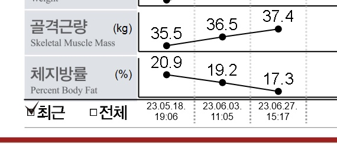

올해를 시작하며 개인적으로 많은 환경을 바꾸려고 했던 것 같다. 
생각했던 것만큼 모두 완벽하게 이루어지지는 않았지만, 그 안에서 했던 노력을 토대로 남은 하반기를 잘 준비해보리라 다짐한다.
가장 유의미했던 활동은 아마 글또 커뮤니티를 통한 블로그를 시작한 점이 아닐까 싶다. 작년을 회고했을 때 아쉬움이 많이 남았다고 했다. 
왜냐하면 나를 측정하고, 기록하지 않았기 때문이었다. 상반기가 지난 지금 되돌아보면 블로그 자체보다 무엇인가 기록을 하려는 습관을 들인점에 뿌듯하다. 
뿐만 아니라 시간을 잘 쓰기 위해 여러 방식을 생각해보고, 운동도 시작하며 나의 환경을 긍정적으로 바꾸려고 하였다. 
요즘에 흔히 말하는 “갓생”으로 살아보려고 발악한 6개월동안에 대해 회고하고 하반기에 대해 다짐을 써보려고 한다.

## ✨ Life
### 블로그
블로그를 개설한 지는 3년 정도 되었지만 제대로 시작한건 올해부터였다. 2주에 하나씩 글을 써야하는데 일을하며 글감을 정하고, 또 남들에게 공유를 하기 위해서 글을 쓰기란 시간상 어려웠다. 시간 관리를 잘하고, 계획을 잘하기 위해 이런저런 툴도 찾아보고 노력을 했던것 같다. 처음에 한두개 쓸때는 정말 백지에 글만 쓰는 느낌이었지만 점차 글이 쌓이는 블로그가 되다 보니 나름 뿌듯하고, 지식에 대한 기록이 산출물로 남아 의미 있었다. 남들에게 공유하기 위해 글을 쓰다보면 어떤 문장에도 왜?라고 스스로한테 질문을 하게 된다. 그러다보니 좀더 깊은 이해가 되고 정리도 잘 되는 느낌이었다. 단순 공부를 했다면 왜?라는 스스로한테의 질문 없이 넘어가는 순간들이 많았을 것 같다. 개인적으로도, 외부적으로도 참 의미 있는 일 중에 하나라고 생각한다. 

### 운동
작년부터 계속 운동해야지, 운동해야지 생각만 했었다. 개발자 특성상 앉아 있는 시간이 참 많을 텐데, 예전에는 관리를 딱히 안 해도 괜찮았지만 올해 부터 체중도 늘고 건강이 안 좋아지는듯한 느낌을 받았다. 마침 여자친구랑 얘기하다가 같이 운동을 시작하기로 하였고 서로 목표도 정하고 시작했던 것 같다. 운동도 처음이고 이왕 하는김에 좋은 루틴을 만들고 싶어 PT도 끊었다. 운동을 하는 그 자체보다 삶에 더 좋은 영향을 주는 듯한 느낌을 받았다. 내 스스로가 바뀌는 모습도 재밌고 좋은 취미가 된듯 하다. 인바디라는 성적표를 보면 참 뿌듯하다. 하지만… 너무 신난 나머지 무리하다가 허리가 다쳐서 현재 1주 정도 쉬고 있는 중이다.. 일도 운동도 오래하기 위해서는 무엇보다 건강이 우선이라고 다시한번 느꼈다.

### 스터디/세미나
회사에서 비슷한 연차의 동료들과 스터디를 진행하였다. 팀 내에서 스터디를 하는게 쉽지는 않겠지만 다들 성장에 대한 욕구가 있고 바라보는 방향이 비슷한거 같아 좋은 영향을 많이 받고 있다. 
1. 객체지향의 사실과 오해
2. 오브젝트
3. 테스트 주도 개발 시작하기
4. 스프링 부트 3 백엔드 개발자 되기 - 자바
5. 처음부터 제대로 배우는 스프링 부트

또한 올해는 처음으로 세미나에 참여하였다. 예전부터 참여하고 싶다는 생각은 하였지만 코로나로 인해 열리지 않았었다. 올해 GDG Korea Android 행사에 참여하며 여러 개발자분들의 얘기도 듣고 동기부여가 되는 날이었다. 끝나고 네트워킹을 하는 시간이 있었지만 참여를 하지 못한게 아쉽다. 

---

## 👨‍💻Work
### UI 개편
올해 초에 현재 진행중인 프로젝트의 UI 리뉴얼이 있었다. 스터디하고 있던 컴포즈 도입에 대해서 팀원들과 토의를 하고 작업을 진행하였다. 구현을 모두 하고 보니 xml 기반으로 UI를 그렸을 때보다 부드럽지 못하였다. 근본적으로는 이유는 컴포즈 자체는 사실 라이브러리이기 때문이었다. 짧게 이유를 말하자면 구글 플레이를 통하여서 배포를 했다면 AOT 컴파일 이점을 받을수 있었지만 구글 플레이를 통하는 앱이 아니였다보니 성능이 떨어질수밖에 없었다. 체감이 크게 안되었을수도 있지만 컴포즈를 사용해야 돼서 성능을 버리는것은 납득할수 없었다. 따라서 xml 방식으로 돌아갔고 다시 구현을 했던 기억이 있다. 같은 화면에 대해 Compose와 XML기반으로 구현하는것도 의미 있었다. 안드로이드 컴파일 방식을 비교해보고 [RecyclerView를 사용할때 최적화 방식에 대해서 블로깅](https://munseong.dev/android/recyclerviewpool/)도 할수 있게 되었다. 배운 점에 대해선 분명 있지만 작업에 두배 가까이 되는 시간을 쏟은 것도 사실이다. 신규 기술을 써야하는 이유가 백 가지가 있어도 치명적인 하나라도 (예를 들면 스크롤 성능) 있다면 쓸 수 없게 된다. 기술 검토를 할때 우리 앱에 정말 잘 맞는지 깊은 검토가 필요하다는 것을 느꼈다.

### CI/CD 구성
기존에 스크립트 기반으로 로컬에서 빌드하고 슬랙에 알림을 보냈던 방식을 서버 기반으로 CI/CD를 구성하는 작업을 했던게 기억에 남는다. 
CI/CD를 도입하는 이유에 대해선 굉장히 많다. 기존에 스크립트 기반의 반쪽짜리 CI를 사용하며 효율적이지 못한 부분들을 서버 기반으로 바꾸며 안정성을 더할수 있었다. 
TDD 기반으로 빡세게 앱을 구현하지 않아 테스트 코드가 많지는 않았다. 커버리지가 눈에 보이면 테스트 코드를 조금이라도 끌어올리는 동기가 되지 않을까 싶어 CI가 돈 후에 슬랙에 리포트도 보이도록 하였다.

APK를 빌드를 하기 위해 도커파일도 구성하고 젠킨스에서 돌리기 위해 Jenkinsfile도 구성하며 보다 넓은 시야를 가지게 되었다.

### 백엔드 
여러가지 외부적인 이유들로 인해 하반기에 백엔드 개발을 진행할 예정이다. 안드로이드 개발뿐 아니라 서버 개발도 궁금하기도 하였고, 흥미도 있던 와중에 마침 좋은 기회라고 생각하였다. 안드로이드 개발 뿐만 아니라 백엔드 개발을 하며 더 많은 시야를 얻고 많은 지식을 얻을수 있을것이라고 생각했다. 자연스레 3년후, 5년후에 어떤 분야의 개발자로 남을것인지에 대한 고민도 든다. 분명 고민해봐야하고, 깊게 생각해봐야겠지만 하반기에 백엔드 개발을 해서 도움이 되지 않는 점은 없다고 생각하였다. 현재 회사에서 백엔드 개발을 할수 있는것도 큰 경험이라고 생각한다. “일단 해보자”라는 마음이다. 다만 걱정되는것은 무리가 되지 않을까라는 마음이지만 힘들어도 재밌다면 괜찮을것같다.

---

## 🙏 아쉬웠던 점 및 다짐
- 상반기에 개발 책 말고 다른책은 거의 읽지 않았던것 같다. 자기개발, 부동산, 경제 책 등 읽고 싶은 책들은 많은데 읽지 못했다. 하반기엔 시간을 따로 내어 이런 부분의 책들도 읽어보려고 한다.
- 나는 어떤 사람이고, 그래서 나는 어떤 개발자가 될것인가에 대해 깊이 생각해보지 못했다. 팀원중 누군가 문성님은 어떤 개발자가 되고 싶어요 라고 물어봤을때 시원한 대답을 못했었다. 안드로이드 개발을 하건, 백엔드 개발을 하건, 어떤 기술스택을 쌓는지 이런 것도 중요하겠지만 이전에 이런 질문들에 대한 확실한 대답이 있어야 할것 같다.
- 현재 4년차 개발자이다. 주니어 개발자지만 스스로를 주니어 개발자라고 단정짓고 싶지 않다. 오만한 소리 일수도 있지만 왜 그렇게 생각하냐면 스스로를 주니어 개발자라는 존 안에 가두는 느낌이고 그래서 느슨해지지 않을까 하는 생각이다. 외부에서 그리고 팀내에서는 당연히 주니어 개발자로 보이는것은 맞지만 내 스스로는 가두지 않으려고 생각한다. 하지만 아직은 업무적으로나 소프트적인 측면에서나 부족한 점이 있다. n년차 개발자가 아닌 시니어 개발자로 올라서기 위해서 자신에 대해 더 메타인지를 하고 객관화를 시키고 부족한 부분을 찾아 발전시키고 성장해서 나의 경력에 떳떳한 개발자가 되고 싶다. 다만 조급하지는 않게 단단하게 해야되는 것이 더 중요하다고 생각한다.
- 올해는 개발자 네트워킹에 좀더 적극적이고 싶었으나 생각보다 잘 못했던것 같다. 글또를 통해서 했을수도 있고, 회사 내부에서 이런저런 커피챗을 했을수도 있고 내가 만들면 기회는 되게 많았다. 하지만 시간, 환경에 핑계를 대며 적극적이지 못했던 것 같다. 최근에 예전에 같이 일하던 시니어 개발자분께 먼저 연락을하고 얘기를 나눴는데 참 좋은 영향을 많이 받았던 것 같다. 우물안의 개구리가 되지 않기 위해 여러방면으로 네트워킹을 해야겠다는 생각이 들었다.

