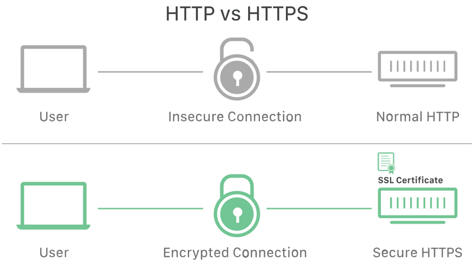
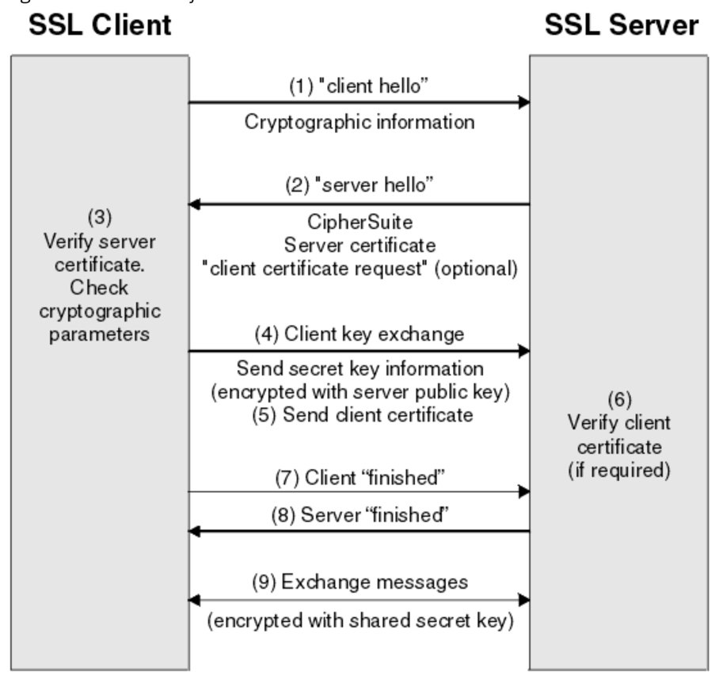
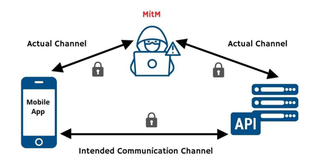

최근 회사에서 SSL Pinning을 우회해서 패킷을 캡쳐하는 방법에 세미나를 들었다. 
세미나를 들으면서 https, ssl 등 개념에 대해 부족함을 느꼈다.
부족한 개념을 채우고, ssl pinning을 해야하는 이유에 대해 정리하고자 글을 작성한다.<br> 

ssl pinning에 대해서 먼저 한줄로 소개하자면 앱과 서버가 통신할때, 중간자 공격(mitm)을 통해 데이터 변조, 정보 누출을 차단하기 위한 기법이다.
위 한줄 설명에 대해 좀더 자세히 알아보기 전에 ssl handshake 방식에 대해 인지하고 있어야 한다.

## SSL Handshake

아래 그림처럼 만약 HTTP를 통해 통신한다면, 보안이 적용되지 않아 개인정보가 인터넷 상에서 노출될 수 있다. 
따라서 SSL을 사용하여 데이터를 암호화하는 것이 **HTTPS 통신 방법**이다.


클라이언트에서 데이터를 암호화 시키고 서버에서 암호화 된 내용을 복호화 하기 위해서는 둘만의 약속이 있어야 한다.
클라이언트와 서버 간에 암호화된 데이터를 교환하기 위해서는 접속한 서버가 올바른 서버인지, 유효한 서버인지 판단할수 있어야 하고, 
어떤 키를 사용해서 암호화를 하고 복호화를 할지에 대한 과정이 있어야 할것이다. 이런 과정들을 `SSL Handshake` 라고 한다.
이 과정에는 SSL 인증서, 키 교환, 암호화 알고리즘 협상 등의 단계가 포함된다. 
아래 사진과 함께 ssl handshake 과정에 대해 자세히 알아보자.



1. Client Hello : 클라이언트의 암호화 알고리즘 목록, 세션 식별자, 랜덤 바이트 문자열 등이 담은 문자열을 Hello 메시지에 담아서 서버로 전송한다.
2. Server Hello : 클라이언트의 Hello 메시지를 받으면 클라이언트가 보낸 암호화 알고리즘 목록 중 선택한 알고리즘과, CA에서 서명된 서버의 공개 인증서, 세션 식별자등의 정보를 Hello 메시지를 통해 전송한다.
3. 인증서 확인 : 클라이언트는 서버가 전송한 인증서를 받아 신뢰할 수 있는 사이트인지 판단한다. 또한 클라이언트가 가지고 있는 공개키로 인증서를 해독하여 서버의 공개키를 획득한다.
4. 세션 키 교환 : 클라이언트는 서버의 인증서를 신뢰하고, 서버와 통신하기 위한 세션 키를 생성한다. 세션 키는 암호화와 복호화에 사용된다.
5. 인증 및 완료: 클라이언트와 서버는 서로에 대한 인증이 완료되었음을 알리는 메시지를 교환합니다. 이를 통해 SSL 핸드셰이크 과정이 성공적으로 완료되었음을 확인하고, 보안 연결이 설정됩니다.

ssl handshake에 대해서 간단하게 알아보았다. 실제로는 더 복잡하고 깊은 내용이 있지만 이 글의 취지와 약간 벗어나기 때문에 간략하게 정리하였다. 
좀더 딥하게 알고 싶다면 [해당 URL](https://medium.com/@kasunpdh/ssl-handshake-explained-4dabb87cdce)을 추천한다.

## 중간자 공격 (MITM : Man-in-the-middle)

만일 안드로이드 기기에서 프록시로 통신하도록 지정해두면 프록시와 SSL이 연결을 맺게 된다. 그리고 프록시는 서버와 연결을 맺게 된다. 
프록시가 공인 인증된 CA를 받게 될것이고, 아니라면 사설(가짜) CA를 받게 될것이다.핸드쉐이크 과정 중 3번을 보면 신뢰할수 있는 사이트인지 확인한다.
만약 전자라면 프록시와 통신을 위한 준비가 될것이고, 후자라면 사설 CA를 해독할수 있는 인증서를 디바이스가 가지고 있지 않기 때문에 실패한다. 
하지만 디바이스를 루팅시키고 직접 사설 CA를 등록시키게 된다면 앱은 서버를 신뢰할수 있게 되고, 중간에서 모든 패킷의 정보를 가로챌수 있을 것이다.
패킷에 개인정보가 있다면 유출될수 있을 것이고, 서버 도메인과 apikey가 있다면 서버에 과부화를 줄수도 있을 것이다. 이것이 중간자 공격이다.
앱에 **고정된 인증서만 사용하도록 하여 중간자 공격을 막는 기법이 SSL Pinning**이다. 



## SSL Pinning

위에 말했던 것처럼 클라이언트에 지정한 서버 호스트의 인증서일 경우에만 통신이 가능하도록 소스 코드를 명시해야 한다.
예를 들어, 클라이언트 앱이 "munseong.com" 도메인과 통신해야 할 경우, 앱의 소스 코드에 "munseong.com" 도메인에 해당하는 인증서만 허용하도록 하드코딩한다. 
이렇게 하면 앱은 오직 특정 도메인에 대한 인증서만 신뢰하고 통신을 진행하게 됩니다.
아래는 3가지 방법으로 SSL Pinning을 적용하는 방법이다.
(앱에 하드코딩을 해놓았기 때문에 만일 서버의 CA가 바뀌게 되거나, 만료가 된다면 새 인증서 정보로 업데이트 하기 위해 앱 업데이트는 필수다)

### TrustManager

TrustManager 클래스를 통해서 ssl pinning을 구현할수 있다.
1. 앱의 res 폴더에 인증서 파일을 추가한다.
2. 인증서 파일을 읽어 keyStore 클래스에 로드한다.
```kotlin
val certInputStream = resources.openRawResource(R.raw.my_certification)
val keyStore = KeyStore.getInstance(KeyStore.getDefaultType())
keyStore.load(certInputStream, null)
```
3. Trustmanager를 생선한다.
```kotlin
val trustManagerFactoryAlgorithm = TrustManagerFactory.getDefaultAlgorithm()
val trustManagerFactory = TrustManagerFactory.getInstance(trustManagerFactoryAlgorithm)
trustManagerFactory.init(keyStore)
```
4. TrustManager를 사용해 SSLContext를 생성 후, 아래와 같이 적용한다.
```kotlin
val sslContext = SSLContext.getInstance("TLS")
sslContext.init(null, trustManagerFactory.trustManagers, null)
val url = URL("http://munseong.com/")
val urlConnection = url.openConnection() as HttpsURLConnection
urlConnection.sslSocketFactory = sslContext.socketFactory
```

이 방법은 framework API를 직접적으로 사용하는 방식이다. 위에 코드만 보더라도 low 레벨의 코드를 건들이게 되고, 보일러플레이트의 코드도 많다.
때문에 버그의 가능성이 높고 조심해서 다뤄야 한다.

### OkHttp / CertificatePinner

OkHttp를 사용해 쉽게 Pinning이 가능하다. TrustManager를 사용했을때보다 훨씬 간단하고 직관적이다.
```kotlin
val certificatePinner = CertificatePinner.Builder()
    .add(
        "http://munseong.com/",
        "sha256/{KEY}"
    )
    .build()
val okHttpClient = OkHttpClient.Builder()
    .certificatePinner(certificatePinner)
    .build()
```

### Network Security Configuration

Andorid 7.0부터 지원되는 기능이며, 가장 선호되는 방법이다. 소스 코드에서 직접 설정하지 않고, xml에 도메인과 키를 직접 명시하는 방법이다.
선언적이기 때문에 유지보수에 쉽고 보일러 플레이트 코드를 줄이게 된다. 명시된 파일과 AndroidManifest.xml을 바인딩한다.
1. rse/xml/network_security_config.xml을 생성합니다.
```xml
<?xml version="1.0" encoding="utf-8"?>
<network-security-config>
    <domain-config cleartextTrafficPermitted="false">
        <domain includeSubdomains="true">munseong.com</domain>
        <pin-set>
            <pin digest="SHA-256">{KEY1}</pin>
            <pin digest="SHA-256">{KEY2}</pin>
        </pin-set>
    </domain-config>
</network-security-config>
```
2. AndroidManifest에 networkSecurityConfig 태그를 설정합니다.
```xml
<?xml version="1.0" encoding="utf-8"?>
<manifest
    xmlns:android="http://schemas.android.com/apk/res/android"
    package="com.your_package">
    <application
        android:networkSecurityConfig="@xml/network_security_config">
        …
    </application>
</manifest>
```

## 후기
이 글에는 자세하게 적진 않았지만, http/https, ssl의 개념 등을 다시 복습하고 부족한 부분을 채울수 있었다. ssl handshake는 눈으로 몇번 보고 나서 까먹었을때가 많았는데 이번 기회에 다시 정리가 됐던거 같다.
SSL Pinning을 통해서 중간 프록시 서버에서 패킷을 캡쳐하지 못하게 하였지만, 꼭 해킹이 아니더라도 프록시 서버를 두어 패킷을 분석하기 위해 우회하는 방법도 존재한다. 난독화가 적용되어 있지 않은 앱이라면 apk를 탈취해 디컴파일 하면 모든 내용이 보일수 있을 것이며, 
frida 등의 유명한 프레임워크를 사용하면 후킹을 통해 쉽게 우회가 가능하다. 서비스를 구현하는 것 만큼이나 보안에도 각별히 신경써야겠다는 생각이 든다.


