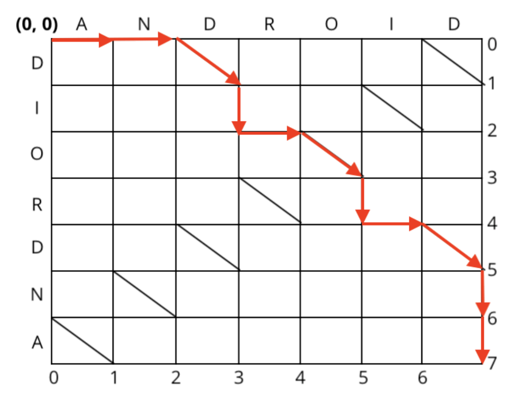
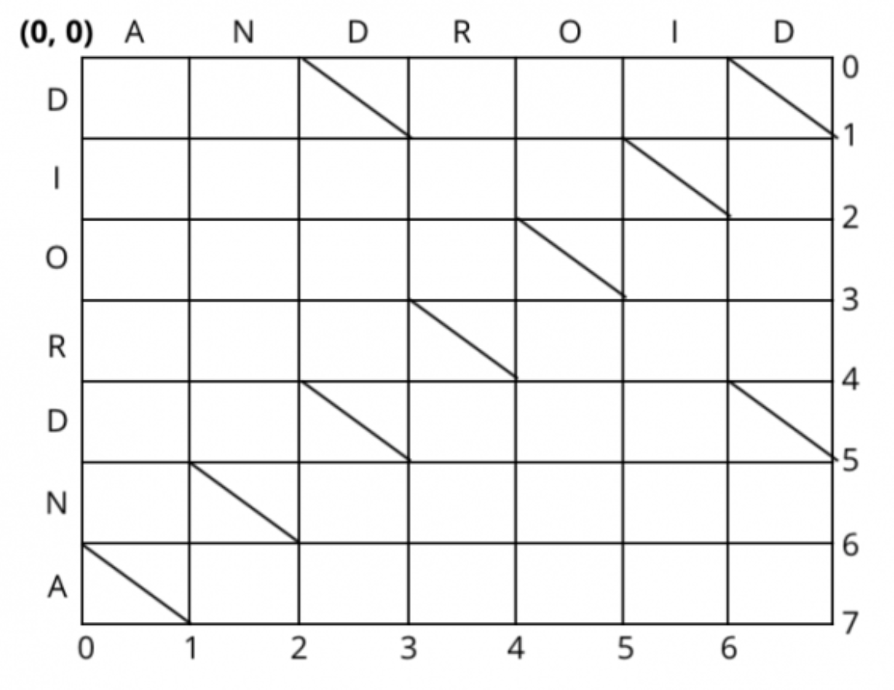
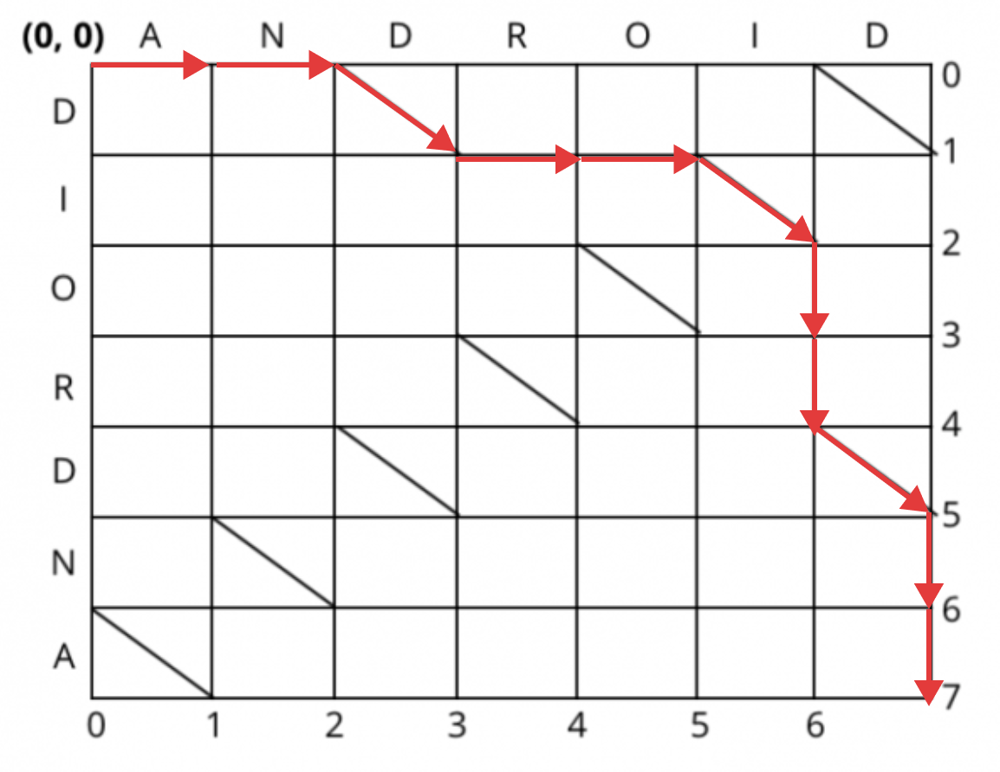
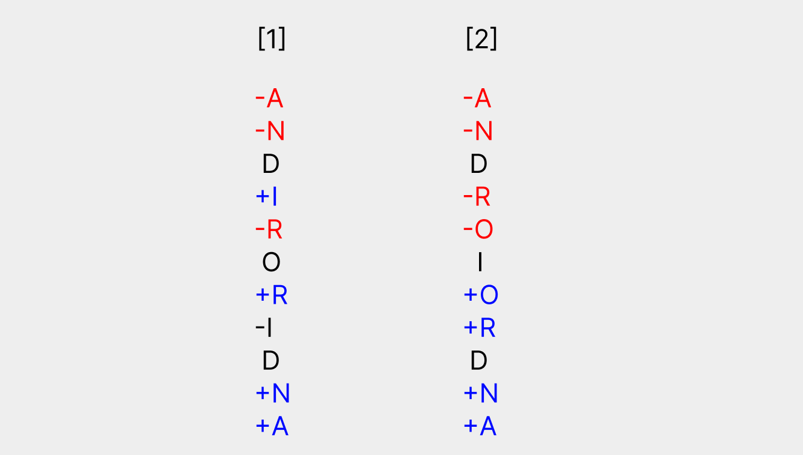

RecyclerView의 DiffUtil은 recyclerView에 표시될 리스트의 값이 변경될 때 효율적으로 바뀐 부분을 찾고 업데이트를 해주는 유틸리티 클래스이다. recyclerView의 성능에 대해서 고민을 해본 개발자라면 이미 diffUtil를 사용하고 있을 것이다. notifyDataSetChanged를 사용하게 되면 불필요한 부분에 대해서도 렌더링이 일어나게 되지만 diffUtil을 사용하면 업데이트가 불필요한 뷰에 대해서는 생성이나 렌더링이 두 번 일어나지 않게 할 수 있기 때문이다. 최근에 recyclerView를 적극적으로 써아햐는 UI 작업을 하였는데 문득 diffUtil의 작동 원리(알고리즘)에 대해서 궁금하였고 예제만 보고 작성했던 코드에 대해 한번 정리해보고 싶은 욕구가 들었다. 일단 공식 문서를 보고 DiffUtil에 대해 알아보자.


## DiffUtil 이란?

안드로이드 공식 문서에서는 다음과 같이 설명한다. 
> DiffUtil is a utility class that can calculate the difference between two lists and output a list of update operations that converts the first list into the second one.

> DiffUtil uses Eugene W. Myers’s difference algorithm to calculate the minimal number of updates to convert one list into another. 

> This algorithm is optimized for space and uses O(N) space to find the minimal number of addition and removal operations between the two lists. It has O(N + D^2) expected time performance where D is the length of the edit script.

정리해보자면 DiffUtil은 두 목록 간의 차이를 계산하고 리스트에서 업데이트된 부분만 출력하게 해주는 유틸리티 클래스라고 한다. 또한  Eugene W. Myers의 difference algorithm을 사용한다고 한다. 이 알고리즘은 공간에 최적화 되어 있어서 공간 복잡도가 O(N) 이고 시간 복잡도는 O(N+D^2)라고 한다. N과 D이 무슨 의미인지는 아래에서 알아보자.

## DiffUtil Algorithm Deep Dive

위에서 언급 했듯이 diffutil에 사용하는 알고리즘은 Eugene W. Myers의 차이 알고리즘을 사용한다. diffUtil에서만 사용되는게 아니라 사실 git, subversion과 같이 버전을 관리하는 소프트웨어에 자주 사용된다. 

<br>

이렇게 두 버전에 대해 삽입, 삭제, 유지에 대해 나타내는 알고리즘이라고 볼수 있다.<br>
이 알고리즘이 어떻게 동작하는지 알아보자.

---
A: ANDROID<br>
B: DIORDNA<br>
A에서 B로 바꾸는 과정을 git diff 처럼 나타낸다고 가정하면 가장 간단한 방법은 이렇게 될것이다.
```
-A
-N
-D
-R
-O
-I
-D
+D
+I
+O
+R
+D
+N
+A
```

위 처럼 A 문자열에 있는 문자들을 모두 삭제한 후 B의 문자열을 모두 붙이는 것이다. 
위의 경우 편집되는 라인 수가 총 14개이다. 하지만 우리가 원하는 git diff의 모양은 이런 결과가 아닐것이다. 엔지니어 답게 좀더 효율적으로 라인 수를 줄여보자. 가장 최적의 라인 수로 DIORDNA를 만드는 방법은 아래와 같다.
```
-A
-N
D
+I
-R
O
+R
-I
D
+N
+A
```
 
위의 방식을 사용하면 수정되는 라인수가 총 8개이다. 기존 방식에 비해 약 43%정도 줄어든 수치이다. [유진 마이어스의 논문](http://www.xmailserver.org/diff2.pdf) 을 보면 최적의 경로를 찾기 위해서 그래프를 사용한다. 유진 마이어스의 논문을 참고해서 ANDROID를 DIORNDA로 바꾸기 위한 차이 알고리즘을 알아내기 위한 그래프를 그리면 다음과 같이 나온다.


<br>
X축에는 변경 전 문자열(ANDROID)을 넣어주고 Y축에는 변경 후 문자열(DIORDNA)을 넣어준다. 그리고 같은 문자열이 만나는 좌표에는 대각선을 그어준다. 그리고 (0,0)에서 (7,7)까지 가는 최단 경로를 그려본다. 


 
 <br>

(0,0)에서 (7,7)까지 최단 경로로 가는 길이 이것만 있는 것은 아니다. 우리가 이 그래프를 그린 이유는 최단 경로가 나온 선을 통해서 diff를 알 수 있다는 점이다. **오른쪽으로 이동하는 것은 삭제**이고 **아래로 내려가는 선은 삽입**이다. **대각선으로 가는 것은 유지**한다는 뜻이다. 대각선으로 가는 것은 변경하지 않는 것이기 때문에 오른쪽/아래로 이동하는 횟수를 최소화 하는 것이 유진 마이어스 알고리즘의 기본 개념이다. 다만 실제 유진 마이어스 알고리즘을 실행해보면 (7,7)까지의 최적 경로는 아래와 같이 나을 것이다. 


<br>
둘다 오른쪽/아래로 가는 횟수는 8인데 어떤 이유에서 일까? 위의 그래프를 보고 첫번째와 두번째의 실제 편집 점에 대해서 써보면 아래와 같다.


<br>
그렇다. 유진 마이어스 알고리즘은 삽입보다 삭제의 우선순위가 더 높다. 이런 이유는 삭제, 삽입, 유지가 번갈아 가면서 있는 것 보다는 삭제가 최대한 많이 일어나고 삽입이 들어가는 구조가 보기에 더 익숙해서이다. 유진 마이어스 알고리즘은 이러한 로직을 통해 보다 양질의 diff를 제공한다. 유진 마이어스의 알고리즘 개념은 사실상 이 내용이며 한마디로 표현하자면 (0,0)에서 (n,m)까지의 오른쪽/아래의 횟수를 최소화로 하는 경로이다.


<br>


[DiffUtil 안드로이드 공식 문서](https://developer.android.com/reference/android/support/v7/util/DiffUtil.html)나 이 알고리즘의 논문을 보면 다음과 같이 나와 있다.
> This algorithm is optimized for space and uses O(N) space to find the minimal number of addition and removal operations between the two lists. It has O(N + D^2) expected time performance where D is the length of the edit script.

공간 복잡도 = O(N)
시간 복잡도 = O(N+D^2)
우리가 위에 봤던 예제로 N과 D의 변수 값을 채워보자면 N은 A,B 문자열 길이의 합으로 14이고 D는 최소 편집점의 개수이다. 즉 8이다.


## RecyclerView DiffUtil Callback
RecyclerView에서 이런 알고리즘을 적용한 api가 DiffUtil이다. 
DiffUtil 클래스는 두 가지 Callback을 제공한다. `DiffUtil.Callback()`과 `DiffUtil.ItemCallback()`이 있다.

### 1. DiffUtil.Callback()
```
class DiffUtilCallback(
    private val oldList: List<User>,
    private val newList: List<User>
) : DiffUtil.Callback() {
    override fun getOldListSize(): Int = oldList.size
    override fun getNewListSize(): Int = newList.size
    override fun areItemsTheSame(oldItemPosition: Int, newItemPosition: Int): Boolean {
        val oldItem = oldList[oldItemPosition]
        val newItem = newList[newItemPosition]

        return oldItem.userId == newItem.userId
    }
    override fun areContentsTheSame(oldItemPosition: Int, newItemPosition: Int): Boolean {
        val oldItem = oldList[oldItemPosition]
        val newItem = newList[newItemPosition]

        return oldItem == newItem
    }
}
```
- getOldListSize(): 이전 목록의 개수를 반환합니다.
- getNewListSize(): 새로운 목록의 개수를 반환합니다.
- areItemsTheSame(int oldItemPosition, int newItemPosition): 두 객체가 같은 항목인지 여부를 결정합니다.
- areContentsTheSame(int oldItemPosition, int newItemPosition): 두 항목의 데이터가 같은지 여부를 결정합니다. areItemsTheSame()이 true를 반환하는 경우에만 호출됩니다.
- getChangePayload(int oldItemPosition, int newItemPosition): 만약 areItemTheSame()이 true를 반환하고 areContentsTheSame()이 false를 반환하면 이 메서드가 호출되어 변경 내용에 대한 페이로드를 가져옵니다.

위와 같이 DiffUtil.Callback()을 상속받아 메소드를 오버라이드 하면 Adapter에서 다음과 같이 사용할 수 있다.
```
private fun setItems(newList: List<User>) {
      val diffCallback = DiffUtilCallback(oldList, newList)
      val diffResult: DiffUtil.DiffResult = DiffUtil.calculateDiff(diffCallback)
      diffResult.dispatchUpdatesTo(this)
  }
```


### 2. DiffUtil.ItemCallback()

위에서 알고리즘의 시간복잡도와 공간복잡도를 봤듯이 공간복잡도에 최적화된 알고리즘이다. 아이템 개수가 많아지게 된다면 시간 복잡도가 올라가 연산 시간이 길어진다. 따라서 이런 계산은 백그라운드 쓰레드에서 처리 하는게 올바르다. DiffUtil.ItemCallback과 AsyncListDiffer를 사용하면 자체적으로 멀티 쓰레드에 대한 처리가 되어 있어서 편리하게 사용할 수 있다. 

```
class DiffUtilItemCallback : DiffUtil.ItemCallback<User>() {

    override fun areItemsTheSame(oldItem: User, newItem: User) =
        oldItem.userId == newItem.userId

    override fun areContentsTheSame(oldItem: Place, newItem: Place) =
        oldItem == newItem
}

```

```
 private val asyncDiffer = AsyncListDiffer(this, DiffUtilItemCallback())
    
  override fun getItemCount() = asyncDiffer.currentList.size
    
  fun updateItem(newItem: List<User>) {
  		asyncDiffer.submitList(newItem)
  }
```

코드 스니펫에서 볼수 있듯이 AysncListDiffer에서 DiffUtilItemCallback을 사용한다. adapter 클래스에서 사용할 AsyncListDiffer와 DiffUtilItemCallback만 정의해주면 된다. 

## ListAdapter
바로 위의 DiffUtil.ItemCallback을 사용할 때 AsyncListDiffer에 넣어줌으로써 사용하였다. 하지만 ListAdapter 클래스를 사용하면 내부적으로 AsyncListDiffer을 사용하고 있기 때문에 ListAdapter를 사용하면 보일러플레이트 코드를 줄일 수 있다. 아래 코드는 ListAdapter 추상 클래스이다. 구현부를 보면 위에서 AsyncListDiffer를 사용했을 때처럼 그대로 구현되어 있다. 다시말하자면 ListAdapter를 상속하기만 하면 AsyncListDiffer를 사용할 수 있게 되고 백그라운드에서 Diff 알고리즘이 동작할수 있도록 해준다.

```
public abstract class ListAdapter<T, VH extends RecyclerView.ViewHolder>
        extends RecyclerView.Adapter<VH> {
    final AsyncListDiffer<T> mDiffer;
    private final AsyncListDiffer.ListListener<T> mListener =
            new AsyncListDiffer.ListListener<T>() {
        @Override
        public void onCurrentListChanged(
                @NonNull List<T> previousList, @NonNull List<T> currentList) {
            ListAdapter.this.onCurrentListChanged(previousList, currentList);
        }
    };

    @SuppressWarnings("unused")
    protected ListAdapter(@NonNull DiffUtil.ItemCallback<T> diffCallback) {
        mDiffer = new AsyncListDiffer<>(new AdapterListUpdateCallback(this),
                new AsyncDifferConfig.Builder<>(diffCallback).build());
        mDiffer.addListListener(mListener);
    }

    @SuppressWarnings("unused")
    protected ListAdapter(@NonNull AsyncDifferConfig<T> config) {
        mDiffer = new AsyncListDiffer<>(new AdapterListUpdateCallback(this), config);
        mDiffer.addListListener(mListener);
    }
    
    // 이하 생략
}
```


## 마무리
항상 모든 기술에는 트레이드 오프, 즉 장/단점이 있다고 생각한다. notifyDataSetChanged을 사용하기 보단 diffUtil을 사용하고 diffUtil을 사용하기 보단 AsyncListDiffer를 사용하는게 좋고 이 모든것들이 추상화 되어 있는 ListAdapter를 사용하는게 렌더링에 있어서 당연히 좋을 것이다. 하지만 불필요한 렌더링을 줄여 앱의 성능을 향상시킬순 있겠지만 그만큼 메모리 사용량이나 CPU 시간은 증가 할 것이다. 만약에 리스트 중에 변경되는 항목의 인덱스를 알고 알고 있고, 그 수가 적다면 직접 notifyItemChanged 메소드를 호출하는게 훨씬 이득일 것이다.
이런 트레이드 오프 되는 상황을 판단하여 적절한 곳에 적절한 기술을 사용함으로써 원활한 사용자 경험을 제공하는 것이 중요하다고 생각한다. 

<br>

### 참고

https://www.kodeco.com/21954410-speed-up-your-android-recyclerview-using-diffutil#toc-anchor-003
https://velog.io/@jshme/diff-algorithm-deep-dive-1
https://www.nathaniel.ai/myers-diff/
http://www.xmailserver.org/diff2.pdf
https://blog.jcoglan.com/2017/02/12/the-myers-diff-algorithm-part-1/
https://developer.android.com/reference/androidx/recyclerview/widget/DiffUtil