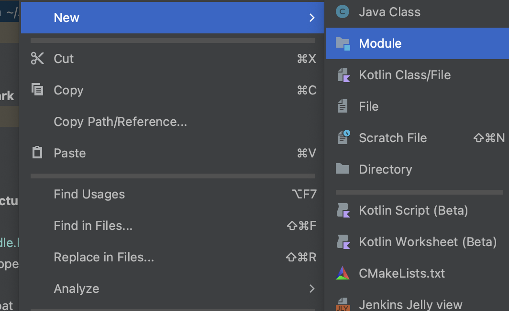
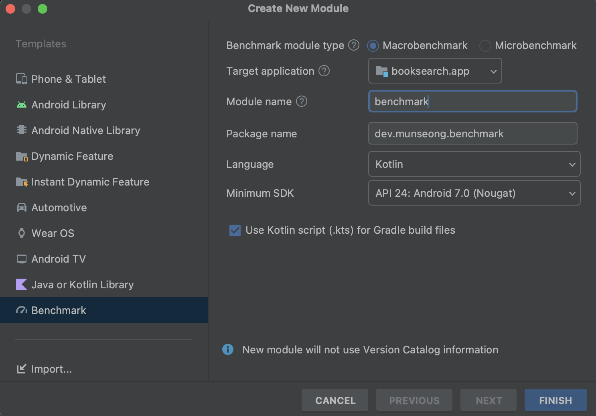
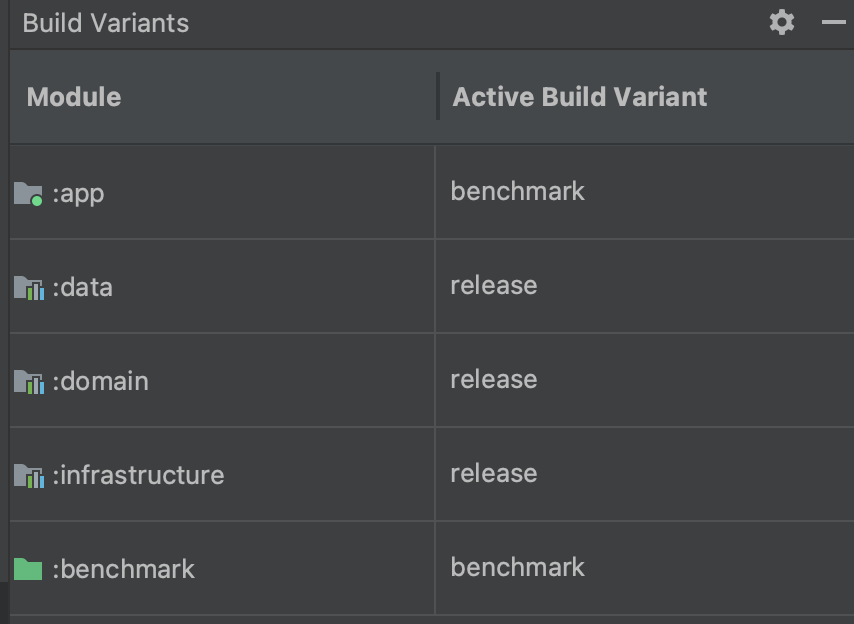
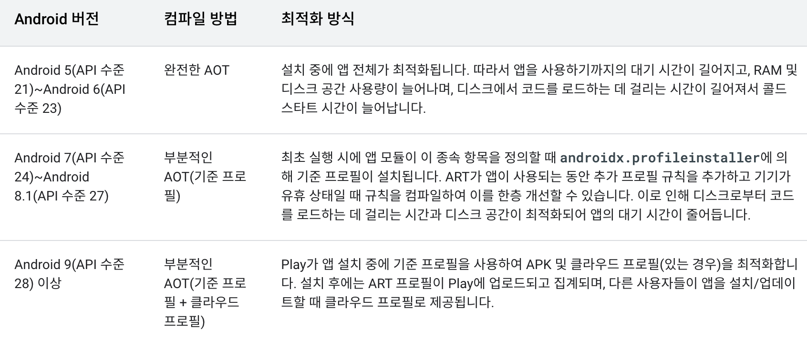
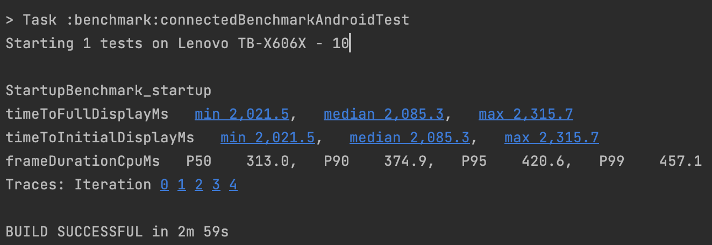
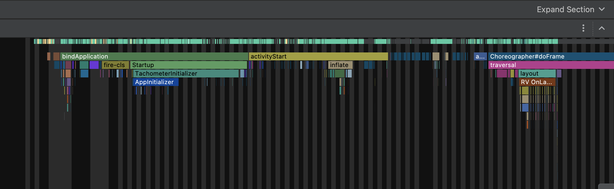

## Macrobenchmark란?

- StartUp, UI 인터렉션, 애니메이션 등 사용자와 end-to-end 요소에 대한 성능을 측정해주는 도구
- 코드를 직접 호출하지 않고, UiAutomator를 통해 터치, 클릭, 스와이프 등 사용자와 인터렉션을 하듯이 성능을 측정
- 앱 시작, 프레임 시간, 추적된 코드 섹션을 직접 측정하도록 애플리케이션의 컴파일, 시작, 중지를 제어할 수 있다.
- 구글 플레이 스토어에 의해 설치된 최적화 된 앱을 로컬에서 재현할 수 있음
- 반복 테스트를 지원해 여러 테스트 실행의 결과를 볼수 있음

## 구성
### 모듈 추가

project → New → Module을 들어가면 BenchMark Templates를 볼수 있다



<br>

<br>

- Target Application :  벤치마킹할 앱 <br>
- Module name : 벤치마킹 Gradle 모듈 이름 <br>
- Package name : 벤치마크 패키지 이름 <br>
- Minimum SDK : Android 6 (API 23) 이상이 필요함

### build.gradle 설정
모듈을 구성하고 나면 app build.gradle의 buildTypes에 benchmark 모드가 추가된다.
```
...
benchmark {
	signingConfig signingConfigs.debug
	matchingFallbacks = ['release']
	debuggable false
}
...
```
build variant가 benchMark로 설정했을 때 machingFallback 옵션에 의해 release 모드를 따르도록 한다. 릴리즈 환경과 최대한 똑같이 하기 위해 debuggalbe은 false로 해준다. app 모듈의 varaint를 benchmakr로 바꾸면 멀티 모듈로 구성된 다른 모듈들도 release모드로 변하는것을 볼수 있다.


<br>

### 측정 코드

benchmark 모듈을 추가하면 기본으로 아래 코드가 생성됩니다.
```
@RunWith(AndroidJUnit4::class)
class ExampleStartupBenchmark {
   @get:Rule
   val benchmarkRule = MacrobenchmarkRule()

   @Test
   fun startup() = benchmarkRule.measureRepeated(
       packageName = "dev.munseong.benchmark",
       metrics = listOf(StartupTimingMetric()),
       iterations = 5,
       startupMode = StartupMode.COLD,
   ){
        pressHome()
        startActivityAndWait()
   }
}
```

macrobenchmark는 일반적인 instrumented 테스트처럼 @Runwith, @Test, @Rule과 같은 JUnit 구문을 사용한다. benchmarkRule의 measureRepeated 함수가 벤치마크를 시작하는 함수다. 이 함수는 코드에서 보듯이 다음과 같은 파라미터를 설정할 수 있다.

- packageName : 성능을 측정할 어플리케이션을 지정한다. macrobenchmark는 앱과 별도의 프로세스로 실행된다. 따라서 측정할 대상 앱을 어떤 앱인지 지정해줘야 하기 때문에 이 파라미터가 꼭 필요하다.
- metric : 벤치마크 중에 측정하려는 항목을 기입. 위 예시 코드에서는 시작시간을 측정하는 StartUpTimingMetric이 사용되었지만 다양한 측정 항목이 있다. ([https://developer.android.com/reference/kotlin/androidx/benchmark/macro/Metric](https://developer.android.com/reference/kotlin/androidx/benchmark/macro/Metric))
- iterations :  말 그대로 반복 횟수를 나타낸다. 많이 반복할 수록 안정성, 신뢰도가 높아지지만 실행 시간이 길어진다.
- startupMode : 벤치마크를 시작할 때 애플리케이션을 시작하는 방법을 정의. 앱의 시작 상태는 cold start, warm start, hot start가 있는데 이 모드를 선택할 수 있음.
- measureBlock : 벤치마크 중에 측정하려는 작업을 정의하고(활동 시작, UI 요소 클릭, 스크롤, 스와이프 등) Macrobenchmark는 이 블록 중에 정의된 metric를 수집합니다.

추가적으로 CompilationMode가 있다. 컴파일 모드를 지정할 수 있는 것이다. 안드로이드 API 마다 컴파일 모드가 다르다. 위의 특징중에 `구글 플레이 스토어에 의해 설치된 최적화 된 앱을 로컬에서 재현할 수 있음`이라는 말이 있는데 이 옵션을 통해 가능하다. 구글 플레이 스토어를 통해 설치된 앱은 android 버전에 따라 다르긴 하지만 AOT 컴파일(pre-compile)을 통해 최적화된 상태로 사용자의 디바이스에 깔리게 된다.



ComplilationMode를 통해 pre-compile의 정도를 설정할수 있다. 

- `None()` – pre-compile을 하지 않고 오직 JIT 컴파일을 통해서만 측정하겠다는 의미 (디버그모드로 앱을 실행했을 때와 같다)
- `Partial()` – 기준 프로필 및/또는 워밍업 실행으로 앱을 사전 컴파일한다. (이 글에서 baselineProfile에 대해서 다루지 않지만 해당 링크에서 자세하게 볼수 있습니다)
- `Full()` – 전체 앱을 미리 컴파일합니다. Android 6(API 23) 이하에서 사용할 수 있는 유일한 옵션입니다.

## 실행

위 사진처럼 Build Variants를 benchmark로 바꾸어 줍니다. 그리고 unitTest와 같은 방식으로 아이콘을 클릭해 실행을 시킬수도 있고 아래 명령어를 통해서 실행 시킬수도 있습니다. 

```
./gradlew :benchmark:connectbenchmark
```

### 이슈1

에뮬레이터에서 실행할수도 있지만 일반적으로 실제 기기에서 테스트를 돌리는것을 권장한다. 왜냐하면 에뮬레이터를 실행시키는 컴퓨터의 부하가 많게 되면 벤치마크가 느리게 표시되기 때문이다. 에뮬레이터로 실행을 해야만 하는 경우라면 아래 옵션을 추가해주면 실행이 된다.

```
// :macrobenchmark:build.gradle

defaultConfig {
testInstrumentationRunnerArguments["androidx.benchmark.suppressErrors"] = 'EMULATOR'
}
```

### 이슈2

만약에 앱에서 사용하는 라이브러리 중 implementaion이 아닌 release와 debug를 따로 사용하기 위해 아래 코드처럼 분기해놓은 의존성이 있다면 라이브러를 찾지 못해 오류가 발생할것이다.

```
dependencies {
	...
    benchmarkImplementation 'com.github.theGlenn:flipper-android-no-op:0.3.0'
    releaseImplementation 'com.github.theGlenn:flipper-android-no-op:0.3.0'
    debugImplementation "com.facebook.flipper:flipper:0.182.0"
	...
}
```

implementation의 접두어는 build varaint를 따라가기 때문에 benchmarkImplementation을 추가해주어야 한다. 실행하고 나면 아래와 같은 결과가 나온다. 명령어를 사용한 경우 build/output에 결과가 json으로 담겨져 있다.



iterator를 5번으로 두었을 때의 최솟값, 중앙값, 최대값을 확인할 수 잇었다. 
StartUp을 측정했을 때 timeToInitialDisplayMs와 timeToFullDisplayMs의 값을 볼수 있다.

- timeToInitialDisplayMs : 시스템에 시작 인텐트가 수신된 후 첫 프레임을 렌더링 할때까지의 시간
- timeToFullDisplayMs : 시스템에 시작 인텐트가 수신된 후 reportFullDrawn (링크 달기) 메소드가 호출될때까지의 시간

또한 아래의 Iterator 숫자를 볼수 있는데 각 결과에 대해 Trace로 있는 링크로 연결된다. 이슈가 있다면 Trace를 분석해서 조치를 취할수도 있다.


<br>

### 후기

macroBenchmark를 도입한건 앱 시작 시간을 측정하기 위해서였다. 위 글에서 쓰진 않았지만 스크롤 등 유저 인터렉션에 대해서도 성능 측정이 가능해서 좀더 보고 싶다면 코드랩에서 확인할 수 있다. 컴파일 모드를 옵션으로 둘수 있어 앱 릴리즈 전에 macroBenchmark를 통해 성능을 측정할수 있는것이 큰 장점이라고 생각이 든다. 구글 플레이를 통한 최적화 앱에 대해 측정도 가능하니 현재 릴리즈 모드의 앱과 사용자에게 전달될때 성능을 비교하고 싶다면 사용해봐도 좋아보인다. 또한 gradle 명령어도 지원을 하고 결과에 대한 output도 파일로 나오기 때문에 CI 환경이 구축되어 있다면 도입을 해봐도 충분히 좋을것 같다.