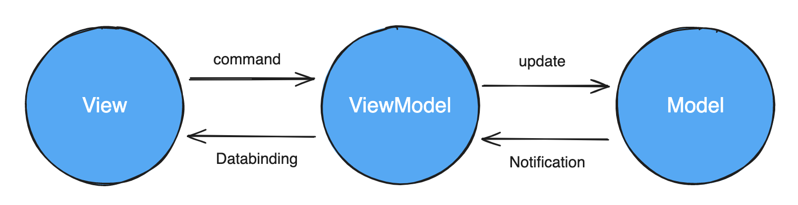
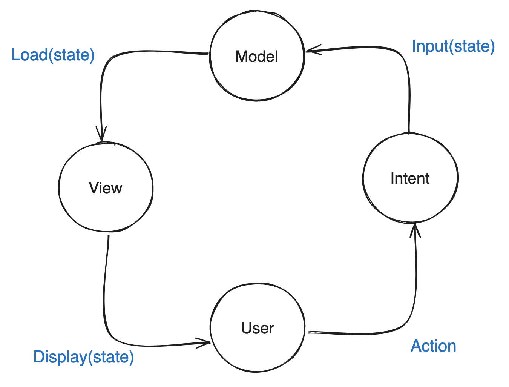
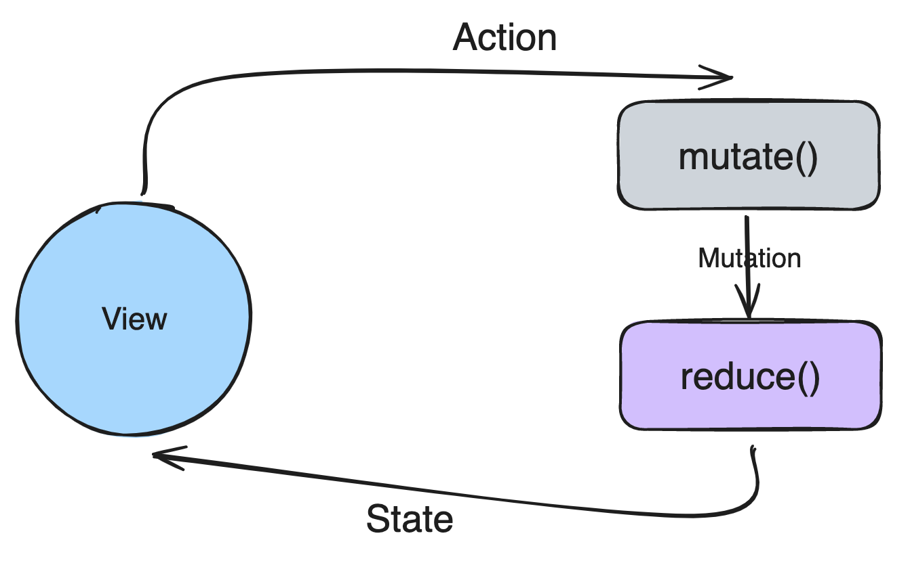
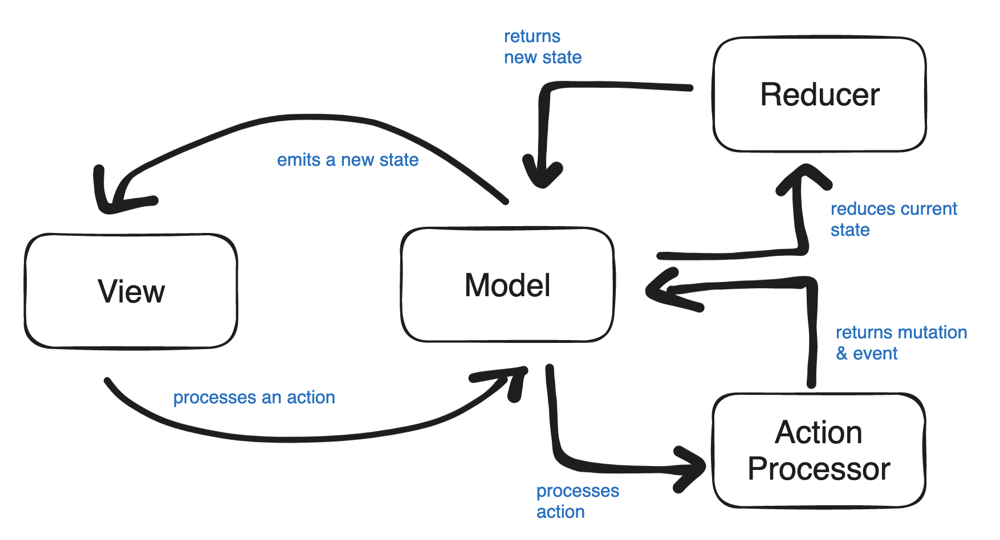

- [0. 배경](#0-배경)
- [1. mvvm에서 mvi로](#1-mvvm에서-mvi로)
- [2. 기본 MVI 패턴 살펴보기](#2-기본-MVI-패턴-살펴보기)
- [3. Reducer](#3-Reducer)
- [4. Action Processors](#4-Action-Processors)
- [5. 결론](#5-결론)

## 0. 배경

작년에 신규 프로젝트를 시작함에 따라 아키텍쳐를 조사하였다. 기존에는 MVVM + 클린아키텍처로 적용하였는데, 앱의 요구사항이 늘어남에 따라 상태관리에 점점 한계를 느끼게 되었다. 아키텍처 조사 중에 MVI에 대해 도입을 논의하였고, 실제 적용해보면서 기존의 한계점과, MVI에서는 어떻게 해결할수 있었는지, 또한 어떻게 컴포넌트를 나누었는지 정리를 하려고 한다.
## 1. mvvm에서 mvi로

    MVVM 패턴에 기반해서 아키텍처를 짜는 이유에는 많이 아시다싶이 뷰 로직과 비지니스 로직이 분리되고, 상태 observing을 통한 reactive 프로그래밍이 쉬워지며, databinding 등 많은 이점이 있다. 즉 레어어별로 역할이 분리되고, 독립성 유지와 의존성 감소라는 효과가 있어 실제 필드에서도 많이 사용되는 패턴이다.
    

많이 사용될 만큼 충분히 이상적이고 좋은 패턴이지만, 화면에 대한 요구사항이 커지고, 상태가 늘어남에 따라 복잡한 데이터 흐름과 상태 충돌, 스레드 안정성이라는 문제에 대한 한계점이 존재한다. databinding을 통해 뷰가 데이터를 구독할수 있지만, viewModel에서의 데이터바인딩과 view 내부에서도 스스로 바인딩 하는 경우가 있고, view와 viewModel이 핑퐁을 통해 로직을 처리하다보면 복잡한 데이터 흐름으로 인해 파악하기 힘들때도 있었다. 한마디로 표현하면 view와 viewModel의 양방향 참조가 가능해서 생기는 문제가 있다.

데이터의 흐름을 제어하지 못하는것이 문제였기 때문에, MVI는 단일 상태 관리와 단방향 데이터 흐름을 통해 MVVM의 문제점을 해결하고자 했다.
ui에서 ViewModel로의 직접적인 호출이 아니라, Intent로 기반하기 때문에 좀더 느슨한 결합을 유지하게 된다는 장점을 느꼈다. 다시 말하자면 UI는 이벤트를 던지고, 상태를 받기만 하면 된다.(단방향 아키텍처 보장) 이 때문인지 상태 관리에만 신경쓰면 되기 때문에, Compose와도 궁합이 잘맞는다는 생각이 들었다.

## 2. 기본 MVI 패턴 살펴보기



**View는** Model로 부터 받은 데이터가 보여지는, 즉 사용자와 상호 작용을 하는 화면을 뜻한다.
**Model**은 domain객체나 dto 등을 말하는 모델이 아닌 Intent를 통해 로직을 수행하고 현재 앱의 상태를 나타내는 불변 객체이다.
**Intent**는 android intent가 아니라 사용자로부터 시작된 이벤트를 통해 상태를 어떻게 바꿀지에 대한 의도이다. 여기서 말하는 이벤트라고 하면, 버튼 클릭이나, 텍스트 입력 등과 같은 작업을 포함한다. 기존 MV 패턴들은 이벤트 발생 시  어떤 로직을 실행할지에 관심이 있었다면, MVI에서는 어떤 이벤트를 보낼 것인가에 대해 관심이 있다.

MVI에 대해서 찾아보면 위 그림과 각 컴포넌트에 대한 설명은 더욱 자세히 나온다. 사실 위 그림과 설명만 봐서는 어떻게 코드가 구성되는지 이해하기 힘들다. MVI를 기반해서 프로그래밍을 할수 있는 library들도 많지만 일단은 실제 아키텍처를 기반으로 구현해보도록 하겠다.

```kotlin
class TodoListViewModel(...) : ViewModel() {  
    private val _state =  
        MutableStateFlow<TodoListUiState>(TodoListUiState.Empty)  
    private val _event = MutableSharedFlow<TodoListEvent>()  
  
    fun processIntent(intent: TodoListUiIntent) {  
        when (intent) {  
            is TodoListUiIntent.FetchTodoList -> fetchTodos()  
            is TodoListUiIntent.AddTodo -> addTodo(intent.todo)  
            is TodoListUiIntent.DeleteTodo -> deleteTodo(intent.todo)  
        }  
    }  
  
    private fun fetchTodos() {  ... }  
  
    private fun addTodo(todo: TodoItem) {  ... }  
  
    private fun deleteTodo(todo: TodoItem) {  ... }  
}
```

MVI는 단일 상태와 단방향 데이터 흐름을 특징으로 한다고 했다. 위에서 TodoListUiState를 통해 뷰가 화면에 렌더링할 요소들을 가지고 있는 단일 상태이다. sealed interface를 통해 viewState를 정의한다. 이것이 MVI에서 말하는 Model에 해당하며, 화면에 표시할 데이터를 담고있다. sealed interface를 사용함으로써 복잡하고 다양한 상태를 한곳으로 묶어, 데이터 접근성을 높힐수 있다. (단일 이벤트 핸들링)
``` kotlin
sealed interface TodoListUiState {  
    data object Loading : TodoListUiState
    data object Empty : TodoListUiState
    data class Content(val todos: List<TodoItem>) : TodoListUiState
    data class Error(val message: String) : TodoListUiState
}
```

아래는 TodoListViewModel이다. 위에서 말했듯이, View에서 ViewModel로 Intent를 전달한다고 했다. view와 viewModel 사이에 processIntent 메소드만 열어두고, 나머지는 모두 private 접근을 설정한것을 볼수 있다. 또한 ViewModel의 메소드에는 Todo리스트에 표현할 fetchTodos와 투두를 추가하는 addTodo, 그리고 삭제하는 deleteTodo로 이루어져있다.
```kotlin
class TodoListViewModel(  
    private val getTodoListUseCase: GetTodoListUseCase,  
    private val addTodoUseCase: AddTodoUseCase,
    private val deleteTodoUseCase: DeleteTodoUseCase
) : ViewModel() {  
	val state = _state.asStateFlow()
    private val _state =  
        MutableStateFlow<TodoListUiState>(TodoListUiState.Empty)
        
    private val _event = MutableSharedFlow<TodoListEvent>()  
  
    fun processIntent(intent: TodoListUiIntent) {  
        when (intent) {  
            is TodoListUiIntent.FetchTodoList -> fetchTodos()  
            is TodoListUiIntent.AddTodo -> addTodo(intent.todo)  
            is TodoListUiIntent.DeleteTodo -> deleteTodo(intent.todo)  
        }  
    }  
  
    private fun fetchTodos() {  
        _state.value = TodoListUiState.Loading  
        viewModelScope.launch {  
            getTodoListUseCase.execute().onSuccess {  
                _state.value = TodoListUiState.Content(it)  
            }.onFailure {  
                _state.value = TodoListUiState.Error("error")  
            }  
        }    
	}  
  
    private fun addTodo(todo: TodoItem) {  
        _state.value = TodoListUiState.Loading  
        viewModelScope.launch {  
            addTodoUseCase.execute(todo).onSuccess {  
                _state.value = TodoListUiState.Content(it)  
            }.onFailure {  
                _state.value = TodoListUiState.Error("error")  
            }  
        }    
	}  
  
    private fun deleteTodo(todo: TodoItem) {  
        // ...  
    }  
}

```

View에서는 viewModel의 state를 observe하고, 단일 상태에 맞추어 렌더링을 하면 된다. 하지만 위 코드에서는 몇가지 문제점을 가지고 있다.
- 뷰에서 나타내는 기능이 많아지면, ViewModel이 비대하지고 복잡해진다. ViewModel은 뷰와 로직 사이의 중간 다리 역할만 해야하고, 최대한 간단하게 만드는것이 유지보수에 유리하다.
- MVI에서 가장 중요한 것은 상태이다. 위 코드에서는 state 를 fetchTodos, addTodo와 같이 여러 곳에서 바꿀수 있다. 아무리 단일 상태라고 할지라도, 여러 곳에서 직접적으로 state값이 변경할수 있다면, 디버깅이 힘들어 질수도 있다.

위 문제점을 해결하기 위해서 뷰모델에 새로운 컴포넌트를 두어 뷰모델을 경량화 해보도록 하겠다.
## 3. Reducer

먼저 여러 곳에서 state를 변경하지 않도록 수정해보겠다. 이 문제점을 해소하기 위해서 reducer 컴포넌트를 두려고 한다. mvi의 핵심은 mutable을 보장하지 않는 순수 불변 상태로 만드는것이 핵심이다. 이러한 개념은 웹 개발에서 쓰이던 Redux와 비슷하다. Redux 아키텍처에서는 새로운 상태를 반환한다. `reducer = (state, event) => new_state`

코드를 먼저 봐보자. Reducer 인터페이스를 다음과 같이 설계하였다.
```kotlin
interface Reducer<Mutation, UiState> {  
    operator fun invoke(mutation: Mutation, currentState: UiState): UiState  
}
```

Mutation이라는 개념이 나왔는데, mutation을 일단 Event라고 생각하면, 코드를 봤을 때, 이벤트와 현재 상태를 파라미터로 넣으면 새로운 UiState가 나오는 것을 볼수 있다.

Mutation이란 Intent를 새로운 상태로 바꾸기 위해 정의된 좀더 구체화된 이벤트라고 보면 된다. TodoList에서 사용될 Mutation을 정의하면 다음과 같을 것이다.
```kotlin
sealed interface TodoListMutation {  
    data object ShowLostConnection: TodoListMutation  
    data object ShowLoader : TodoListMutation  
    data class ShowTodoList(val todos: List<TodoItem>) : TodoListMutation  
    data class ShowError(val message: String) : TodoListMutation  
}
```

현재 UiState와 Intent 그리고 Mutation까지 MVI를 접할때 처음 보는 개념들이 나왔는데, 다시 정리를 해보자.



**UiState**는 지금 화면에 무엇이 보여져야하는가에 대한 단일 상태이다.
**Intent**는 View에서 사용자의 이벤트를 나타낸다.
**Mutation**은 사용자의 이벤트를 나태나는 Intent로부터 좀더 구체적으로 변화를 일으키는 이벤트라고 볼수 있다.

TodoListViewModel에서 사용할 Reducer 구현체는 다음 코드에서 확인할 수 있다. 다음은 현재 UiState와 mutation을 받아 새로운 상태를 반환하는 함수로만 구성할수 있다.
```kotlin
class TodoListReducer: Reducer<TodoListMutation, TodoListUiState> {  
    override fun invoke(  
        mutation: TodoListMutation,  
        currentState: TodoListUiState  
    ): TodoListUiState {  
        return when(mutation) {  
            TodoListMutation.ShowLostConnection -> mutateToLostConnection()  
            TodoListMutation.ShowLoader -> mutateToShowLoader()  
            is TodoListMutation.ShowTodoList -> mutateToShowTodoList(  
                mutation.todos  
            )  
            is TodoListMutation.ShowError -> mutateToShowError(  
                mutation.message  
            )  
        }  
    }  
  
    private fun mutateToShowError(message: String): TodoListUiState {  
        return TodoListUiState.Error(message)  
    }  
  
    private fun mutateToShowTodoList(todoList: List<TodoItem>): TodoListUiState.Content {  
        return TodoListUiState.Content(todoList)  
    }  
  
    private fun mutateToLostConnection(): TodoListUiState {  
        return TodoListUiState.Error("")  
    }  
  
    private fun mutateToShowLoader(): TodoListUiState {  
        return TodoListUiState.Loading  
    }  
}
```

뷰모델에서 위에서 만든 reducer를 주입하면, 아래와 같이 사용할수 있다. state를 직접적으로 변환하는 곳이 여러 메소드에 퍼져있었는데 한곳으로 모을수 있게 된다.
```kotlin
class TodoListViewModel(  
    private val todoReducer: Reducer<TodoListMutation, TodoListUiState>,  
    private val getTodoListUseCase: GetTodoListUseCase,  
    private val addTodoUseCase: AddTodoUseCase  
) : ViewModel() {
	
	...
	
	private fun fetchTodos() {  
    handleMutation(TodoListMutation.ShowLoader)  
    viewModelScope.launch {  
        getTodoListUseCase.execute().onSuccess {  
            handleMutation(TodoListMutation.ShowTodoList(it))  
        }.onFailure {  
            handleMutation(TodoListMutation.ShowError("error"))  
        }  
    }}  
  
	private fun addTodo(todo: TodoItem) {  
	    handleMutation(TodoListMutation.ShowLoader)  
	    viewModelScope.launch {  
	        addTodoUseCase.execute(todo).onSuccess {  
	            handleMutation(TodoListMutation.ShowTodoList(it))  
	        }.onFailure {  
	            handleMutation(TodoListMutation.ShowError("error"))  
	        }  
	    }}  
  
	private fun handleMutation(mutation: TodoListMutation) {  
	    _state.update {  
	        todoReducer(mutation, _state.value)  
	    }  
	}	
}
```

## 4. Action Processors
상태를 변경하는 곳을 한 곳으로 모으고, 컴포넌트를 나눴지만, 여전히 뷰모델이 로직을 가지고 있기 때문에 기능이 커짐에 따라 복잡해진다는 문제를 가지고 있다. ActionProcessor라는 컴포넌트를 두고, 이곳에서 로직을 처리하도록 위임해보려고 한다. 먼저 interface를 아래와 같이 설계하였다.
```kotlin
interface ActionProcessor<Action, Mutation, Event> {
    operator fun invoke(action: Action): Flow<Pair<Mutation?, Event?>>
}
```

flow를 반환하는 이유는, fetchTodos와 같은 api나 db 요청에 대한 로직을 처리할때, 상태가 loader에서 show나 error로 변하게 된다. 프로세서 로직 하나에서 여러개의 값을 방출할수 있기 때문이다. 아래는 위 인터페이스에 대한 구현체이며, 기존에 viewModel에서 처리하던 로직을 구현체에서 처리하고 있다.
```kotlin
class DefaultActionProcessor(  
    private val getTodoListUseCase: GetTodoListUseCase,  
    private val addTodoUseCase: AddTodoUseCase  
): TodoActionProcessor<TodoListUiIntent, TodoListMutation, TodoListEvent> {  

    override fun invoke(intent: TodoListUiIntent): Flow<Pair<TodoListMutation, TodoListEvent>> {  
        when(intent) {  
            is TodoListUiIntent.FetchTodoList -> load()  
            ...
        }  
    }  
    
    private suspend fun load(): Flow<Pair<TodoListMutation, TodoListEvent>> = flow {  
        emit(TodoListMutation.ShowLoade to null)  
        getTodoListUseCase.execute().onSuccess {   
			emit(TodoListMutation.ShowTodoList(it) to null)  
        }.onFailure {  
            emit(TodoListMutation.ShowError(it.message ?: "Unknown error") to null)  
        }  
    }    ...  
}
```

ActionProcess를 ViewModel에서 사용하게 된다면 아래와 같이 ViewModel의 코드가 경량화 된것을 확인할 수 있다.
```kotlin
class TodoListViewModel(  
	private val ActionProcessor<TodoListIntent, TodoListMutation, TodoListEvent>
    private val todoReducer: Reducer<TodoListMutation, TodoListUiState>,  
) : ViewModel() {
	
	val state = _state.asStateFlow()
    private val _state =  
        MutableStateFlow<TodoListUiState>(TodoListUiState.Empty)
        
    private val _event = MutableSharedFlow<TodoListEvent>()  

	fun processIntent(intent: TodoListUiIntent) {  
	    viewModelScope.launch {  
	        actionProcessor(intent).collect { value ->  
	            mutation?.let(::handleMutation)
	            event?.let {
		            _event.tryEmit(it)
	            }
	        }  
		}
    }
  
	private fun handleMutation(mutation: TodoListMutation) {  
	    _state.update {  
	        todoReducer(mutation, _state.value)  
	    }  
	}	
}
```

로직을 ActionProcessor에서 처리하고, ViewModel은 flow를 통해 나온 이벤트만 처리하면 된다. 이벤트는 mutation이며, reducer에서 적절한 상태로 업데이트 되는 모습을 볼수 있다.
## 5. 결론



위의 컴포넌트를 결합하면 아래와 같은 그림이 된다.
기본 MVI를 적용하였을때 ViewModel이 무거웠는데, 새로운 컴포넌트에 역할을 위임함으로써, ViewModel은 Actinprocess를 호출하고, Reducer를 통해 수집된 상태를 반영하기만 하는 책임을 가지게 되었다.

MVI에 대해서 조사해보면 굉장히 많은 패턴이 있다. 이 때문인지, MVI를 기반으로한 프레임워크들이 많이 있었다. Airbnb에서 만든 Mavericks(), spotify의 [mobius](https://github.com/spotify/mobius), [orbit](https://github.com/orbit-mvi/orbit-mvi) 등등 많이 볼수 있었다. 위 예제는 [이 레포](https://github.com/uteke/contact-book/tree/main)를 참조하였다.

이 글에서 MVVM의 단점에 대해서 서술을 했는데, 사실 MVVM에서도 MVI처럼 중간에 eventDispatcher등을 두고, ViewModel에서 단일 상태를 두어서 기존 MVVM의 단점을 많이 상쇄시킬수 있다. (배민 우아콘 참고: https://www.youtube.com/watch?v=pdy1WXEawiw&t=1405s)

지금까지 MVI의 패턴을 구현하는 방법에 대해서 알아보았는데, 모든 아키텍처가 그렇듯 팀 논의를 통해 상황에 맞게 정하는것이 가장 좋다고 생각한다. MVVM이나 MVI나 결국 View와 로직을 나누기 위해 점점 발전된 것이고, 협업을 위해 좋은 코드를 만들기 위한 **틀**이라고 생각한다. 잘 만들어져 있는 틀이 있다면 누가 짜도 그럭저럭 괜찮은 코드가 나온다. 실제 업무를 하다보면 아키텍처도 중요하지만, 아키텍처가 전부는 아니라고 느낄때가 많다. MVVM에서 ViewModel과 Model로만 앱을 만들수 없고, 지금까지 말한 MVI 예제에서 Intent와 Model만으로 앱을 만들수 없듯이, 각 아키텍처에서 말하는 컴포넌트 외의 구조들에 대해  레이어를 잘 나누고, 상위 참조를 하지 않는다는 등 팀 내부적으로 효율적인 규칙을 정하는것이 중요하다고 생각한다.

## 6. 참조

https://proandroiddev.com/lighten-mvi-architecture-delegate-responsibilities-to-new-components-7ea27ea54021

https://medium.com/@kimdohun0104/mvi-%ED%8C%A8%ED%84%B4%EC%97%90-%EB%8C%80%ED%95%9C-%EA%B3%A0%EC%B0%B0-%EC%9D%B4%EC%9C%A0%EC%99%80-%EB%B0%A9%EB%B2%95-%EA%B7%B8%EB%A6%AC%EA%B3%A0-%ED%95%9C%EA%B3%84-767cc9973c98

https://medium.com/myrealtrip-product/android-mvi-79809c5c14f0

https://meetup.nhncloud.com/posts/342

https://www.youtube.com/watch?v=Wr6jebUAfOw

https://github.com/satoshun-example/android-architecture-mvi

https://github.com/uteke/contact-book/tree/main