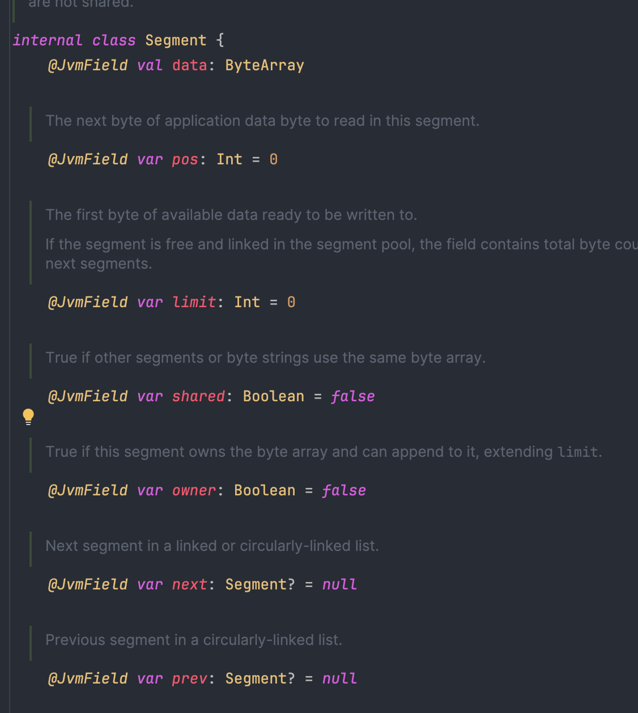
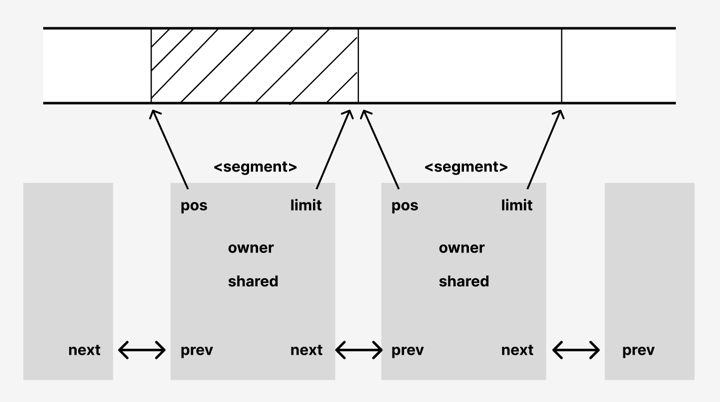
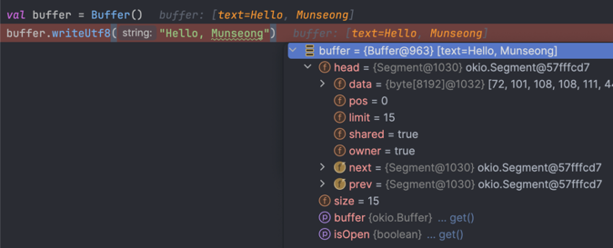
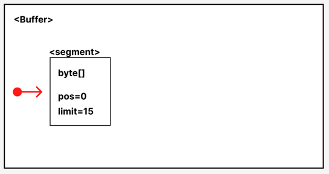
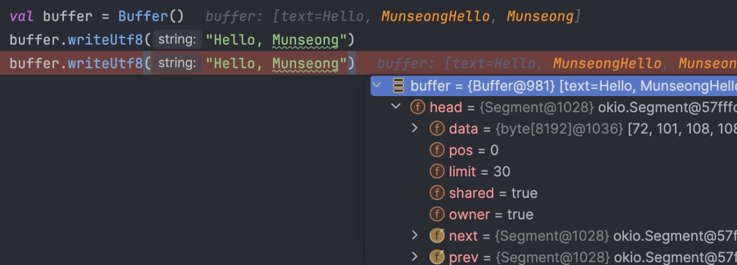
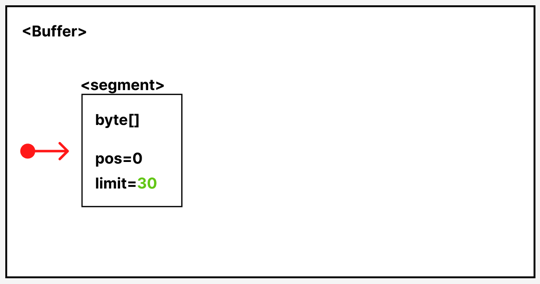
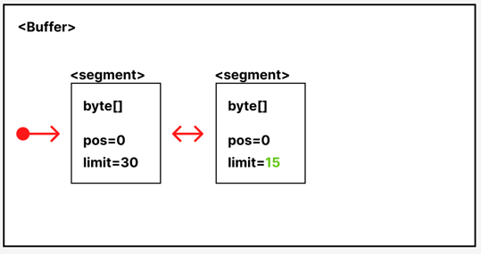
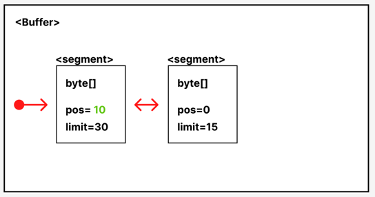
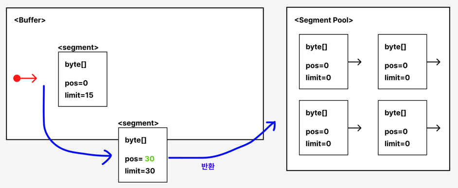
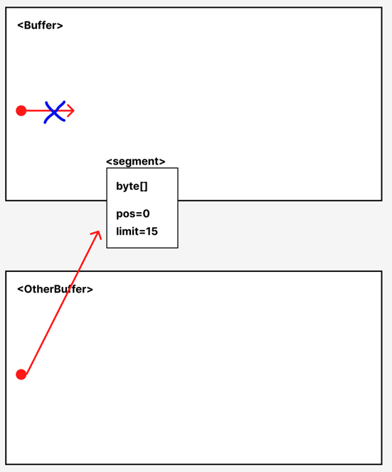

1. [개요](#개요)
2. [Okio: Source, Sink](#okio-source-sink)
3. [Okio: Buffer](#okio-buffer)
4. [Okio: Segment](#okio-segment)
   - [쓰기 동작 방식](#쓰기-동작-방식) 
   - [읽기 동작 방식](#읽기-동작-방식) 
   - [데이터 이동 방식](#복사-방식)
5. [성능 비교](#성능-비교)


## 개요

안드로이드 앱 개발시 흔하게 사용하는 네트워크
라이브러리인 [retrofit](https://github.com/square/retrofit), [okhttp](https://github.com/square/okhttp)와
serialize 라이브러리인 [moshi](https://github.com/square/moshi)는 모두 내부적으로 okio를 기반으로 IO 스트림을 처리한다.
java에는 기본적으로 파일 시스템, 네트워크 등 다양한 소스와 대상으로 데이터를 읽고 쓰는 기능을 제공하는 java.io API가 있다.
retrofit, okhttp, moshi는 모두 square사에서 제공하는 오픈 소스인데, 왜 javaIO가 아닌 자체적인 okio를 만들어서 stream을 처리했는지 알아보고, 내부 동작에 대해서 알아보자.

## Okio: Source, Sink

Okio의 [공식문서](https://square.github.io/okio/)를 보면 다음과 같이 라이브러리르 소개하고 있다.
> Okio is a library that complements java.io and java.nio to make it much easier to access, store, and process your data

java.io와 java.nio 보다 데이터를 더 효율적으로 처리하는 라이브러리라고 한다.

Okio를 사용하면 Source와 Sink라는 인터페이스를 볼수 있다. 이 두가지 인터페이스는 java.io에서 사용되는 인터페이스와 대응시킬수 있다.
Okio의 Source는 java.io의 InputStream, Sink는 OutputStream으로 보면 된다.

java.io를 사용해서 데이터를 읽을때는 InputStream을 사용하고, 이 인터페이스는 read() 메소드를 제공한다.
read는 한 바이트씩 읽기 때문에, io 호출 횟수가 많아진다.
보통 이런 구현은 비효율적이기 때문에 버퍼링을 위해 Buffered{Input, Output}Stream을 사용한 경험이 있을것이다.
Okio의 Source와 Sink는 이미 내부적으로 Buffer를 사용한다고 한다.
Okio에서 내부적으로 사용하는 Buffer가 무엇인지 알아보자.

## Okio: Buffer

Okio에서 소개하고 있는 Buffer는 java.io에서 사용하는 Buffer와는 약간 다른 개념이다.
자체적인 Buffer 인터페이스를 만들었다. 일단 java.io에서 버퍼링을 사용해서 데이터를 읽을때 예시코드를 봐보자.

```kotlin
fun copyFile(sourceFile: String, destFile: String) {  
    FileInputStream(sourceFile).use { inputStream ->  
        FileOutputStream(destFile).use { outputStream ->  
            val buffer = ByteArray(1024)  
            while (true) {  
                val length = inputStream.read(buffer)  
                if (length <= 0) break  
                outputStream.write(buffer, 0, length)  
            }
        }
    }
}
```

위는 sourceFile을 읽어서, destFile에 복사하는 작업을 하는 예시 코드이다.
위에서 보다시피 고정된 크기의 ByteArray를 사용해서 버퍼링을 하고 있다. 버퍼링을 사용한다는 것은 데이터를 쭉 읽어서 버퍼가 가득 차면 버퍼를 비우는 행위를 하는것으로 동작한다.
위에서 언급했듯이 한 바이트씩 읽지 않기 위해서 버퍼를 사용하는것이 좋지만, 다량의 데이터를 읽어야 한다면 쓰고, 비우는 작업이 계속 일어나 성능 저하의 문제가 발생할수 있다.
또한 고정된 배열을 사용하기 때문에, 데이터 양이 작다면 배열 전체가 메모리에 할당된다는 문제점도 있다.

Okio에서 말하는 Buffer는 java.io처럼 고정된 크기의 바이트배열을 사용하지 않고, 동적으로 메모리를 할당하고 데이터를 읽는 구조이다.
Okio의 Buffer는 이를 위해 Segment라는 개념을 사용하였다. Okio의 Buffer와 Segment가 핵심적인 요소라고 볼수 있다.
Okio에서 말하는 Segment가 무엇인지 좀더 자세하게 봐보자.

## Okio: Segment

okio에서 구현한 Segment의 인터페이스를 보면 다음과 같이 되어 있다.



위 코드에서 볼수 있듯이 Segment는 byteArray 버퍼를 포함하고 있고, next와 prev라는 변수가 있고 타입은 segment이다.
즉 이중 연결 리스트로 각각의 세그먼트가 연결되었다고 볼수 있다.
아래는 데이터가 있을때 세그먼트 단위로 데이터를 쪼개고, 각 세그먼트가 linked list로 연결된 것을 보여주는 그림이다.



### 쓰기 동작 방식

okio가 segment를 통해 데이터를 저장할때 실제 동작방식을 그림과 함께 이해해보자.

```kotlin
val buffer = Buffer() //okio의 buffer
buffer.writeUtf8("Hello, Munseong")
```

buffer를 생성하고 이 "Hello, Munseong"을 입력하는 코드를 작성하고 break point를 찍어서 내부를 확인해보면 다음과 같다.

 

prev와 next가 자기 자신을 참조하고 있는데, 실제로는 원형 리스트로 연결되어 있지만, 편의상 linked list로 그림을 그렸다.
현재 buffer의 상태를 그림으로 나타내면 아래의 그림이 될 것이다.



버퍼에 똑같은 데이터를 한번 더 써보자

```kotlin
val buffer = Buffer() //okio의 buffer
buffer.writeUtf8("Hello, Munseong")
buffer.writeUtf8("Hello, Munseong") // 추가
```

이번에도 break point를 찍어보고 내부를 그림으로 나타내면 아래와 같은 상태가 될것이다. segment의 byteArray의 크기가 32바이트라고 할때,
데이터를 저장하기 위한 크기가 더 남았기 때문에 같은 segment에 저장된다.

 <br>



여기서 한번 더 같은 글자를 입력하면, byteArray가 32바이트라고 가정했기 때문에 세그먼트의 byteArray에서 담을수 없게 된다.
이 경우에는 새로운 세그먼트가 만들어지고, 이전 세그먼트와 포인터를 연결해주기만 하면 된다.

```kotlin
val buffer = Buffer() //okio의 buffer
buffer.writeUtf8("Hello, Munseong")
buffer.writeUtf8("Hello, Munseong")
buffer.writeUtf8("Hello, Munseong") // 추가
```



### 읽기 동작 방식

현재 buffer의 구조에서 데이터를 읽으면 어떻게 될까? 10만큼의 길이를 읽게되면 그만큼 반환되고 pos가 10으로 반영될 것이다.

```kotlin
val buffer = Buffer() //okio의 buffer
buffer.writeUtf8("Hello, Munseong")
buffer.writeUtf8("Hello, Munseong")
buffer.writeUtf8("Hello, Munseong") 

buffer.readUtf8(10) // Hello, Mun
```



첫번째 세그먼트에 저장된 데이터를 모두 읽게되면 segment가 반환되고, 두번째 세그먼트와 연결되는 구조가 된다. 실제로는 segment는 필요할때 만들어지는 것이 아니다.
필요할때 마다 segment를 만들지 않도록 segment pool이 있어 적절하게 풀링을 할수 있다. 따라서 필요하다면 pool에서 segment를 가져오고 필요가 없어지면 pool에 반환한다.

```kotlin
val buffer = Buffer() //okio의 buffer
buffer.writeUtf8("Hello, Munseong")
buffer.writeUtf8("Hello, Munseong")
buffer.writeUtf8("Hello, Munseong") 

buffer.readUtf8(10) // Hello, Mun
buffer.readUtf8(20) // seongHello, Munseong 
```



### 복사 방식

현재 buffer에 있던 데이터를 다른 buffer로 이동하면 어떻게 될까? 여기까지 읽었다면 기존 java.io보다 구조가 복잡한것 같고,
segment의 내부는, 포인터 할당 등의 얘기도 나와서 어떤 장점이 있는것인지 궁금했을 것이다. 데이터를 이동할때 효율적으로 이동하는것을 볼수 있다.
아래 코드처럼 기존 buffer의 내용을 다른 buffer에 쓴다고 가정해보자

```kotlin
val buffer = Buffer() //okio의 buffer
buffer.writeUtf8("Hello, Munseong")
buffer.writeUtf8("Hello, Munseong")
buffer.writeUtf8("Hello, Munseong")

buffer.readUtf8(10) // Hello, Mun
buffer.readUtf8(20) // seongHello, Munseong

val otherBuffer = Buffer()
otherBuffer.writeAll(buffer)
```

글 처음에 java.io를 사용해서 파일간의 복사하는 코드를 보았을 것이다. 그 코드는 InputStream의 내용을 outputStream 쓰고 있었다.
이때 과정은 버퍼링을 위해 항상 byteArray에 데이터를 할당하였다. 이 말은 메모리로 항상 올린다는 것이다.
okio에서는 데이터의 복사 없이 이미 만들어진 세그먼트의 소유권만 넘긴다. 다른말로 하면 포인터 주소만 옮긴다는 것이다. 때문에 CPU와 메모리를 획기적으로 아낄수 있게 되었다.
아래 그림에서 보듯이 데이터가 복사되는게 아니라 포인터만 변경해 소유권만 넘긴 것이다.



## 성능 비교

okio의 동작 방식을 그림과 함께 살펴보았다. 실제 java.io를 사용할때와 okio를 사용할때 성능을 측정해보았다.
계속 살펴보았던 파일을 복사하는 코드를 java.io와 okio로 구현했을때 시간을 측정해본다. 테스트는 Macbook M2 Pro에서 진행하였다.

```kotlin

// java.io 사용
fun copyFile(sourceFile: String, destFile: String) {
    FileInputStream(sourceFile).use { inputStream ->
        FileOutputStream(destFile).use { outputStream ->
            val buffer = ByteArray(1024)
            while (true) {
                val length = inputStream.read(buffer)
                if (length <= 0) break
                outputStream.write(buffer, 0, length)
            }
        }
    }
}

//okio 사용
fun copyFileWithOkio(sourceFile: String, destFile: String) {
    val source = File(sourceFile).source().buffer()
    val sink = File(destFile).sink().buffer()

    source.use { input ->
        sink.use { output ->
            output.writeAll(input)
        }
    }
}


fun main() {
    val sourceFile = "./source_10MB.txt" // 원본 파일 경로
    val destFile = "./destination.txt" // 목적지 파일 경로
    val current = System.currentTimeMillis()
    copyFile(sourceFile, destFile)
    println("Time: ${System.currentTimeMillis() - current}ms")

    val sourceFile2 = "./source_10MB.txt" // 원본 파일 경로
    val destFile2 = "./destination2.txt" // 목적지 파일 경로
    val current2 = System.currentTimeMillis()
    copyFileWithOkio(sourceFile2, destFile2)
    println("Time: ${System.currentTimeMillis() - current2}ms")
}
```

| source 파일 사이즈 | java.io 소요 시간 | okio 소요 시간 |
|---------------|---------------|------------|
| 0.3MB         | 3ms           | 16ms       |
| 3MB           | 14ms          | 19ms       |
| 30MB          | 99ms          | 36ms       |
| 300MB         | 1093ms        | 199ms      |

0.3MB 정도의 파일을 읽고 쓰는데는 java.io가 더 좋은 성능을 보였다. 하지만 3MB가 넘어가는 파일을 측정해보면 모두 okio가 압도적으로 좋았다.
파일의 크기가 커질수록 java.io는 선형적으로 증가하는데 비해, okio에서는 적은 폭으로 소요가 되는것을 볼수 있었다.

네트워크를 사용해서 json을 주고 받으면 성능 측정을 했던 것처럼 큰 사이즈를 사용하진 않겠지만 multipart로 업로드를 한다던가, 파일을 받게 되면 okio를 사용하는것이 효율적이다. 
이런 성능 때문인지 square사의 오픈소스는 내부적으로 Okio를 사용하고 있는것으로 보인다.

## 참고

https://square.github.io/okio/

https://medium.com/@jerzy.chalupski/a-closer-look-at-the-okio-library-90336e37261

https://www.youtube.com/watch?v=WvyScM_S88c