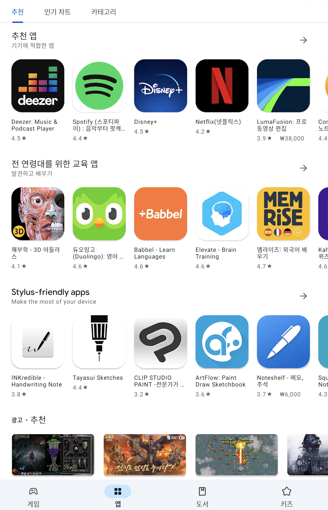
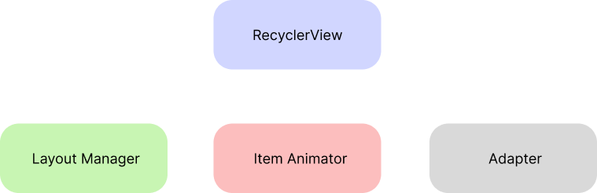
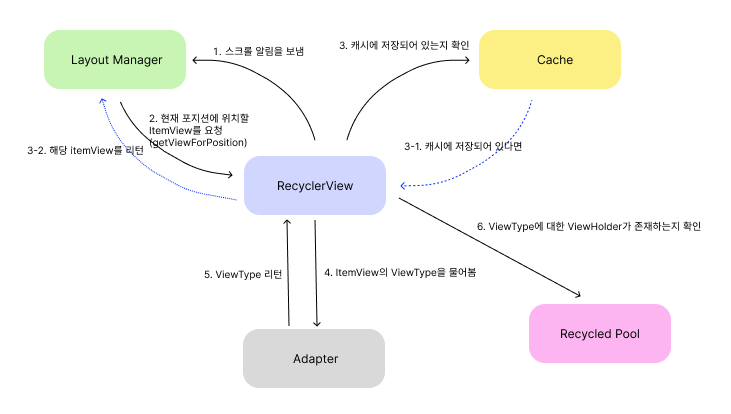
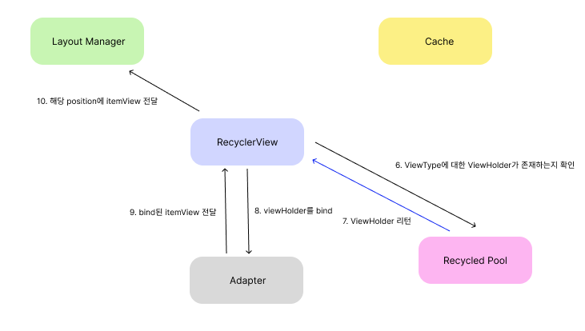
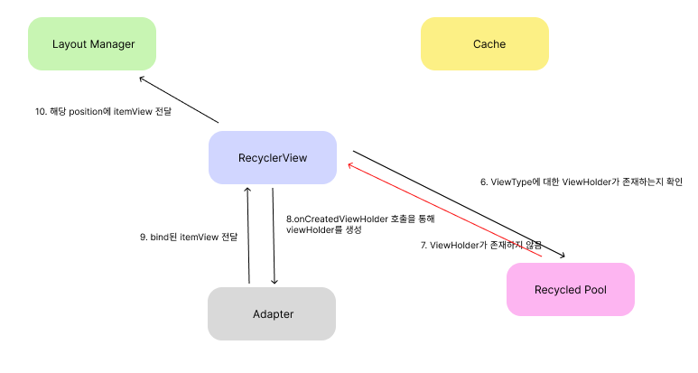
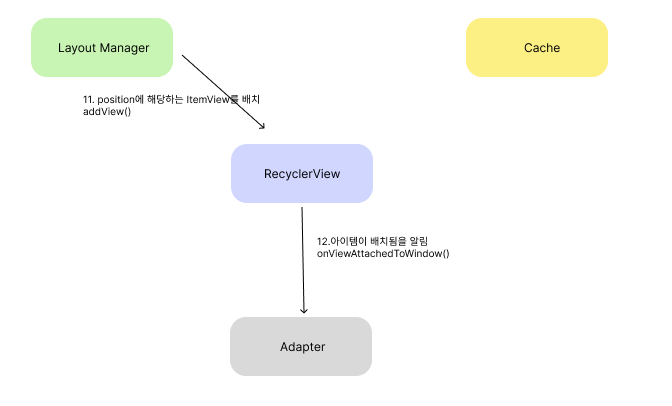
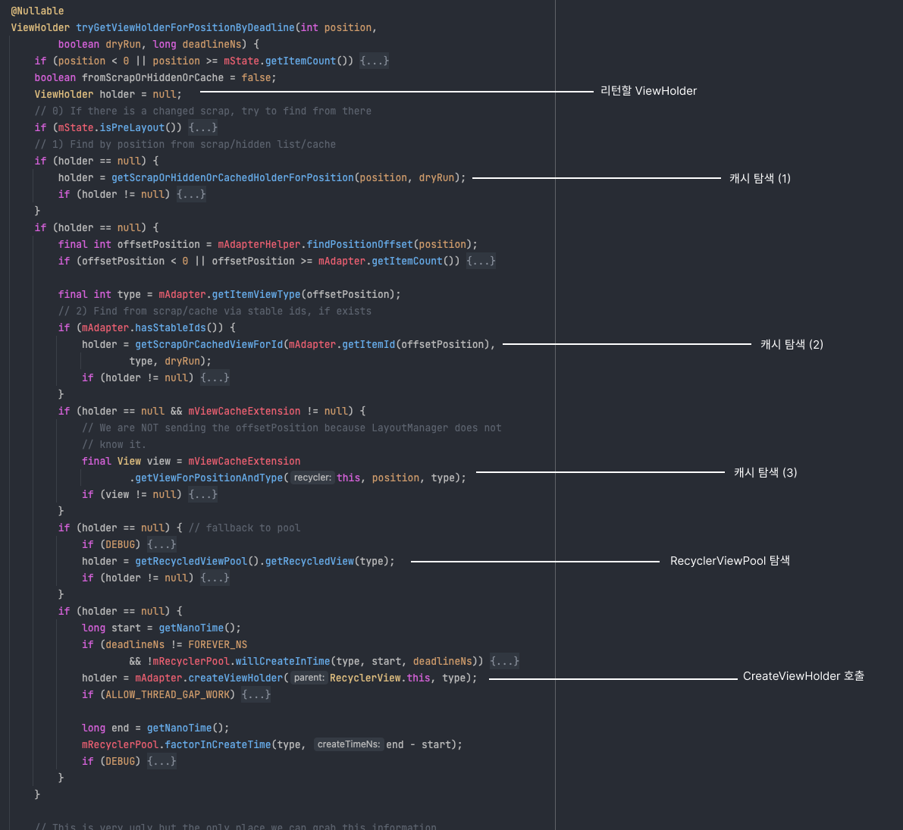
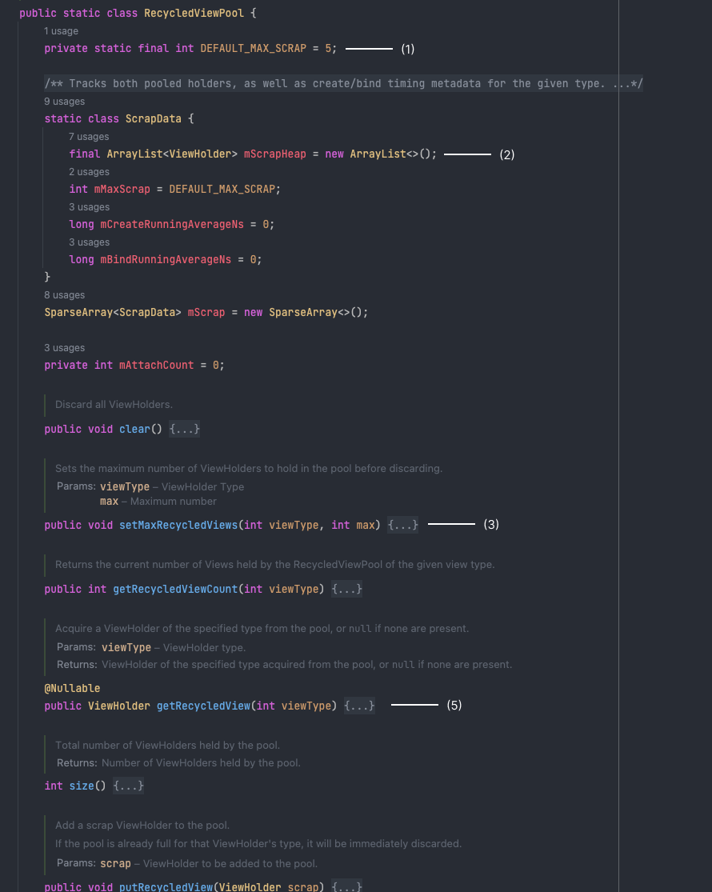
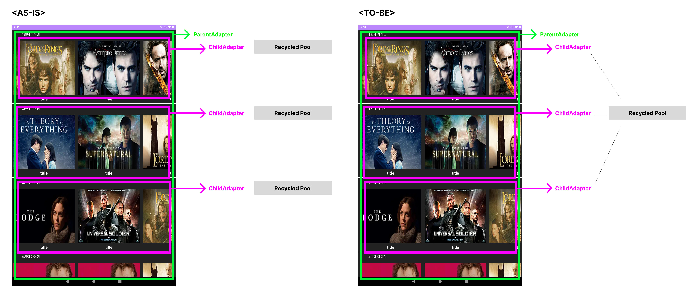

## 개요
구글 플레이, E-commerce, 넷플릭스와 같은 OTT 플랫폼뿐만 아니라 카테고리별대로 UI를 보여줄때 아래와 같이 중첩된 RecyclerView를 종종 보곤한다. 세로로 구성되어 있는 부모 RecyclerView 안에 가로의 RecyclreView가 다수 존재한다. 



최근 업무 중에 이런 화면을 구성해야 할 일이 있었다. 요구사항에 맞게 화면을 구성을 했는데 스크롤 할때 버벅거림이 있어 경험이 썩 좋지 못했다. 최적화 하기 위해 xml 뷰 구조도 최대한 덜 복잡하게 하였고, hasFixSize를 설정을 통해 리사이클러뷰가 뷰를 그릴때 requestLayout() 메소드가 덜 호출되도록 구현하였다. 그밖의 다른 부분에 있어 최적화 작업하였지만 여전히 약간의 버벅거림이 존재하였다. 이미지 라이브러리로는 glide를 사용하였는데 glide를 잘못사용했나 생각이 들어 들여다 봤지만 크게 달라지지 않았다. 이미지뷰를 제거하고 텍스트 뷰만 남겨놓고 테스트를 해봤더니 여전히 버벅거림이 존재하는 것을 발견하였다. 즉 ItemView에 구성될 UI를 그릴때가 아닌 onCreateView의 호출이 많아서 버벅거린다는 것을 알았다. recyclerView는 기본적으로 재활용이 되어서 잘 동작하는줄 알았지만 Cache나 ViewPool을 활용해서 좀더 개선할수 있는 점을 깨달았다. onCreateView의 호출을 최소화 하기 위해서 내부적으로 어떻게 캐시를 활용하는지를 학습하였고, RecyclerViewPool을 활용해서 스크롤 경험을 많이 향상시킬수 있었다. 이번 글에서는 리사이클러뷰가 내부적으로 어떻게 뷰를 호출하고 그리는지 알아보고, RecyclerViewPool을 사용하는 방법에 대해 알아보겠습니다.

## RecyclerView의 구성 요소

RecycleView가 어떤 구성 요소를 가지는지에 대해 먼저 알아보도록 하겠습니다. 안드로이드 앱에서 recyclerView 라이브러리를 사용할 때 LayoutManager, Adapter, ViewHolder 등을 구성해야 하는것을 보았을 것입니다. 왜냐하면 RecyclerView는 단일 컴포넌트가 아닌 다른 컴포넌트들과 통신을 하며 구성된 컴포넌트 기반 아키텍쳐이기 때문입니다. 어떤 컴포넌트들과 함께 이루어져 있는지는 다음과 같습니다.



- LayoutManager 
	- RecyclerView에 아이템을 표시할때, 레이아웃을 결정하는 역할을 합니다.
	- 아이템을 표시할 때 선형으로 표시한다면 LinearLayout, 격자로 표시한다면 GridLayout 등을 사용합니다.
	- RecyclerView의 아이템들을 각 화면에 적절히 배치하는 작업을 합니다. RecyclerView 자체는 자신의 어떻게 배치될지, 어떤 위치에 놓일지 모릅니다.
- Adapter 
	- RecyclerView에 표시될 데이터를 제공하고, 뷰를 생성하며, 뷰에 데이터를 바인딩하는 역할을 합니다.
	- onCreateViewHolder() 메소드는 뷰 홀더를 생성하고, onBindViewHolder() 메소드는 뷰 홀더와 데이터를 바인당합니다. 
- ViewHolder
	- Recyclerview의 아이템 뷰를 저장하는 역할을 한다. 위의 Adapter는 뷰를 생성하는것이 아니라 xml의 레아이웃이 메모리에 객체화된 뷰를 가지는 ViewHolder를 생성한다.
	- 생성된 ViewHolder를 캐시하고 필요할때 재활용하여 성능을 개선한다.

다시 정리해보자면 LayoutManager는 RecyclerView의 아이템 뷰를 어떻게 배치할 것인지, Adapter는 어떤 데이터를 표시할 것인지, ViewHolder는 어떤 뷰를 저장할 것인지를 결정하는 역할을 합니다. 세가지 구성요소 외에도 Cache나 RecyclerViewPool등의 구성요소도 가지고 있습니다.

## RecyclerView의 ViewHolder는 언제 생성될까?
위에서 언급한것 처럼 ViewHolder는 adapter에서 onCreateViewHolder가 호출될 때 생성이 됩니다. 그럼 onCreateViewHolder는 언제 호출이 되는것일까요? 또 ViewHolder를 캐시해서 재활용 한다고 했는데 어떻게 재활용을 할까요? 이 질문에 답을 하기 위해서 먼저 사용자가 데이터를 보기 위해서 스크롤을 할때 RecylerView와 내부 컴포넌트들이 어떤 상호작용을 하는지 알아봅시다.

<br>



1. 스크롤이 되면 RecyclerView는 새로운 ItemView를 보여줘야 한다고 LayoutManager에게 알립니다. (위의 설명을 보면 RecyclerView는 자신이 어디에 배치될지 모르고 이 정보를 알고 있는 것은 LayoutManager이기 때문에)
2. 스크롤 됐을때 어떤 포지션에 ItemView를 위치해야 하는지 계산하고 이 위치에 구성할 ItemView를 달라고 RecyclerView에게 요청합니다.
3. 뷰 홀더가 캐시에 저장되어 있다면 해당 뷰홀더를 LayoutManager에 리턴해줍니다.
4. 저장되어 있지 않다면 Adapter에게 해당 ItemView의 ViewType을 물어봅니다.
5. Adapter는 ViewType을 알려줍니다.
6. RecyclerView는 ViewType에 대한 VIewHolder가 RecyclerViewPool에 있는지 확인합니다.

### RecyclerViewPool에 존재할 때



7. RecyclerViewPool에서 ViewHolder를 리턴합니다.
8. Adapter에게 viewHolder에게 데이터를 바인딩하라고 합니다. (onBindViewHolder())
9. bind된 ItemView를 리턴합니다.
10. itemView를 LayoutManager에게 전달합니다.

### RecyclerViewPool에 존재하지 않을 때



7. ViewHolder가 존재하지 않다고 리턴됨
8. Adapter에게 ViewHolder를 생성을 요청합니다. (onCreatedViewHolder())
9. 데이터까지 바인딩된 itemView를 전달합니다.
10. itemView를 LayoutManager에게 전달합니다.


### 마지막



11. position에 해당하는 itemView를 배치하고 (addView()) RecyclerView에게 알려준다.
12. RecyclerView는 Adapter에게 뷰가 붙었다고 전달한다. (onViewAttachedToWindow())


LayoutManager에서 getViewForPosition()을 호출했을때 RecyclerView와 Cache, Adapter, Recycled Pool이 어떻게 ItemView를 가져오는지 알아보았습니다. RecyclerView의 getViewForPostiion()이 호출됐을때 코드를 실제로 한번 봐보자. 사실 그림에 Cache 컴포넌트가 하나만 있지만 캐싱하는 방법은 다양합니다. 일단은 캐시에서 가져온다고만 생각하고 아래 코드를 보면 위의 그림과 똑같은 로직으로 구현되어 있습니다.



지금까지 layoutManager가 ViewHolder를 리턴 받는 방법에 대해서 알아보았습니다. 실제 코드를 보면 언제 캐시하고, ViewPool에는 언제 저장하는지, adapter에 전달된 데이터가 변경될 경우 등 다양한 시나리오에 맞게 프로그래밍 되어 있습니다. 현재 글에서는 뷰가 생성되는 과정까지만 서술하고 다음 글에 이어서 써보도록 하겠습니다.

## RecyclerViewPool을 사용해야 하는 이유
위의 ViewHolder를 생성하는 과정을 봤듯이 onCreateViewHolder까지 호출되기 까지 캐시와 ViewPool을 계속 확인한다.onCreateViewHolder 까지 가서 inflated를 하는 작업은 무거운 작업이다. 따라서 캐시와 풀을 적절히 활용해서 한번 만들어 놓은 뷰에 대해서는 최대한 재활용이 많이 되도록 해야 한다. RecyclerViewPool은 내부적으로 어떻게 풀링을 하고 어떤 자료구조로 캐시를 하는지 코드를 통해 확인해보자.



- 위 코드에서 보듯이 viewType 마다 각각의 뷰 홀더 Pool을 가지고 있다. ((2)번 참고) getRecyclerdView 파라미터로 ViewType을 전달하면, ViewType에 맞는 ViewHolder를 return 해준다. ((5)번 참고))
- DEFAULT_MAX_SCRAP =5로 선언되어 있어 viewType 별로 pool의 기본 용량이 5개 이지만 ((1)번 참고), setMaxRecycledViews 메소드를 통해 viewType별 pool의 용량을 늘릴수 있다. ((3)번 참고)
- setMaxRecycledViews를 통해 pool의 개수를 조절할수 있다는것이 유연하다. 한 화면에 동일한 viewType을 가지는 아이템이 많다면 pool의 사이즈를 늘리는것이 유용하며, 한개의 화면만 있다면 capacity를 1만 주는것이 메모리 관점에서 좋다. 기본 사이즈가 5인데 그대로 놔둔다면 4개는 사용되지 않고 메모리를 낭비하기 때문이다. 
- 또한 recyclerViewPool은 getter, setter가 public이다. 즉 하나의 pool을 여러 리사이클러뷰와 같이 공유할수 있다는 점이 핵심이다. 
- 다만 주의할 점은 pool은 viewHolder들고 있고, viewHolder는 view를 들고 있으며, 마지막으로 view는 context를 들고 있다. 따라서 여러 recyclerView에 단일 pool을 공유할때 같은 context (같은 액티비티)내에 있어야 한다.

이 글의 제목처럼 RecyclerViewPool을 통해 사용자 경험을 개선할수 있던 이유는 pool을 공유했기 때문이다. 다시 말하자면 부모 RecyclerView에 자식 RecyclerView가 10개가 있을때 내부 Pool은 각각 RecyclerView마다 10개가 생성될 것이다. 하지만 자식 RecyclerView가 모두 같은 화면으로 구성되어 있다면 자식 RecyclerViewPool을 하나로 공유해도 된다고 생각하였다. 아래의 그림처럼 설명할수 잇을것 같다.



적용 방법은 아래와 같다. 부모 Adapter에서 RecycledViewPool을 생성하여 자식 Adapter들에게 붙여주면 된다.

```kotlin
class ParentAdapter(private val parentList: List<ParentItem>) :
    RecyclerView.Adapter<ParentAdapter.ParentViewHolder>() {

    val recyclerViewPool = RecyclerView.RecycledViewPool().apply {
        setMaxRecycledViews(1, 100)
    }

    override fun onCreateViewHolder(parent: ViewGroup, viewType: Int): ParentViewHolder {
        val view = LayoutInflater.from(parent.context).inflate(R.layout.parent_item, parent, false)
        return ParentViewHolder(view).apply {
            childRecyclerView.layoutManager =
                LinearLayoutManager(view.context, RecyclerView.HORIZONTAL, false).apply {
                    recycleChildrenOnDetach = true
                }
            childRecyclerView.setRecycledViewPool(recyclerViewPool)
        }
    }

    ...
```

실제 onCreateViewHolder가 호출되는 횟수를 로그로 찍어 세어보았다.
총 63개의 이미지가 그려질 때 recyclerViewPool을 사용하지 않으면 34번이 호출되었고 recyclerViewPool을 사용하면 19번이 호출되었다.
이 글에서 따로 언급하지 않았지만 recyclerChildrenOnDetach도 설정을 하면 단 7번밖에 호출되지 않았다.

### RecyclerViewPool을 적용하지 않았을 때


<br>

### RecyclerViewPool을 적용했을 때
