## RunTest
runTest는 테스트 코드를 단일 스레드에서 실행할 수 있게 해주는 함수이다.
테스트 코드에서 suspend 함수를 호출하기 위해서는 코루틴 블록에서 호출해야 한다.
Coroutine 1.6 이전 버전에서 코루틴을 테스트하기 위해서 runBlockingTest를 통해 테스트를 했었지만 1.6 이후 부터는 runBlockingTest가 Deprecated 되었기 때문에 runTest를 사용해서 코루틴 블록을 테스트 해야 한다.

RunTest를 사용하면 기본적으로 delay로 인한 지연을 자동으로 무시하게 하고, try-catch 되지 않은 Exception을 대신 처리해주는 특징을 가지고 있다.

```kotlin
@Test
fun test() = runTest {
    val currentTimeMs = Instant.now().toEpochMilli()
    delay(5000) // delay를 무시
    println("Done runTest : ${Instant.now().toEpochMilli() - currentTimeMs}ms")
}
 // Done runTest : 8ms
```

하지만 runTest 내부에서 새로운 코루틴을 생성하는 경우, delay를 스킵할 수 없게 된다.

```kotlin
@Test
fun test_withContext() = runTest {
    val currentTimeMs = Instant.now().toEpochMilli()
    withContext(Dispatchers.IO) {
        delay(5000)
    }
    println("Done runTest : ${Instant.now().toEpochMilli() - currentTimeMs}")
}
 // Done runTest : 5017ms
```

왜 이런일이 발생할까? runTest 함수를 사용하면 코루틴 블록이 TestDispatcher를 통해 테스트 스레드에서 실행된다. 일반적으로 사용하는 Dispatcher가 어느 쓰레드에서 코루틴이 실행 시킬지 결정하는 놈이라면 TestDispatcher는 테스트의 실행 순서를 제어하고 테스트에서 새 코루틴을 예약하는 데 사용된다. 위의 코드처럼 withContext를 사용해 Dispatcher를 변경하게 되면 실행 스레드가 변경하기 때문에 더이상 delay를 스킵할 수 없는것이다.

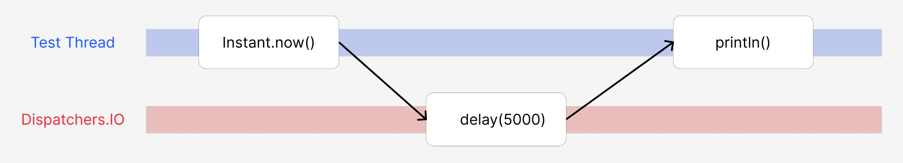

## TestDispatcher
이 내용을 바탕으로 정리하자면 테스트 코드에서 코루틴이 여러 스레드에서 실행된다면 예측 가능성이 떨어지게 된다. 코루틴의 실행 시간, 실행 순서 등을 보장받지 못하기 때문이다. TestDispatcher를 사용하게 되면 하나의 스케쥴러를 공유하고 이 스케쥴러에 대해 모든 생성된 테스트 스레드가 공유하게 된다. 따라서 병목 현상을 막을 수 있으며 실행 시간, 실행 순서에 대해 보장받게 된다. 아래 그림과 같은 구조가 된다.

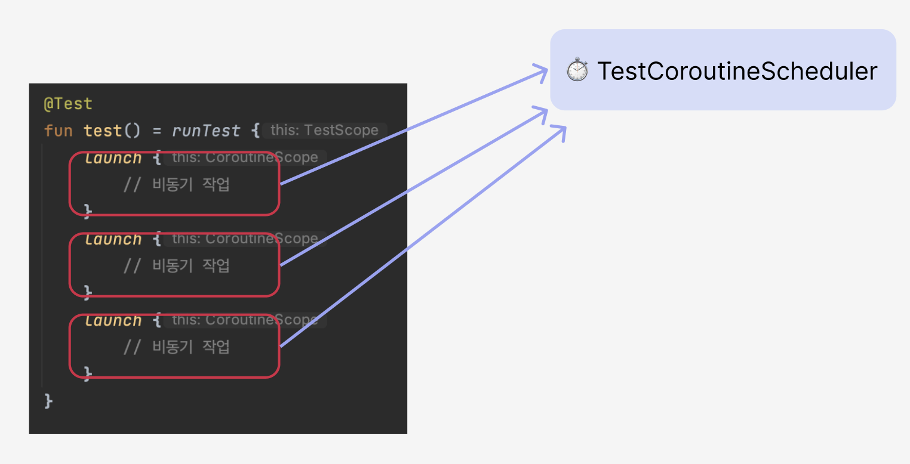

TestDispathcher의 구현에는 StandardTestDispatcher와 UnconfinedTestDispatcher로 나눠진다. 각각 어떠한 특징이 있는지 알아보자.

### [StandardTestDispatcher](https://kotlinlang.org/api/kotlinx.coroutines/kotlinx-coroutines-test/kotlinx.coroutines.test/-standard-test-dispatcher.html)
- runTest가 기본적으로 사용하는 TestDispatcher
- 코루틴이 시작되면 스케줄러의 대기열에 추가되고 테스트 스레드가 사용할수 있을 때마다 실행된다.
- 실제 환경에서 코루틴 스케쥴링과 비슷하게 맞춰 테스트하고 싶을때 사용한다.

위 특징을 이해하기 위해서 실제 테스트 코드를 보자.
```kotlin
class UserRepository() {
    val users = mutableListOf<String>()
    fun register(name: String) {
        users.add(name)
    }
}

@Test
fun StandardTestDispatcherTest() = runTest(StandardTestDispatcher()) {
    val userRepo = UserRepository()
    launch { userRepo.register("Alice") }
    launch { userRepo.register("Bob") }
    assertEquals(listOf("Alice", "Bob"), userRepo.users)
}
```

위와 같은 StandardTestDispatcher를 사용한 테스트 코드가 있을때 실행 될까요? 코루틴을 테스트하기 위해서 runTest를 사용하므로 동작하는것처럼 보인다. 하지만 결과는 실패가 된다.

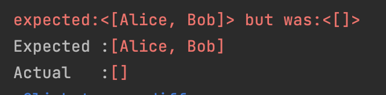

위의 특징을 보면 작업이 시작되면 스케줄러에 추가된다고 나와 있다. 테스트 스레드를 바로 사용할 수 없게 되면 대기열에 있는 상태이고 그대로 assertEquals가 호출되면서 실패하게 된다. 아래 그림처럼 스케줄러에 비동기 작업이 추가되어 있는 상태고 실행되지 않은채 테스트 코드가 종료된다.

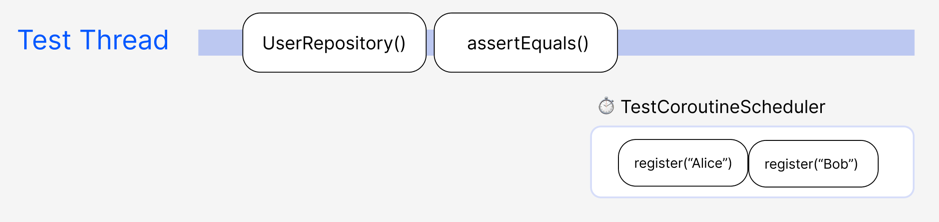

스케줄러에 있는 작업들을 실행시키기 위한 다음과 같은 api들을 제공한다.
- [advanceUntilIdle](https://kotlinlang.org/api/kotlinx.coroutines/kotlinx-coroutines-test/kotlinx.coroutines.test/-test-coroutine-scheduler/advance-until-idle.html) : 대기열에 아무것도 남지 않을 때까지 스케줄러에서 다른 모든 코루틴을 실행합니다.
  
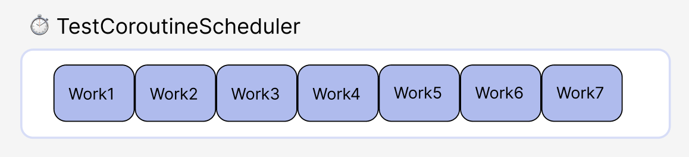

- [advanceTimeBy](https://kotlin.github.io/kotlinx.coroutines/kotlinx-coroutines-test/kotlinx.coroutines.test/-test-coroutine-scheduler/advance-time-by.html) : 주어진 시간을 진행하고 해당 지점 전에 실행되도록 예약된 코루틴을 실행.
  
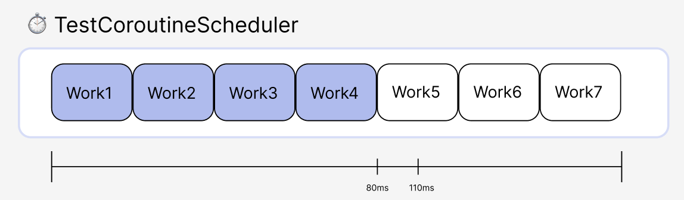

- [runCurrent](https://kotlin.github.io/kotlinx.coroutines/kotlinx-coroutines-test/kotlinx.coroutines.test/-test-coroutine-scheduler/run-current.html) : 예약된 코루틴을 실행한다.
  
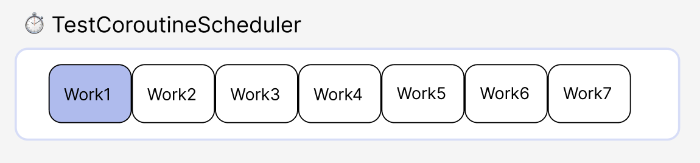

스케줄링 api를 사용해서 실행을 조절하고 통제할수 있다. 위 테스트 코드에서 assert전에 advanceUntilIdle을 사용해서 모든 작업을 실행하기를 기다린 후 테스트코드가 성공하는 것을 볼수 있다.

```kotlin
@Test
fun StandardTestDispatcherTest() = runTest(StandardTestDispatcher()) {
    val userRepo = UserRepository()
    launch { userRepo.register("Alice") }
    launch { userRepo.register("Bob") }
	  advanceUntilIdle()
    assertEquals(listOf("Alice", "Bob"), userRepo.users)
}
```

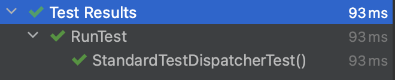


### [UnconfinedTestDispatcher](https://kotlinlang.org/api/kotlinx.coroutines/kotlinx-coroutines-test/kotlinx.coroutines.test/-unconfined-test-dispatcher.html)
- StandardTestDispatcher와 다르게 코루틴 빌더가 반환될 때까지 기다리지 않고 바로 실행한다.
- 실행 순서에 대한 완전한 제어는 불가능하기 때문에 실행 순서가 중요하지 않은 간단한 테스트에 적합하다.
- 실행 순서가 상관없기 때문에 advanceUntilIdle, runCurrent 같은 함수를 사용하지 않아도 된다.
```kotlin
@Test
fun UnconfinedTestDispatcherTest() = runTest(UnconfinedTestDispatcher()) {
    val userRepo = UserRepository()
    launch { userRepo.register("Alice") }
    launch { userRepo.register("Bob") }
    assertEquals(listOf("Alice", "Bob"), userRepo.users)
}
```
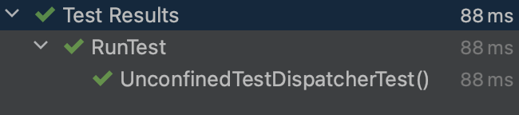

<br>
<br>

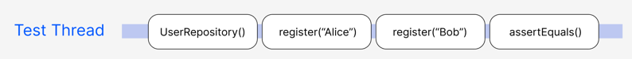

새 코루틴을 바로 실행하지만 완전히 작업이 완료될때까지 기다리는것은 아니다. 코루틴 특성상 delay 등으로 인해 일시 중지 된다면 다른 코루틴이 실행을 시작하게 된다. 아래 테스트 코드에서 alice를 등록 후 delay를 주게 되면 그대로 코루틴의 제어가 넘어가면서 assertEquals이 불리고 테스트가 실패로 이어지는 것을 볼수 있다.

```kotlin
@Test
fun UnconfinedTestDispatcherWithDelayTest() = runTest(UnconfinedTestDispatcher()) {
    val userRepo = UserRepository()
    launch {
        launch { userRepo.register("Alice") }
        delay(10)
        launch { userRepo.register("Bob") }
    }
    assertEquals(listOf("Alice", "Bob"), userRepo.users) // fails, no  items emitted
}
```
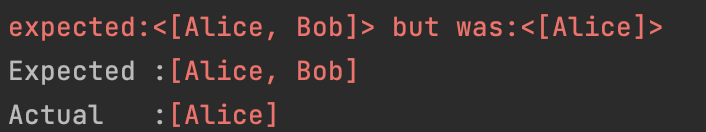


## 참고
https://developer.android.com/kotlin/coroutines/test

https://medium.com/androiddevelopers/migrating-to-the-new-coroutines-1-6-test-apis-b99f7fc47774

https://kotlinlang.org/api/kotlinx.coroutines/kotlinx-coroutines-test/kotlinx.coroutines.test/run-test.html

