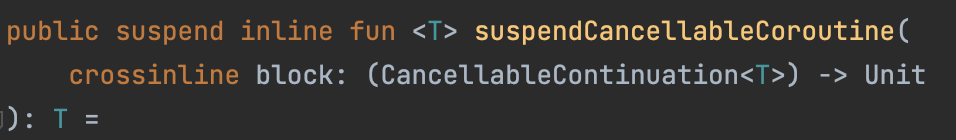

OkDownload 라이브러리 내부 코드를 볼 일이 있어 분석하던 도중 `suspendCancellableCoroutine`를 마주치게 되었다. 해당 api에 대해서 이름만 들었을뿐 정확하게 모르고 있기에 학습한 내용을 정리해본다.

SuspendCancellableCoroutine이 무엇인지 알아보기 전에 아래 코드를 봐보자.

```kotlin
class TestViewModel : ViewModel() {
    interface Result {
        fun success()
        fun failed()
    }

    private fun isValidIdPwd(id: String, password: String, callback: Result) {
        viewModelScope.launch {
            delay(500)
            callback.success()
        }
    }

    private suspend fun saveUser(id: String, password: String): Boolean {
        delay(200)
        //return userRepository.save()
        return true
    }

    suspend fun registerUser(id: String, password: String): Boolean {
        var isValid = false

        isValidIdPwd(id, password, object : Result {
                override fun success() {
                    isValid = true
                }

                override fun failed() {
                    isValid = false
                }
            },
        )

        return if (isValid) {
            saveUser(id, password)
        } else {
            false
        }
    }
}
```

registerUser는 suspend 함수이다. 로직은 다음과 같다.
1. 파라미터로 받은 아이디와 패스워드에 대해 isValidIdPwd() 함수로 유효성을 검증한다.
2. 유효성 결과를 통해 user를 저장할건지 안할건지 결정한다.

위 함수는 올바르게 동작할 수 있을까? 다들 알겠지만 당연히 아니다. isValidPwd는 비동기 함수이며 결과를 Callback으로 실행시키기 때문에 아래의 isValid는 false이다. isValidIdPwd 함수의 실행 후에 saveUser를 실행시켜야 하며, callback을 사용하지 않고 비동기 처리를 하기 위해서 우리는 코루틴의 사용을 고려해 볼 수 있다.

하지만 많은 오픈소스 라이브러리들 중 많은 api들이 callback으로 비동기 처리를 하는 모습을 볼수 있다. 네트워크, 소켓 통신 등등 대부분 요청 결과를 받기 위해서는 콜백을 interface로 제공하고 개발자가 구현체를 만들어 넘기곤 한다. callback으로 비동기 처리를 한다고 해도 코루틴을 쓰는것은 문제가 되지 않는다. 하지만 위의 예시 코드처럼 callback의 종료 시점을 기다리고 어떤 함수가 호출되기를 기대한다면 await()등을 써서 기다려야 한다.

이런 상황에 대해 좀 더 간편하게 사용할수 있도록 코루틴 api로 suspendCancellableCoroutine 제공한다. 비슷하게 suspendCoroutine도 존재한다. `suspendCoroutine`과 `suspendCancellableCoroutine`에 대한 차이를 알아보자.

```kotlin
suspend fun fetchData(): String {
    return suspendCoroutine { continuation: Continuation ->
        // 비동기 작업 처리
        val result = "data"
        continuation.resume(result)
    }
}

suspend fun fetchDataWithCancellable(): String {
    return suspendCancellableCoroutine { continuation: CancellableContination의 ->
        // 비동기 작업 처리
        val result = "data"
        continuation.resume(result)
        // 작업 취소 처리
        continuation.invokeOnCancellation {
            // 작업 취소될 때 추가적인 처리를 수행
        }
    }
}
```

suspendCancellableCoroutine 함수는 작업이 취소 될때 추가적인 처리를 수행하는 invokOnCancellation api를 제공한다. 파일 시스템을 사용하거나 resource의 해제, 소켓 close 등의 처리를 위해서 suspendCancellableCoroutine를 사용하는 것이 안정적이다.

suspendCancellableCoroutine의 함수는 아래와 같다.



<br>
block은 CancellableContination을 파라미터로 가지며 반환값이 없는 함수이다. 때문에 위에서 봤던 invokOnCancel을 사용할 수 있는 것이다. 

맨 위에 있던 예시 코드를 suspendCancellableCoroutine를 사용해서 수정하면 아래와 같이 될 것이다.

```kotlin
suspend fun registerUser(id: String, password: String): Boolean {
    suspendCancellableCoroutine { continuation ->
        isValidIdPwd(
            id, password,
            object : Result {
                override fun success() {
                    continuation.resume(Unit, null)
                }

                override fun failed() {
                    continuation.resumeWithException(Exception())
                }
            },
        )

        continuation.invokeOnCancellation {

        }
    }

    return saveUser(id, password)
}
```

registerUser 함수를 호출하면 suspendCancellableCoroutine 블록 내부의 코드가 수행된다. 단 suspendCancellableCoroutine 블록 내부는 suspend 되게 된다. 코루틴의 정지와 재개(resume)을 직접 제어할수 있도록 api가 제공된다. 블록 아래의 코드를 수행하기 위해서 resume을 호출할 수 있다. 이 때문에 callback 함수가 있더라도 동기식 코드처럼 수행할 수 있는 것이다.

콜백으로 failed가 되는 부분을 보면 resumeWithException을 볼수 있을 것이다. Continutation에서 제공되는 api로 block을 해제하고 외부로 Exception을 Throw해주는 역할을 한다. 

### 참고

https://kotlinlang.org/api/kotlinx.coroutines/kotlinx-coroutines-core/kotlinx.coroutines/suspend-cancellable-coroutine.html
https://tourspace.tistory.com/442