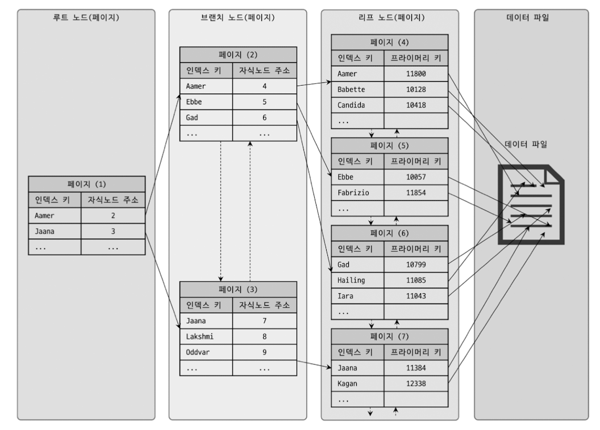

## 📚 책을 읽게 된 계기

작년 하반기부터 스프링으로 서버 개발에 투입되었다. 이후로 앱 개발과 서버 개발을 2:8 정도로 업무를 진행하고 있는것 같다. 
안드로이드 개발 시 로컬 디비를 사용할때느 SQLite를 추상화한 RoomDB를 사용하였고, 스프링 서버 개발시 JPA를 사용한다. 
결국 앱이던 서버든 객체 지향 언어를 사용해서 개발한다면 거의 필수적으로 ORM을 사용하게 된다. ORM 사용 시 자체 라이브러리와 DBMS의 인터렉션은 블랙박스이다. 
결국 ORM을 잘 사용하기 위해서는 사용하는 DBMS가 어떻게 동작하고, 어떤 방식으로 쿼리나, 성능을 향상시킬수 있는지 아는것이 필수라고 생각한다. 
팀에서는 RDB로 MySQL을 사용하고 있었고, 팀 내에서 꾸준하게 하고 있는 스터디에서도 공감대가 형성되어 이 책을 스터디하고 읽게 되었다.

## 💡새로 배운 내용

### 4장 아키텍처
- MySQL의 엔진 아키텍처와 InnoDB 스토리지 엔진 아키텍처에 대해서 알수 있다. InnoDB는 MySQL에서 대표적으로 사용되는 스토리지 엔진이다.
- InnoDB는 **테이블 기반이 아닌 레코드 기반 잠금을 제공**하기 때문에 높은 동시성 처리와 성능을 보장한다
- 쓰기 작업을 지연하고, 디스크 작업 횟수를 줄이기 위한 InnoDB의 핵심적인 **버퍼 풀**, 트랜잭션의 안정성을 보장하기 위한 **리두로그**, 트랜잭션의 일관성을 유지하고, 롤백 연산을 지원하기 위한 **언두로그** 등 InnoDB가 데이터의 일관성와 무결성을 보장하고, 성능을 보장하기 위해 어떤 설계를 했고, 어떤 메커니즘으로 구조를 설계했는지 알수 있었다.
- InnoDB의 **모든 테이블은 Primary Key 기준으로 클러스터링** 된다. PK의 순서대로 디스크에 저정되며, 세컨더리 인덱스는 레코드의 주소가 아닌 PK 값을 논리적인 주소로 사용한다 (결국 세컨더리(보조) 인덱스를 사용하게 되면 세컨더리 인덱스를 통해 PK를 확인하고, PK 통해 최종 레코드를 가져온다)

### 5장 트랜잭션과 잠금
- MySQL 엔진 잠금과, InnoDB 레벨의 잠금에 대해서 알아보았다. InnoDB의 잠금은 **레코드를 잠그는것이 아니라 인덱스를 잠그는 방식**이다. 즉 변경할 레코드를 찾기 위해서는 인덱스의 레코드가 모두 잠기게 된다(풀 스캔이 일어나는 경우 모든 인덱스에 락이 걸리게 된다) 이를 통해 스터디원들과 **데드락이 발생되는 경우**에 대해 예제를 찾고, 실습해보았다.
- 트랜잭션이 동시에 수행될 때 데이터의 일관성을 보장하기 위한 방법으로 격리 수준에 대해 살펴보았다. (READ UNCOMMITTED, READ COMMIETED, REPEATABLE READ, SERIALIZABLE)

### 8장 인덱스

- B-Tree 인덱스를 통해 데이터를 읽을 때, 인덱스 레인지 스캔, 인덱스 풀 스캔, 루스 인덱스 스캔의 특성에 대해서 알수 있었다.
- 쿼리를 충족하는데 필요한 데이터를 모두 갖고 있다면 커버링 인덱스라고 한다. **커버링 인덱스**로 처리되는 쿼리는 디스크의 레코드를 읽지 않아도 되어서 **디스크 IO를 줄이고 쿼리 향상** 시킬수 있음
- 뒷부분을 통한 검색시에는 인덱스를 사용할수 없다 (ex) %Keyword), 또한 NOT IN, NOT NULL과 같은 조건에서는 사용할수 없다.
- 인덱스를 통해 레코드 1건을 읽는것이 직접 레코드 1건을 읽는 것보다 비용이 더 많이든다. 따라서 쿼리를 옵티마이저로 예측 했을 때, 인덱스를 통해 읽어야 할 레코드 건수가 많다면 그냥 테이블을 직접 모두 읽는다.
- **다중 컬럼 인덱스를 사용하는 경우 인덱스 컬럼의 순서**가 중요하다. 적은 데이터를 조회하는 컬럼을 앞쪽에 설정하고, 범위 검색과 같이 많은 데이터를 조회하는 컬럼을 뒤에 설정하는것이 좋다.
- 유니크 인덱스인 경우 쓰기 작업을 할때 중복된 값이 있는지 체크해야 되기 때문에 세컨더리 인덱스보다 쓰기가 느리다. 중복된 값을 체크해야 된다는 뜻은 읽기 잠금을 사용해야 된다는 뜻이고, 데드락이 빈번히 발생할수 있음

### 9장 옵티마이저와 힌트
- 옵티마이저를 통해 각 쿼리가 수행할때 최적의 비용으로 처리될수 있도록 도와준다. 각 쿼리마다 **옵티마이저가 어떻게 실행 계획을 수립**하는지 자세하게 알수 있었다.
- 테이블을 조인할때 드라이빙 테이블을 어떻게 배치하느냐에 따라서 성능을 크게 향상시킬수 있다.
- 서브쿼리보다는 최대한 JOIN을 활용하자.

### 10장 실행 계획

- 옵티마이저가 항상 최적의 실행계획을 만드는것은 아니기 때문에 개발자가 직접 확인해야 될때가 있다. 이때 **EXPLAIN 명령**을 통해 옵티마이저가 수립한 실행 계획을 확인할수 있다.
- EXPALIN을 통해 실행 계획이 출력되었을대, 각 컬럼에 대한 뜻과, 결과에 대해 어떻게 해석해야할지 알수 있었다. 이를 통해 어떻게 쿼리를 최적화 해야 하는지 알수 있었다. 인덱스를 추가하거나, 쿼리를 재작성 하는 등을 통해 쿼리 성능을 향상시킬수 있다.

## 🚀 소감 및 액션아이템
- MYSQL 버전 5.x와 비교를 통해 상세한 설명을 해주고, 이해하는데 필요한 그림들이 적절하게 배치되어 한층 더 깊은 이해가 가능했다.
- 실무에서 MySQL 사용시 궁금한점이 있거나, 에로사항이 있을때 바이블처럼 옆에 두고 볼만한 책인것 같다.
- 책이 워낙 방대하고, 많은 양의 정보를 담고 있다. DB에 대한 개념이 부족했던 상태로 이 책을 읽어서 난이도가 있던 부분도 분명 있었다. 스터디가 아니였다면 이 책을 모두 읽지 못했을것 같다.
- 1회독 밖에 안해서 아직 부족한 부분이 많지만, 아키텍처라던가, 잠금, 인덱스, 옵티마이저, 실행 계획 등에 대해 굉장히 많은 부분을 배울수 있었다. 전반적인 구조나 흐름에 대해서는 알수 있었지만, n회독을 통해 좀더 깊게 이해해야 되겠다.
- 책만 읽고 적용해보지 않으면, 금방 휘발되는 지식일것 같다. 실제 개발중인 서비스가 배포되기 전에 복잡한 쿼리에 대해 EXPLAIN 명령을 통해 실행 계획을 보고 분석해보려고 한다. 이 과정이 책의 내용에 대해 복습하는 과정이 될 것이고, 좀더 깊은 이해를 하는 과정이 될것 같다.
