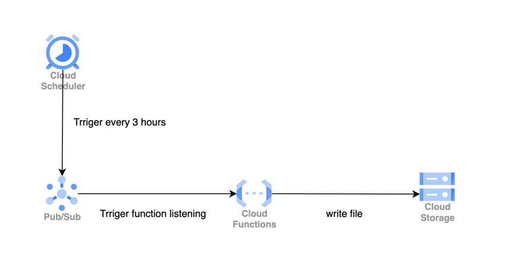
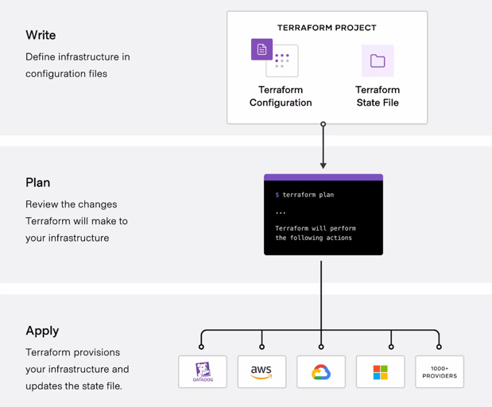
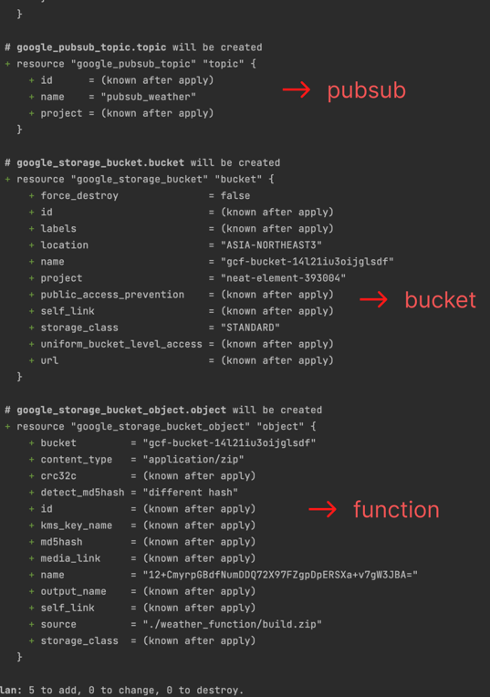
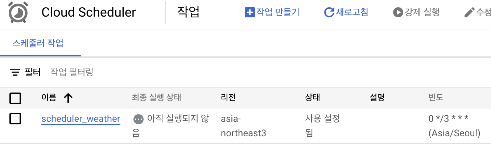
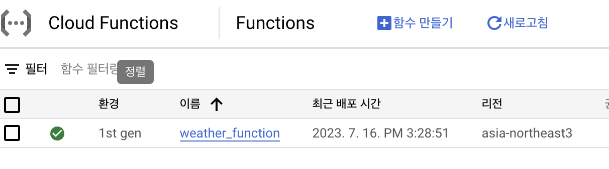
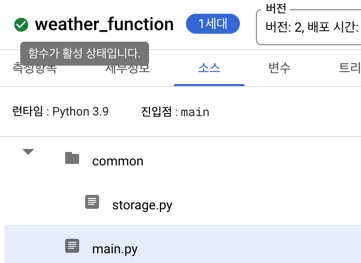

1. [테라폼이란](#테라폼이란)
2. [테라폼 파일 정의하기](#테라폼-configuraiton-파일-정의하기)
3. [공통 코드 관리하기](#공통-코드-관리하기)
4. [후기](#후기)

## 테라폼이란?

Terraform은 사람이 읽을 수 있는 구성 파일을 사용하여 클라우드,온프레미스 resource 인프라를 코드로 관리할 수 있는 도구이다.
GCP나 AWS와 같은 곳에서 서비스를 만들 때 웹 콘솔에서 마우스 클릭으로 구성을 했을 것이다. 또는 커맨드 라인 툴로 명령어를 치며 관리를 했을 것이다.
예를 들어 아래와 같은 요구사항이 있다고 하자.

`GCP 서비스를 사용해서 3시간에 한번씩 기상청의 날씨를 조회해서 cloud storage에 파일을 저장하는 인프라를 구성해 주세요.`

gcp의 리소스를 이용해서 아래와 같은 설계를 할수 있을 것이다.


위의 서비스를 구성하기 위해서 웹 콘솔에서 작업을 한다면 Scheduler를 만들고, cron식을 지정하고, pub/sub과 topic을 만들고, function도 정의하고 등등 한땀한땀 모두 마우스 클릭으로
구성해야 할것이다.
사실 위의 예제라면 terraform까지 사용할 필요는 없다. 하지만 좀더 복잡하게 서버를 구성하고, 여러 리소스를 연결시킨다면 관리의 포인트들이 더 늘어날것이고, 따로 문서를 만들지 않다면 관리하기 어려워
질것이다.

terraform을 사용한다면 선언적 코드로 리소스를 생성, 수정, 삭제를 용이하게 해준다.
테라폼 기본 동작 구조는 아래 그림과 같다. terraform 공식문서에서 사용되는 그림이며, 3단계로 요약해서 소개하고 있다.

1. **write** : configuration file에 리소스를 정의한다.
2. **plan** : 정의된 리소스들을 생성, 업데이트, 삭제하기 전에 실행 계획을 확인한다.
3. **apply** : 정의된 리소스들의 종속성을 고려하여 올바른 순서로 작업을 수행한다.



출처 - [https://developer.hashicorp.com/terraform/intro](https://developer.hashicorp.com/terraform/intro)

## 테라폼 configuraiton 파일 정의하기

terraform에서 사용하는 파일은 확장자가 tf인 파일이다. [HCL](https://github.com/hashicorp/hcl) 문법을 따르지만 json으로도 이용이 가능하다.
위의 요구사항에 따라 설계한 그림대로 리소스를 만들어 배포해보자. 폴더 구조를 먼저 보자면 아래와 같이 될것이다.
weather_function은 기상청에서 날씨를 가져올 비지니스 로직을 수행할 cloud function에 배포될 코드가 들어있다.

```xml
terraform_prac
|--weather_function // cloud function에 배포될 폴더
    |--main.py
    |--requirements.txt
|--main.tf
|--providers.tf
|--variables.tf
```

### 1. provider.tf 정의

일단 providers.tf에 gcp를 사용한다는 것을 명시해준다. gcp에서 사용하기 위해서 어떻게 정의해야
하는지는 [공식문서](https://registry.terraform.io/providers/hashicorp/google/latest/docs)에 친절하게 잘 나와 있다.
공식 문서에 나와 있는대로 아래와 같이 코드를 작성한다.

```terraform
//providers.tf
provider "google" {
  project = "my_project"
  region  = "asia-northeast3"
}
```

### 2. variables.tf 정의

terraform 코드에서 사용할 변수를 정의할 수 있다.

```terraform
//variables.tf
variable "project" {
  default = "my_project"
}
variable "region" {
  default = "asia-northeast3"
}

variable "bucket_name" {
  default = "gcf-bucket"
}
```

위와 같이 변수를 정의 했다면 1번에서의 providers코드를 아래처럼 변수화 해서 사용할 수 있다.

```terraform
//providers.tf
provider "google" {
  project = var.project
  region  = var.region
}
```

### 3. main.tf 정의

main.tf(파일명 변경 가능)에 이제 사용할 리소스를 정의해주자.
우리가 정의해야할 리소스는 4가지이다.
3시간 마다 한번씩 실행하게 도와주는 scheduler, 그리고 cloud function이 구독할 pubsub, 비지니스 로직이 실행될 cloud function, 그리고 cloud function 코드를 올릴
storage가 필요하다.

1) [Cloud Scheduler](https://registry.terraform.io/providers/hashicorp/google/latest/docs/resources/cloud_scheduler_job)

3시간에 한번씩 실행하기 위해서 schedule 필드에 다음과 같이 적어주었다. default 타임존은 UTC이기 때문에 한국으로 설정해주었다.

```terraform
resource "google_cloud_scheduler_job" "job" {
  name      = "scheduler_weather"
  schedule  = "0 */3 * * *"
  time_zone = "Asia/Seoul"

  pubsub_target {
    topic_name = google_pubsub_topic.topic.id
    data       = base64encode("test")
  }
}
```

2) [PubSub Topic](https://registry.terraform.io/providers/hashicorp/google/latest/docs/resources/pubsub_topic)

```terraform
resource "google_pubsub_topic" "topic" {
  name = "pubsub_weather"
}
```

3) [Cloud Storage](https://registry.terraform.io/providers/hashicorp/google/latest/docs/resources/storage_bucket)

cloud function을 배포하기 위해서는 소스 코드를 zip 파일로 묶어서 cloud storage에 올려야한다. 이 zip 파일을 만들기 위해서 archive_file을 사용한다.
terraform이 실행되기 전에 source_dir 필드에 적힌 weather_function 폴더를 대상으로 zip 파일로 만든다. terraform이 실행되면 bucket에 이 zip파일을 업로드 하도록
하였다.
terraform을 실행하더라도 소스코드의 변동 사항이 없다면 function이 배포되지 않도록 해야한다. 따라서 base64sha256을 name으로 두어, 변동사항이 없다면 테라폼이 실행되지 않도록 하였다.

```terraform
data "archive_file" "build" {
  source_dir  = "./weather_function"
  type        = "zip"
  output_path = "./weather_function/build.zip"
}

resource "google_storage_bucket" "bucket" {
  name     = var.bucket_name
  location = var.region
  project  = var.project
}

resource "google_storage_bucket_object" "object" {
  name         = data.archive_file.build.output_base64sha256
  content_type = "application/zip"
  bucket       = var.bucket_name
  source       = data.archive_file.build.output_path
}
```

4) [Cloud Function](https://registry.terraform.io/providers/hashicorp/google/latest/docs/resources/cloudfunctions_function.html)

cloud function 리소스도 아래오 같이 설정할 수 있다. 파이썬에서 살행하므로 runtime을 python으로 지정해주었다. 아래에서는 설정하지 않았지만 vpc, 인그레스 등등 공식문서를 참고해서 정의가
가능하다.
또한 cloud storage의 bucket와 object를 설정해주어야 한다.

```terraform
resource "google_cloudfunctions_function" "function" {
  project               = var.project
  region                = var.region
  name                  = "weather_function"
  runtime               = "python39"
  entry_point           = "main"
  source_archive_bucket = google_storage_bucket.bucket.name
  source_archive_object = google_storage_bucket_object.object.name
  available_memory_mb   = 512

  event_trigger {
    event_type = "google.pubsub.topic.publish"
    resource   = google_pubsub_topic.topic.id
  }

  depends_on = [
    google_storage_bucket_object.object
  ]
}
```

### 4. 실행

모두 정의를 하였다면 `terraform apply` 명령어를 치면 터미널에 생성될 리소스들에 대해서 쭉 보여준다.


배포가 모두 완료되고 실제 콘솔에서 확인해보면 정의된 리소스들이 모두 생성된것을 볼수 있다.



## 공통 코드 관리하기

만일 cloud function들을 하나의 레파지토리에 모두 모아서 사용할때 공통 코드를 관리하고 싶으면 어떻게 해야할까?
예를들어 폴더가 하나 더 추가되었다고 하자. 날씨를 기록하는 weather_function뿐만 아니라 코로나를 기록하는 covid_function이 있다고 치자.
두 function에서 cloud storage에 기록을 하는 로직은 똑같을 것이다. 이 코드를 따로 빼서 common 폴더에서 관리할 수 있을 것이다.

```xml
terraform_prac
|-- common
    |-- storage.py
|--weather_function
    |--main.py (common/storage.py 의존성)
    |--requirements.txt
|--covid_function
    |--main.py (common/storage.py 의존성)
    |--requirements.txt
|--main.tf
|--providers.tf
|--variables.tf
```

위에서 보자면 cloud function을 배포할 때 zip 파일로 배포한다고 했다. 또한 zip 파일로 배포하려면 archive_file을 사용한다고 하였다.
결국에 아래와 같은 구조를 가진 zip파일이 만들어지면 된다.

```xml
build.zip
|--common
    |-- storage.py
|--{name}_function
    |-- main.py
    |-- requirements.txt
```

하지만 아쉽게도 archive_file을 이용하기만 해서는 위와 같은 폴더 구조를 만들고 zip을 하기 어렵다. 최근 업무 시에 이렇게 공통 코드를 만들어서 할 작업이 있었고, 이 방법을 찾기 위해 많은 삽질을 했던
것 같다.
결과부터 말하자면 external이라는 data 리소스를 활용하였다. 다른 방법을 사용할수 있겠지만 나는 이 방법이 제일 깔끔하였다.
external을 사용하면 쉘 스크립트를 실행할수 있다. zip 파일을 만드는 쉘 스크립트를 만들어서 사용하였다.

```terraform
data "external" "build" {
  program = ["sh", "./build.sh", "weather_function"]
}
```

```shell
//build.sh

zip -rq build.zip common
mv build.zip $1
cd $1
zip -uq build.zip main.py requirements.txt

zip_file=build.zip
BUILD_HASH=$(md5 "$zip_file" | awk -F '= ' '{print $2}')
OUTPUT_PATH=$1/build.zip

jq -ncM \
  '{ "build_hash": $build_hash, "output_path": $output_path }' \
  --arg build_hash "$BUILD_HASH" \
  --arg output_path "$OUTPUT_PATH"
```

common 폴더를 zipping하고 main.py와 requirements.txt를 zipping 해주는 스크립트이다.
external은 json을 반드시 리턴해야한다. hash 값과 zip파일의 경로를 리턴해준다. 이 리턴 값을 가지고 아래 리소스에 다음과 같이 정의할수 있다.

```terraform
resource "google_storage_bucket_object" "object" {
  name         = data.external.build.result.build_hash
  content_type = "application/zip"
  bucket       = var.bucket_name
  source       = data.external.build.result.output_path
}
```

위와 같은 방식을 사용하면 공통 코드와 함께 배포가 가능하며, 새로 배포하면 우리가 배포하고자 한 구조대로 배포가 된 것을 확인할수 있다.



## 후기

위의 예제는 모듈도 사용하지 않고 최소한의 구성만 이용해서 맛만 본 예제이다.  
실제 서버를 구성하고 서버에 많은 리소스를 붙이게 되면 웹 콘솔만으로는 관리하기에는 어려울 것이다.
서버나 리소스의 수정사항이 생겼을 때 웹 콘솔을 뒤적이면서 수정을 하고, 또 그에 따른 의존성을 건들이게 될텐데 확실히 복잡해진다.
코드로 리소스를 관리한다는 점도 확실히 효율성이 올라가지만 terraform을 실행하고 나면 백업 파일이 생긴다. 즉 형상 관리를 하고 있으며 언제든지 백업이 가능하다는 뜻이다.
물런 처음 사용한다면 당연하지만 러닝커브가 존재한다. 나도 처음보는 HCL 문법에 생소하였다. 또한 기존 인프라를 import를 하는것도 러닝커브가 필요해보인다.

테라폼의 경험이 없다면 위의 예제처럼 간단한 서비스라도 배포해보면 많은 도움이 된다고 생각한다.
