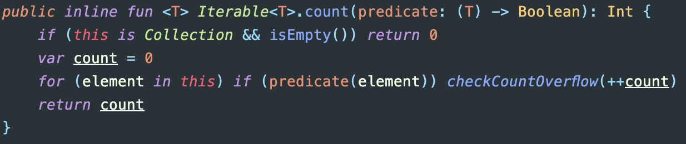
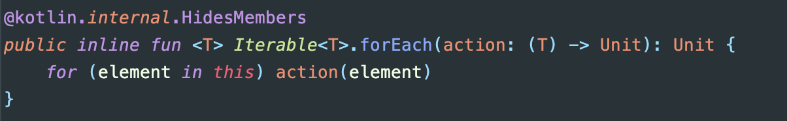
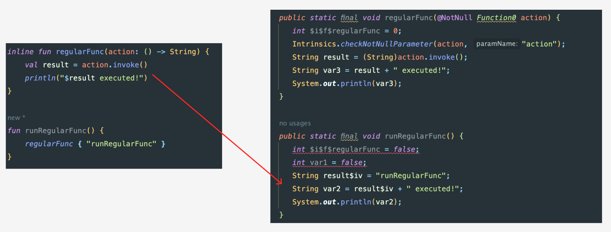
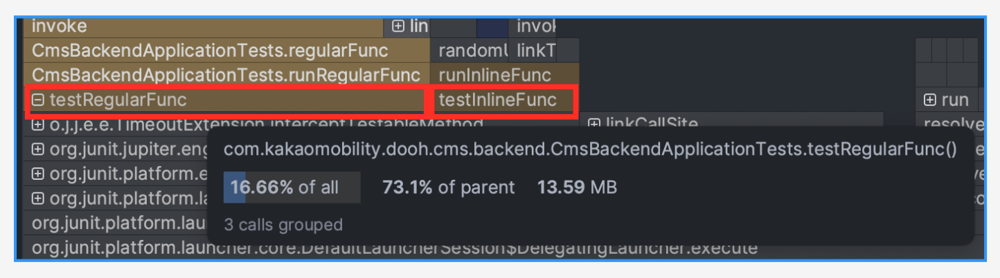
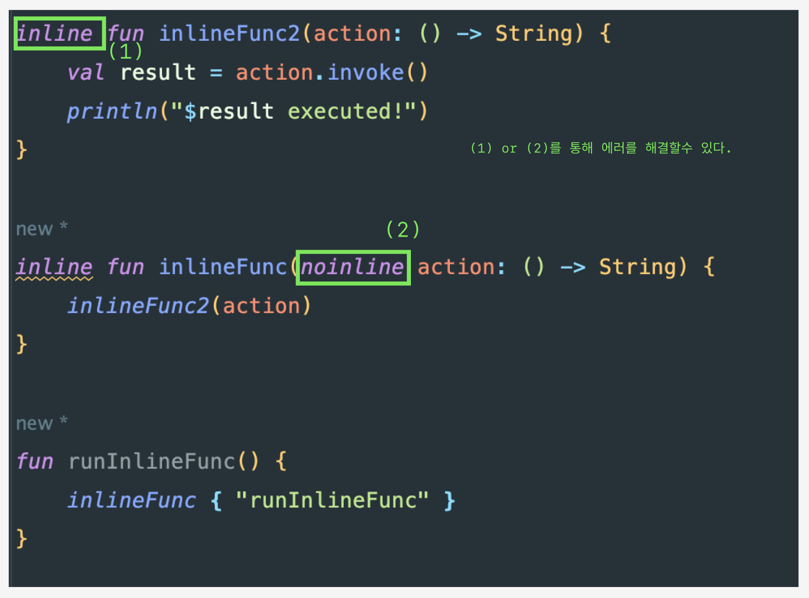
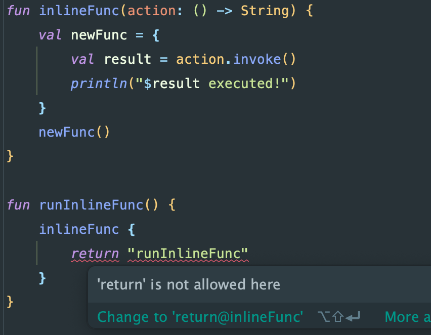
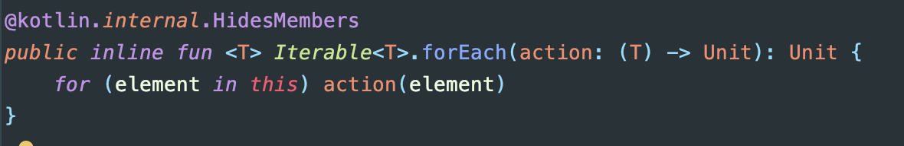
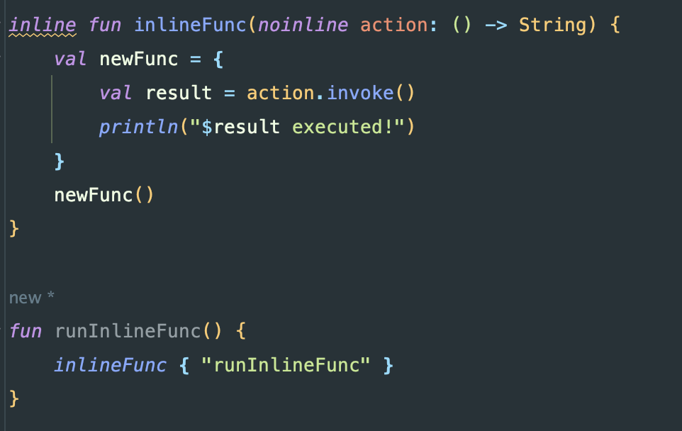
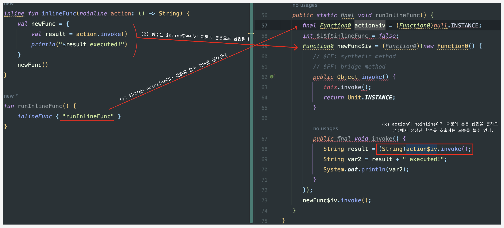
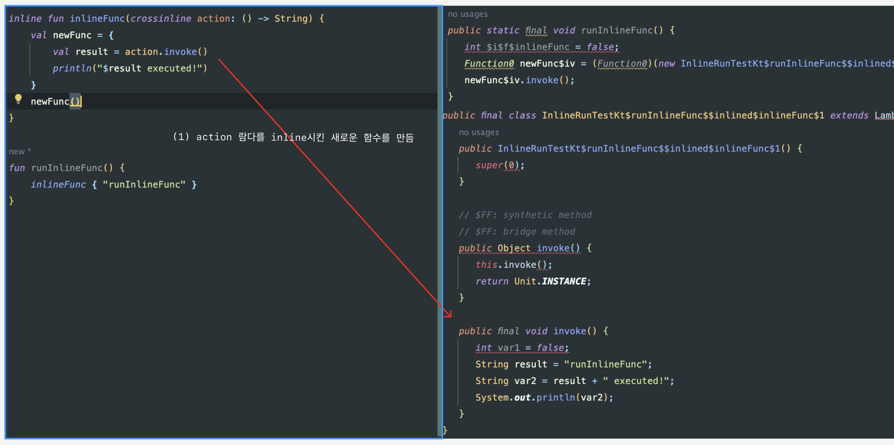

1. [Inline Function이란](#Inline-Function이란)
2. [Inline Function의 제약](#Inline-Function의-제약)
3. [CrossInline](#CrossInline)
4. [코루틴과 Inline Function](#코루틴과-Inline-Function)

## Inline Function이란

inline 키워드에 대해서는 개발을 하다보면 라이브러리 내부에서 많이 볼수 있습니다.<br>
흔하게 쓰는 collection내부에서도 사용된 함수를 많이 볼수 있습니다.



inline 함수를 알아보기 전에 아래 코드를 보겠습니다.
runRegularFunc 함수에서는 regularFunc 실행시키고, runRegularFunc 함수에서는 파라미터로 받은 action 함수를 실행시켜 print를 하는 함수입니다. 
kotlin을 사용하셨다면 눈에 들어오는 간단한 함수입니다.

```kotlin
fun regularFunc(action: () -> String) {  
	val result = action.invoke()  
	println("$result executed!")  
}  
  
fun runRegularFunc() {  
	regularFunc { "runRegularFunc" }  
}
```

이 코드를 자바로 디컴파일하게 되면 어떻게 될까요?<br>
실제 IDE에서 디컴파일을 돌려보니 아래와 같은 결과가 나왔습니다.
```java
public static final void regularFunc(@NotNull Function0 action) {  
	Intrinsics.checkNotNullParameter(action, "action");  
	String result = (String)action.invoke();  
	String var2 = result + " executed!";  
	System.out.println(var2);  
}  
  
public static final void runRegularFunc() {  
	regularFunc((Function0)null.INSTANCE);  
}
```

디컴파일 후에 약간 복잡해졌긴하지만 regularFunc은 java 문법으로 변환되었고 callingFunc에는 (Function0)null.INSTANCE이 생겼습니다. 
이 표현에 대해서는 익명함수를 런타임에 아래와 같은 형태로 익명함수를 생성한다고 이해해주면 될거 같습니다.
``` java
public final void runRegularFunc() {  
	Function0 body = (Function0)(new Function0() {  
		@Override  
		public Object invoke() {  
			return "runRegularFunc";  
		}  
	});  
	fooRegular(body);  
}
```

즉 Decompile된 결과를 보듯이, 람다(고차함수)를 사용하게 되면 매번 무명 함수 객체로 변환하게 되고, 이 경우 **메모리의 낭비와 런타임시 오버헤드가 발생**시킬 것입니다.

**고차함수를 사용할때 이런 오버헤드를 줄이기 위해서 만들이진것이 inline 함수**입니다. 
이번에도 inline 함수를 사용했을때 어떤 변화가 있는지 코드로 먼저 보도록 하겠습니다. 
함수 앞에 inline 키워드를 붙이면 inline 함수로 동작하게 됩니다.
```kotlin
inline fun inlineFunc(action: () -> String) {  
	val result = action.invoke()  
	println("$result executed!")  
}  
  
fun runInlineFunc() {  
	inlineFunc { "runInlineFunc" }  
}
```

```java
// Decompiler
public static final void inlineFunc(@NotNull Function0 action) {  
	int $i$f$inlineFunc = 0;  
	Intrinsics.checkNotNullParameter(action, "action");  
	String result = (String)action.invoke();  
	String var3 = result + " executed!";  
	System.out.println(var3);  
}  
  
public static final void runInlineFunc() {  
	int $i$f$inlineFunc = false;  
	int var1 = false;  
	String result$iv = "runInlineFunc";  
	String var2 = result$iv + " executed!";  
	System.out.println(var2);  
}
```

inline으로 함수를 정의하고 Decompile을 해보니 runInlineFunc에서 inlineFunc 호출하지 않고, **실행되어야 할 함수 본문을 직접 포함하고 있는것이 확인**됩니다. 
따라서 무명 함수를 만들 필요가 사라지게 되었습니다.



inline 함수로 실행될때는 컴파일 되는 바이트 코드의 양은 많아지지만, **함수를 호출하거나 추가적인 객체를 생성하지 않는것을 볼수 있습니다**.

inline 함수를 사용했을때와, 일반 함수를 사용했을때 실제 얼마만큼의 효율이 있는지 측정해보겠습니다.
위의 예제코드를 살짝 바꿔서, inline 함수일때와 일반 함수일때 10000번씩 호출해보도록 했습니다.
```kotlin
fun regularFunc(action: () -> String): String {  
    val result = action.invoke()  
    return "$result executed!"}  
  
fun runRegularFunc() {  
    val currentDateTime = System.currentTimeMillis()  
    for(i in 1..10000) regularFunc { UUID.randomUUID().toString() }  
    println("소요시간 : ${System.currentTimeMillis() - currentDateTime}")  
}  
  
inline fun inlineFunc(action: () -> String): String {  
    val result = action.invoke()  
    return "$result executed!"}  
  
fun runInlineFunc() {  
    val currentDateTime = System.currentTimeMillis()  
    for(i in 1..10000) inlineFunc { UUID.randomUUID().toString() }  
    println("소요시간 : ${System.currentTimeMillis() - currentDateTime}")  
}  
  
@Test  
fun testRegularFunc() {  
    runRegularFunc()  //21ms, 13.59mb
}  
  
@Test  
fun testInlineFunc() {  
    runInlineFunc()  //13ms, 5mb
}
```

regularFunc를 호출했을때는 21ms가 소요됐고, inlineFunc를 호출했을때는 13ms가 소요되었습니다. 
무명 함수를 만드는 시간 자체에서는 큰 차이가 없었습니다. 메모리 측정도 해보았는데, 테스트 하나동안 사용하는 메모리를 print로 측정하기는 어려움이 있어 
intellij에서 profile를 사용하였을때 각각 13.59mb와 5mb가 나온것을 확인하였습니다. 위 테스트만으로는 서비스 시 영향을 미칠정도의 결과는 아니겠지만, 
**inline 함수를 썼을때와 일반 함수를 사용했을때 시간,메모리상 차이는 있다는것을 확인할 수 있었습니다.**



## Inline Function의 제약

### 1. inline함수에 인자로 전달받은 함수는 다른 함수로 전달될수 없음

   말이 어려우니 이번에도 코드로 확인해보겠습니다.
```kotlin
fun inlineFunc2(action: () -> String) {  
	val result = action.invoke()  
	println("$result executed!")  
}  
  
inline fun inlineFunc(action: () -> String) {  
	inlineFunc2(action) // compile error
}  
  
fun runInlineFunc() {  
	inlineFunc { "runInlineFunc" }  
}
```
runInlineFunc는 inlineFunc를 호출하고 람다를 다시 inlineFunc2에 넘기는 코드입니다. 이 경우 주석처럼 compile error를 볼수 있습니다.<br>
`Illegal usage of inline-parameter 'action' in 'public inline fun inlineFunc(action: () -> String):`

왜 컴파일 에러가 발생할까요?<br>
inline 함수의 특징을 다시 보면 알수 있습니다. 위에 말했던것처럼 인라이닝을 통해 람다를 객체로 만들지 않고 본문에 바로 삽입시킵니다. 
따라서 **inlineFunc2에 파라미터로 넘길 action 객체가 없기 때문에 에러가 발생하게 됩니다**.

해결하기 위해서는 inlineFunc2도 inline 함수로 바꾸거나, inlineFunc의 action 객체를 inline하지 않도록 만들어줘야합니다. 
이때는 noinline을 사용하게 되는데 noinline에 대해서는 아래에서 좀더 살펴보겠습니다.



### 2. inline함수에 인자로 전달받은 함수는 다른 함수로 참조될수 없음

이번에는 inlineFunc 내부에 newFunc 람다식을 만들어서 내부에서 action을 실행하도록 하였습니다.
```kotlin
inline fun inlineFunc(action: () -> String) {  
	val func = {  
		val result = action.invoke()  // compile error
		println("$result executed!")  
	}  
	func()  
}  
  
fun runInlineFunc() {  
	inlineFunc { "runInlineFunc" }  
}
```
이번에는 1번과 다르게 이런 컴파일 에러가 발생합니다.<br>
`Can't inline 'action' here: it may contain non-local returns`

이 에러에 대해서 원인을 찾기 위해서는 no-local return과 local return에 대해서 알아야 합니다. 가볍게 짚고 넘어가겠습니다.

아래 코드를 실행시키면 어떻게 될까요?<br>
"Alice is not found"는 로그에 나오지 않게 됩니다. 즉 forEach내부의 return이 forEach의 람다를 벗어나 상위 함수를 중단시켰습니다.
```kotlin
fun lookForAlice(people: List<String>) {  
	people.forEach {  
		if (it == "Alice") {  
			println("Found!")  
			return
		}  
	}  
	println("Alice is not found")  
}  

lookForAlice2(listOf("Bob","Alice","Harry")) // Found!
```

이런 return을 non-local return이라고 합니다. local return으로 만드려면 return에 label을 붙혀 해당 label에서만 종료되도록 해야합니다.
```kotlin
fun lookForAlice2(people: List<String>) {  
	people.forEach label@{  
		if (it == "Alice") {  
			println("Found!")  
			return@label  //label 추가
		}  
	}  
	println("Alice is not found")  
}
```

코틀린의 lambda function에서는 local return을 하지 않으면 return이 허용되지 않습니다.
아래 사진처럼 람다 식에 return을 하게 되면 컴파일 에러가 나고, 위에 본것처럼 label을 붙히라고 합니다.



하지만 lookForAlice2 예제에서는 forEach 내부에서 return 하는것을 보았는데 어떻게 된걸까요?
forEach의 람다식은 inline function으로 이루어져 있기 때문입니다. (inline은 no-local return을 허용하기 때문에)



다시 말해, **inline function으로 이루어진 경우에만 non-local return을 사용할수 있습니다.**

다시 주제로 돌아가서, inline function에 인자로 전달받은 함수는 다른 함수에 쓸수 없는 이유가 무엇일까요?<br>
inline function에 인자로 전달받은 함수는 즉 non-local return입니다. 
**non-local return 식을 파라미터로 넘기게 되면 예상치 못한 함수 종료나, 런타임 오류를 발생시킬수 있다고 판단하여 kotlin에서 허용하지 않습니다**.

그럼 inline function에 전달받은 람다식은 무조건 다른 함수에 넘기지 못하고 안에서만 사용해야할까요? <br>inline으로 만들고 싶지 않으면 noinline 키워드를 붙히면 됩니다. 
noinline 키워드를 붙힘으로써 해당 함수는 action.invoke() 호출 시 에러가 발생하지 않는것을 확인할수 있습니다.



위 코드를 Decompile 하게되면 아래처럼 바뀌는 것을 확인할수 있습니다.



정리하자면 inlineFunc는 inline function이기 때문에 인자로받은 action 람다식은 non-local return식입니다. 
하지만 kotlin에서는 non-local return에 대해서 다른 함수의 인자로 전달할때 에러를 내뱉습니다. 
따라서 action을 **noinline으로 설정해주면서 inline하지 못하도록 할수 있습니다**.

Decompile한 코드를 보게 되면 결국 noinline 때문에 inline의 이점을 가져가지 못하고 함수를 생성하게 됩니다. 
위와 같은 상황에서는 무조건 noinline을 해야만 할까요? 개발자는 람다식을 다른 함수에서 호출할때 고려를 해서 noinline 키워드를 고려해야 할까요?

이런 문제점을 해결하기 위해서 **crossInline**이 나오게 되었습니다.

## CrossInline

crossInline을 붙히게 되면 no-local return을 사용하지 않는다는 뜻으로 컴파일러가 이해를 하게 됩니다.
결국 local return한다고 생각하고 inlining을 해줍니다. 말로는 헷갈릴수 있어 직접 컴파일된 결과를 보겠습니다.



noinline처럼 action을 따로 함수로 만들지 않고, inline처럼 본문에 삽입한 형태로 함수를 만들었다. 
호출하는쪽에서는 **inline으로 구성된 함수를 호출해서 사용하는 형태**로 바뀐걸 확인할수 있습니다.

## 코루틴과 Inline Function

아래 간단한 Coroutine 코드가 있습니다.<br>
test 함수를 실행시키면 BEFORE가 호출되고, 람다식이 호출되고, AFTER가 호출되는 함수입니다.
```kotlin
fun main() = runBlocking {  
	test {  
		print("Hello...")  
		delay(100)  
		println("World !")  
	}  
}  
  
suspend fun test(action: suspend () -> Unit) {  
	println("BEFORE")  
	action.invoke()  
	println("AFTER")  
}
```

이 함수에 대해서 inline 함수로 만들게 하고 싶다면 어떻게 해야할까요?<br>
test 함수를 위와 같이 바꿔주면 됩니다.
```kotlin
inline fun test(action: () -> Unit) {  
	println("BEFORE")  
	action.invoke()  
	println("AFTER")  
}
```

위와 비교해보면 suspend 키워드가 모두 빠진것을 볼수 있습니다. test이 람다식에는 delay가 있고, 
test도 delay를 포함된 함수를 호출해야 되기 때문에 당연히 suspend가 붙어야 될것으로 생각됩니다.
어떻게 suspend가 없어도 컴파일 에러가 나지 않는것일까요?

위에서 말한 inline의 특성을 이해하면 답을 풀수 있습니다. inline은 람다를 호출하는 쪽의 본문으로 삽입이 됩니다. 
즉 함수를 실행하는 컨텍스트는 test가 아니라 main 함수 입니다. 따라서 **main에는 runBlocking이 있고, delay를 호출하는 함수도 main이기 때문에 정상적으로 실행**이 됩니다.

## 후기

일을 하다보면 라이브러리를 보면 inline 키워드가 꽤 붙어있는것도 볼수 있다. 최근에 Kotlin in Action을 읽으면서도 inline에 대해서 학습을 하였지만,
헷갈리는 개념이어서 정리를 해보았다. kotlin도 결국 java 베이스이고, kotlin이 알아서 잘 해주겠지라는 생각으로 Decompile을 해본적은 거의 없던것같다. 
직접 decompile을 해가며 분석을 해보니 코틀린에 대해서도 조금이나마 잘 알게된것 같다. inline과 noinline, crossinline에 대해서 명확히 정리가 될수 있었다.

## 참고

Kotlin In Action 8장

https://kotlinlang.org/docs/inline-functions.html

https://proandroiddev.com/kotlin-under-the-hood-how-inline-functions-work-e37be021b068

https://discuss.kotlinlang.org/t/coroutines-and-crossinline/25737/2
<br>
<br>