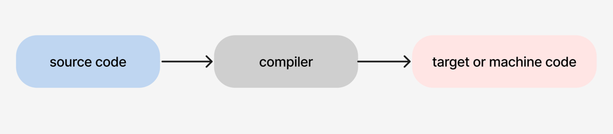
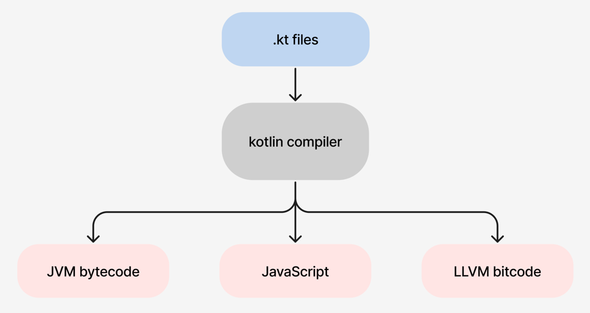
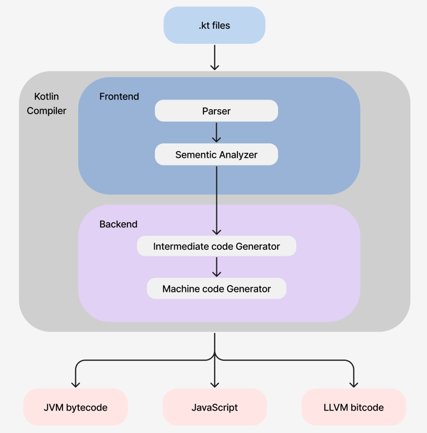
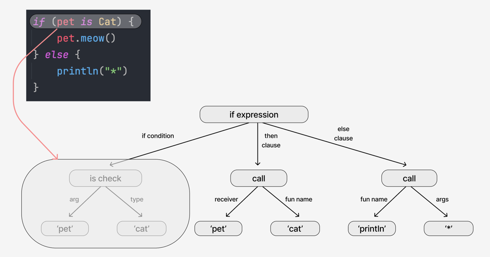
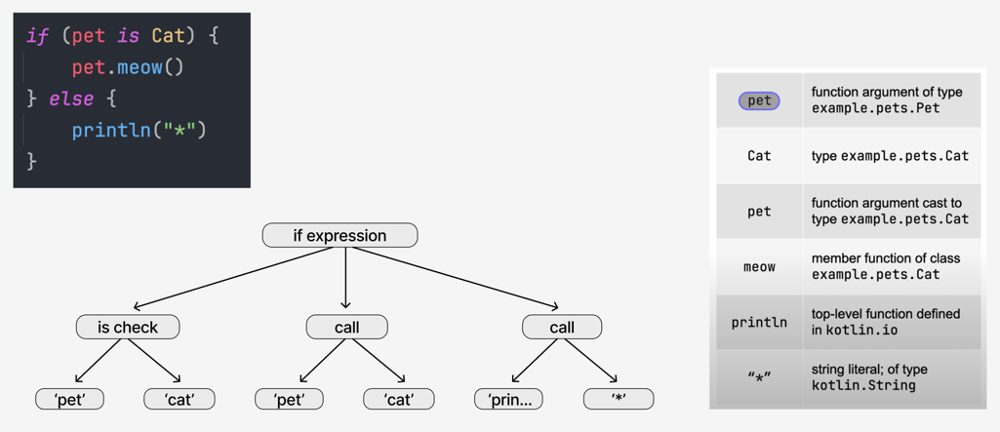
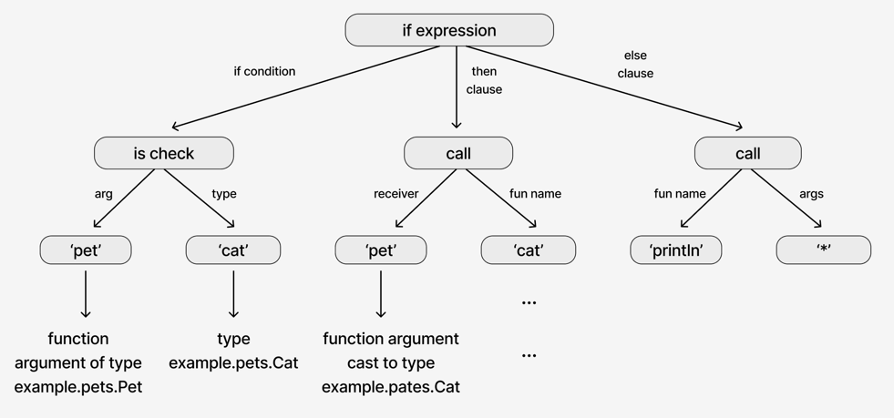
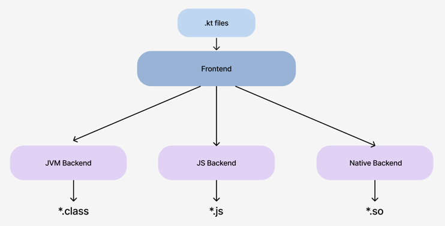
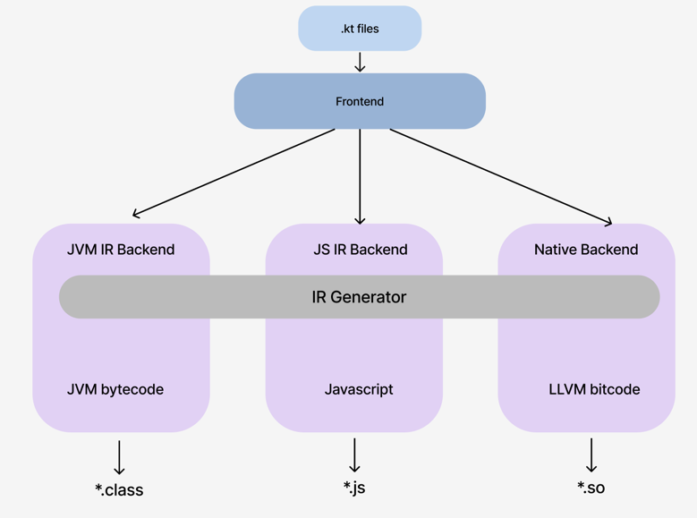
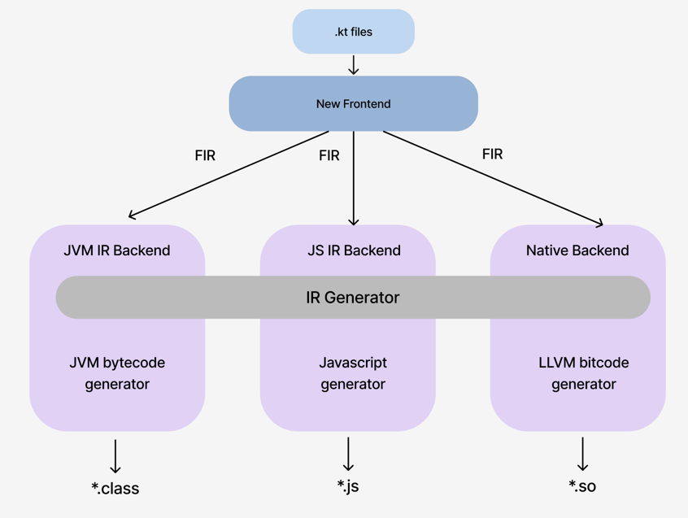

1. [Compiler란?](#1.-compiler란)
2. [Kotlin Compiler란?](#2.-kotlin-compiler란)
3. [Kotlin Compiler Frontend](#3.-kotlin-compiler-frontend)
4. [Kotiln Compiler Backend](#4.-kotlin-compiler-backend)
5. [K2 Compiler](#5.-k2-compiler)

## 1. Compiler란
kotlin compiler에 대해 알아보기 전에 Compiler에 대해 간단하게 알아보자.
간단하게 말하면 source code를 target 또는 machine code로 변환하는 역할을 한다.



- source code
    - human-readable and writeen by programmer1s
    - 함수, 클래스 및 기타 최신 언어의 모든 기능을 추상화
- machine code
    - not human-readable
    - 기계가 실행하기 위한 일련의 명령어
    - 메모리 로드, 값 저장, 프로세서에 대한 명령의 추상화
``
Compiler에 대해 간단하게 알아봤으니 Kotlin Compiler에 대해서 알아보자.

## 2. Kotlin Compiler란
말 그대로 Kotlin으로 쓰인 source code를 컴파일하는 것이다.
다만 코틀린 컴파일러는 machine code가 아닌, target code로 변환한다. 
왜냐하면 kotlin은 결국 JVM 위에서 동작하게 되기 때문에, jvm 위에서 동작할 수 있는 바이트 코드로 변환되어야 한다.
사실 코틀린 컴파일러는 JVM 위에서 동작하는 바이트코드만 생성하는게 아니라, 멀티플랫폼을 지원하는 언어이기 때문에 js와 native도 지원한다. 



위의 그림을 보면 코틀린 컴파일러가 되게 많은 일을 하고, 블랙박스처럼 보인다.
코틀린 컴파일러를 한번 더 자세히 들여다보면, 아래 그림처럼 역할에 따라 Frontend와 backend로 구성되어 있다.

<그림1>

Frontend와 Backend에서 무슨 일을 하는지 알아보자.

## 3. Kotlin Compiler Frontend
Frontend는 다음과 같은 역할을 수행한다
- 소스코드의 구문, 어휘, 의미를 분석한다
- 즉 프로그램 코드의 유효성을 검사한다 (오타가 생기거나 괄호가 누락되면 에러를 내뱉는다)
- backend에서 바이트코드를 생성하기 위해 syntax tree와 semantic info를 생성한다

코틀린 컴파일러 초기의 Old Frontend와 개선된 New Frontend 버전이 있다.
위 <그림1>에서 Frontend 영역의 Parser와 Semetic Analyzer은 무엇이고, New Frontend에서는 어떤게 개선되었는지 정리해보자. 

### 3.1 Old Frontend
#### Parser
소스 코드의 유효성을 체크하고, 문법이 맞으면 구문트리를 빌드한다
```kotlin
if (pet is Cat) {
  pet.meow()
} else {
  println("*")
}
```
- 위와 같은 코드가 있을때, 다음과 같은 구문 트리를 만들어낸다. 이러한 구문 트리를 PSI(Program structure interface)라고 부른다
- 문법에 따라 구조만 생성하고, 의미는 부여하지 않는다



#### Sementic Analyzer
의미를 확인하고, 올바르게 함수가 호출되는지 확인한다.
- 아래 코드처럼 파라미터의 개수가 안맞거나, 참조할수 없는 함수를 참조하는 등에서 발생
```
if (pet is Cat) {
  pet.meow(1) // Error: Too many arguments
} else {
  pet.mmeow() // Error: Unresolved reference
}
```
- 함수, 변수, 타입에 대한 세부 정보에 대한 답을 찾는다
- 타입을 추론한다
- 모든 노드에 대한 정보를 찾아, 의미를 추가한다.
- 각 노드에 대한 의미는 맵(Binding Context)에 저장된다
- 아래 그림처럼 생성된 Syntax tree와 Sementic Info(=binding context)를 백엔드에 넘겨준다



지금까지 Old Frontend에서 어떻게 동작하는지 확인하였다. New Frontend는 기존의 Old Frontend에서 무엇이 개선되었는지 확인해보자.

### 3.2 New Frontend
- parser와 sementic analyzer를 사용하는것은 동일하다.
- binding context에서 차이점이 있다
- binding context는 의미를 담기 위한 별도의 데이터 구조이다.
- New Frontend에서는 맵에 저장하지 않고, 의미 정보가 트리에 직접 저장된다. 이 구조는 **FIR(Frontend Intermediate Representation)**이라고 부른다
- 정리하자면 Old는 트리와 맵인 두개의 데이터 구조를 생성한다면, New는 하나의 데이터 구조를 생성하게끔해서 성능 향상을 시킨다
- Kotlin 
  


### 3.3 Desugaring
New Frontend에서의 FIR은 디슈가링(안드로이드에서 호환성을 위해 일컫는 Desugaring이랑은 다름)을 지원한다.
디슈가링이란 복잡한 언어 구문을 단순화하고 더 간단한 구문으로 대체하는 것이다.
dusugarging의 예시로는 아래와 같은 것들이 있다.
- operators desugaring
  - 코틀린에서는 연산자(+, +=, in, .. 등)를 명시적인 함수 호출로 변환한다. 
  - 예를 들어, `a + b`는 `a.plus(b)`로 변환된다.
- 구조 분해 선언 desugaring
  - 구조 분해 선언은 풀어서 선언된다. 
  - 예를 들어, `val (a, b) = pair`는 `val a = pair.component1(); val b = pair.component2()`로 변환된다.
- for문 Desugaring
  - iterator' 규약을 사용하는 for문은 while문으로 대체된다. 
  - 예를 들어, `for (item in collection)`은 `val it = collection.iterator(); while (it.hasNext()) { val item = it.next() }`로 변환된다.
- data class에 대한 메서드 생성
  - 데이터 클래스는 자동으로 `equals()`, `hashCode()`, `toString()` 등의 메서드를 생성한다. 이러한 메서드 선언은 컴파일 과정에서 추가된다.
- 등등

## 4. Kotlin Compiler Backend
Backend는 frontend의 결과를 입력으로 취해서 다양한 대상으로 바이트코드를 생성한다. 
이번에도 Old kotlin complier와 개선된 New kotlin compiler로 나뉜다.

### 4.1 Old Backend


- 위 그림에서 보듯이 frontend의 구문트리와 의미 정보를 변환하는 세 가지 다른 백엔드가 존재한다
- 초기에는 jvm backend와 js backend만 존재했지만, 이후 native backend가 등장하였다
- 각 backend에서 공통적으로 쓰이는 로직이나, 추상화를 할 필요를 느끼게 되었다

### 4.2 New Backend
- IR(intermediate representation) Generator을 중간에 두어서 다른 백엔드 간에 로직을 공유하도록 하였다
- 즉 Old에서 New로 이동한 이유는 성능 향상이 주된 목적이 아니었다.
- IR backend가 도입된 컴파일러는 JVM은 버전 1.5부터, JS는 버전 1.6부터 stable해졌다.



## 5. K2 Compiler
위에서 봤던 New Frontend 구조와 New backend 구조를 합치면 아래 그림이 된다.  
kotlin 2.0 부터 stable하게 도입될 예정이다. 
현재는 kotlin beta로 2.0이 운용되고 있고, 계속해서 안정화 중이라고 한다.
New Frontend가 도입되면 기존보다 약 두배정도의 성능이 향상될 것이라고 한다.



## 참고

https://blog.jetbrains.com/ko/kotlin/2022/02/the-road-to-the-k2-compiler/

https://www.youtube.com/watch?v=iTdJJq_LyoY

https://proandroiddev.com/lets-talk-about-kotlin-k2-3e1c6f10d74

https://kotlinlang.org/docs/whatsnew-eap.html#kotlin-k2-compiler


