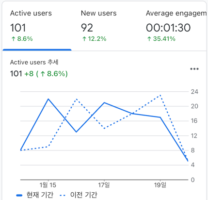
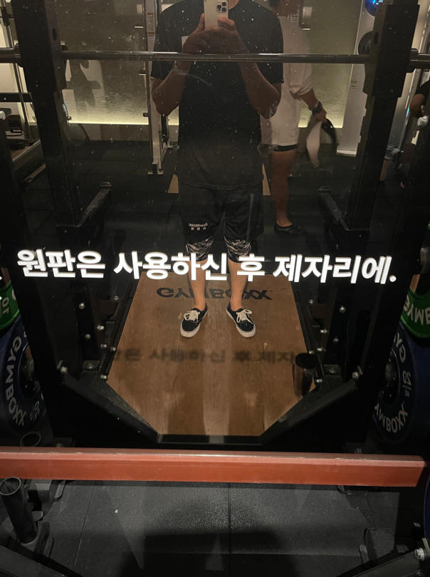
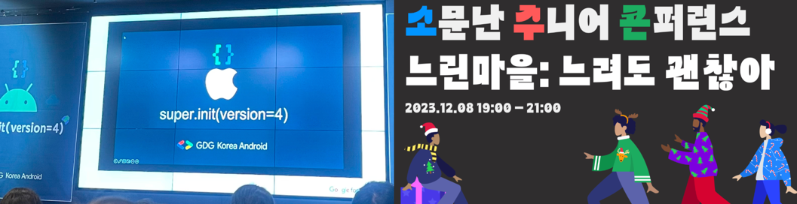
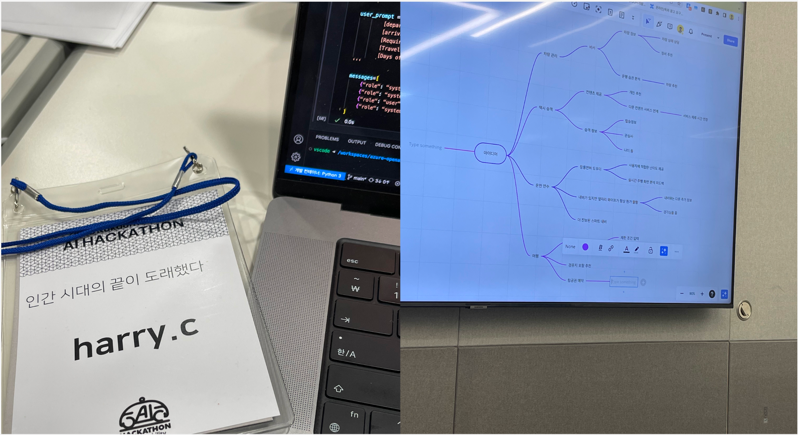
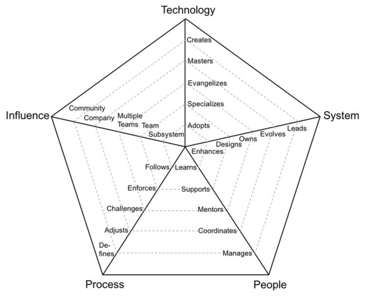

## 블로그
처음 블로그를 만들었던건 21년도였던거 같다. 열정을 가지고 내 브랜딩이라는 생각으로 도메인도 사고, 템플릿을 이용해 나의 블로그를 만들었다. 
하지만 바쁘다는 핑계로 방치해두다가 23년부터 다시 시작하였다. 1년이 지난 지금 약 10개 정도의 글이 포스팅 되었다. 블로깅을 놓지 않고 꾸준히 했다는거에 의의를 둔다. 
예전에는 글을 쓰는것 자체가 되게 무겁게 느껴지고, 큰 일이라고 생각했는데 지금은 글을 쓰는거에 대한 두려움 정도는 사라진 것 같다. 이 때문인지 회사 위키에도 업무 중 배운 내용에 대해 자연스레 정리하곤 했다. 
문서화를 함으로써 논리적인 문장을 완성시키기 위해 스스로에게 왜?라는 질문을 계속 던진다. 이 과정속에서 문장을 완성 시키기 위해 좀더 깊게 찾아보고 완성시킴으로써 성장한다는 느낌이 참 좋은것 같다.

처음엔 블로그에 방문자가 많아야 5명 정도였는데, 최근에는 하루에 20명 정도는 들어오는것 같다. 
이 수치가 중요하진 않지만, 글을 쓰는거에 책임감이 들고, 좀더 양질의 글을 작성해야 겠다는 생각이 든다. 
최근 팀내에서 "어떻게 하면 글을 좀더 잘쓸수 있을까"를 공감대로 새로운 스터디를 시작하였다. 
문서화에 대한 책을 읽어봐야겠다는 생각은 들었지만, 쉽게 손이 가진 않았다. 
[기술 문서 작성 가이드](https://product.kyobobook.co.kr/detail/S000201419245)라는 책으로 시작했는데, 아직 초반부 밖에 읽지 않았지만 내용이 괜찮은것 같다.

## 운동

22년 대비 23년에 또 시작한게 있다면 운동이다. 좋지 않은 식습관과 좋지 않은 자세 때문인지 살도 찌는거 같고, 건강이 안좋아짐을 조금씩 느끼고 있었다. 
언젠가 신체 무료 구독기간?이었나 이런말을 들었는데, 20살 후반부터 운동하지 않으면 30대가 돼서 보증기간 끝나서 병원에 돈을 내야된다는 말이었다. 
무튼.. 관리를 해야겠다는 생각에 5월부터 PT를 끊고 운동을 시작하였다. 워낙 헬스를 안했던터라 운동을 할수록 인바디가 좋게 찍히는것을 보고 뿌듯하였다. 
PT가 끝나고 집 근처로 헬스장을 옮겨서 지금까지 꾸준히 하고 있다. 날이 추워지면서 헬스장가는 빈도가 좀 줄긴했지만 그래도 꾸준히 하는거에 감사하다. 
루틴한 일상중에 운동이 들어가게 되었고, 식습관도 맞추려고 노력하다보니 삶의 질이 향상되었다고 느낀다.

## 세미나/스터디

예전부터 컨퍼런스에 참여하고 싶다는 생각은 있었지만, 코로나와 시간이 안맞아서 잘 참여하진 못했다. 
올해는 상반기에 한번, 하반기에 한번정도 참여하였다. 상반기엔 GDG Korea Android 행사에 참여하였다. 하반기엔 소주콘이라는 행사에 참여하였다. 
기술적인 얘기와, 개발자 분들의 커리어나 번아웃 극복 사례들을 들으면서 동기부여를 얻었다.

회사 팀내에서 꾸준히 하고 있는 스터디가 있다. 성장하고 싶다는 욕구하나로 비슷한 연차의 동료들과 모여 주제를 선정하고, 책을 읽고, 액션 아이템을 적용해본다. 23년에는 아래와 같은 책들을 스터디했다.
1. 객체지향의 사실과 오해
2. 오브젝트
3. 테스트 주도 개발 시작하기
4. Spring Boot Up & Running
5. Kotlin In Action
6. Real MySQL 8.0 1권
   일을 통해 경험으로 느낀 지식이 아니라, 경험을 토대로 책을 차근차근 읽으니, 좀더 단단한 지식이 되는것 같다. 꾸준히 스터디를 이어가고 있음에 감사하다.

생각해보니 회사에서 AI 해커톤도 참여하였다. AI 직무에 종사하지 않더라도 AI가 삶에 다가오면서 항상 팀원 분들과 점심을 먹거나 하면 자주 나오는 주제다. 
프롬프트를 어떻게 잘 쓰고 활용할수 있을까 생각하는 찰나에 회사에서 해커톤을 열어서 참여하게 되었다. 
회사의 서비스 개선을 위한 해커톤이었는데 프롬프트 교육도 받고 Azure API도 사용해보고 좋은 경험이었다.

## 커리어

21년 말에 현재 회사로 합류하며 신규 프로젝트를 진행하였다. 22년에 오픈을 하고, 23년 3분기까지는 계속 유지보수와, 새로운 피쳐를 개발하였다. 
새로운 앱은 어느정도 안전 궤도에 올라갔고, 새로운 프로젝트에 대한 소식이 들려왔다.

팀 내에선 서버 개발자에 대한 리소스가 부족한 상황이었다. 스스로도 좋은 기회라고 생각해서 말씀드렸고 현재는 서버 개발에 좀더 치중해서 일을 하고 있다. 현재는 서버와 안드로이드를 8:2정도로 일을 하고 있는것 같다.
팀 리소스 때문의 고려도 있었겠지만, 자발적으로 시작한만큼 나로 인해서 일이 늘어지는 상황은 없게하고 싶었다.
새로운 것을 도전해는거에 대한 열정은 있었지만, 그만큼 부담감과 책임감도 다 같이 공존했다. 
설계가 필요한 부분이나 막히는 부분에 대해서는 기존 서버 개발자분 또는 시니어 개발자분들과 소통하며 진행하였다. 
어느덧 프로젝트 중반을 향해 가고 있는데 다행스럽게?도 잘 진행되는것 같다. 무엇보다 재미있게 하고 있음에 감사하다.

예전에는 기술 스택을 변경하는것에 대한 두려움이 있었다. 그때는 1~2년차 이기도 했었고 깊게 아는것이 중요하다고 생각햇었다. 
다른 분들을 보고 배우며 그게 그렇게 중요하진 않는다고 깨달았다. 일을 하다보니 사람마다 성향이 다르겠지만 나는 적절한 기술을 사용해서 제품을 만드는게 더 재밌다고 느낀다. 
그래서인지 직무를 변경하는데 있어서 긍정적이었다.

회사에선 매년 성과평가를 한다. 평가는 그럭저럭 나쁘지 않았다. 전반적으로 기대만큼 잘 하고 있다는 평가였다. 
주도성을 가지고 프로젝트를 하려고 했고, 좀더 필요한 사람이 되기 위해서 노력했던것 같다. 
다만 팀적으로도, 개인적으로도 4년차 개발자의 기대 이상이 되려면 어떻게 해야할까는 물음표였다.
이 물음을 가지고 찾다보니 [엔지니어링 래더](https://wonderer80.github.io/engineeringladders/)를 보게되었다. 이 지표가 절대적인 지표는 아니겠지만 어느정도 베이스라인으로 생각해 적용해보았다. 
수치화해보면서 Process나 People에 대한 영역은 부족하다고 생각하였다. 기술과 아키텍처에 대한 고민은 항상 하였지만, 사람을 어떻게 매니징하고 독려하는지에 대한 생각은 잘 안했던것 같다.
만약 '신입 개발자분이 오신다면 그분의 커리적인 성장에 영향을 미칠수 있을까'라는 생각이 들었다.

24년이 시작되면서 5년차 개발자로 들어섰다. 
언제까지 N년차 주니어로서 남지 않으려면 사람을 대하는 소프트적인 측면도 생각해봐야 될것 같다.

## KPT

### Keep

- 블로그를 꾸준하게 하고 있다
- 운동을 시작하고 현재까지 꾸준히 하고 있다
- 업무가 변경되었음에도 재미있게, 열정을 가지고 하고 있다. 개발이 재밌다.
- 꾸준하게 스터디를 잘 유지하고 있다
- 노트 앱을 Obsidian으로 정착했는데, 기록하는 습관이 잡혀가고 있는것 같다

### Problem

- MBTI가 J라 그런지 계획 세우는건 좋아하지만, 실천을 잘 못할때가 많다. 시간 관리를 좀더 잘 해야겠다
- 개발 책 이외에는 잘 읽지 못했다
- 개발 외에 주식, 경제에 대해서 공부를 하지 못했다
- 여러 개발자분들과 커피챗 할수 있는 환경임에도 적극적으로 하지 못했다

### Try

- 개발자로서 코딩 외에 개발 프로세서, 매니징 등에 대해서도 관심을 가져보자
- 다른 개발자 분들도 만나보면서 시야를 키우자
- 제품을 개발하는 것 외에 비지니스에도 관심을 가지고 이해력을 키워보자
- 성장에 있어 조급하게 생각하지 말자. 무엇이든 꾸준하게 할수 있도록 하자.
