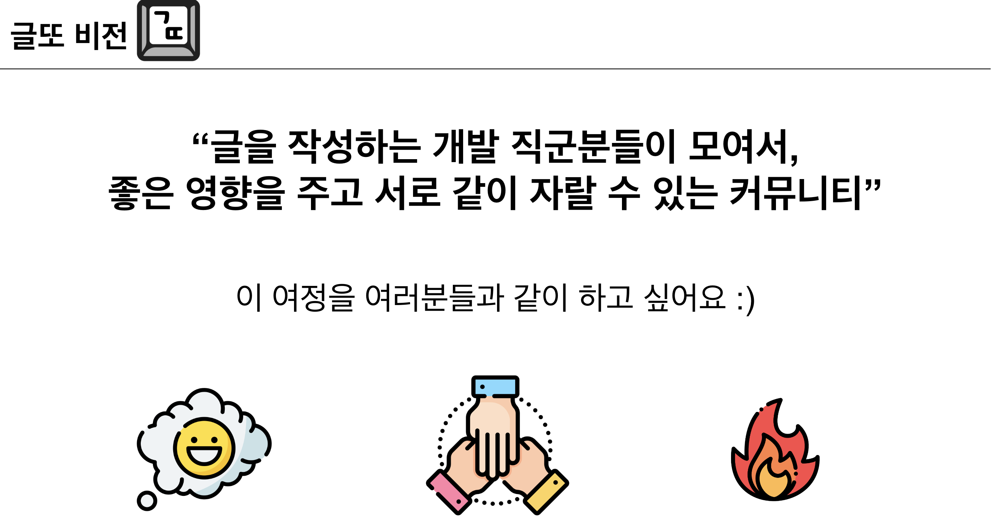

2022년이 마무리되어갈 때쯤에 많은 생각이 들었다. 올해를 돌아봤을 때 개발자로서 만족할만한 성장을 했는가? 3년 차 개발자로서 역량은 충분한가? 회사 일 하며 어영부영 시간을 보내진 않았는가 등등 생각이 들고 아쉬운 점들이 느껴졌다.

22년에는 분명 회사도 옮기고 그 안에서 새로운 프로젝트에도 투입됐고, 비지니스 요구사항에 유연하게 구조를 짜보려고 노력하였고, 사내에 문서도 몇 개를 남기고 파트에 공유도 하였다. 하지만 22년을 만족하며 마무리 했다는 생각보단 왜 아쉬움이 남았을까?

나를 돌이켜볼 수 있는 수단, 또 나의 성장치를 측정할 수 없는 도구가 없기 때문이었다. 그나마 있다면 기억.. 뿐일 것이다.

매년 12월 20일이 되면 계좌에서 15,564원이 빠져나간다. 이 돈은 구글 도메인 비용이다. 약 3년 전쯤 개인 블로그를 만들었다. 나를 표현하고 지식을 공유하면서 성장하고 싶기 때문이었다. 하지만 만들고 바쁘다는 이유로 거의 개장폐업 하였다. 매년 돈이 빠져나갈 때쯤이면 내년엔 꼭.. 하면서 올해까지 온 것 같다. 

하고 싶은게 많고 열정이 있어도 혼자하면 금방 식는 성격이라고 스스로 생각한다. 사실 원래는 혼자 있을때 시간을 더 잘 통제하는 줄 알았다 (~~메타인지가 잘못된 예..~~) 하지만 나는 사람들과 같이 책을 읽으면서, 스터디를 하면서 얻어간 게 더 많았던 것 같다. 이런 생각을 거치면서 내 스스로 습관을 만들 수 없다면 강제성을 부여해서라도 나 자신을 바꾸는 게 먼저라고 생각했다.

위와 같은 생각을 하고 보니 회사의 같은 팀 분께서 변성윤 님이 운영하시는 글또를 하고 계셨던 게 생각났다. 찾아보니 마침 글또 다음 기수를 모집을 준비 중이었고 글또 후기를 보면서 가슴속에서 꼭 이걸 하고 싶다는 생각이 들었다.

**글을 쓰는 습관을 기르고 개발자 커뮤니티 속에서 서로가 서로에게 좋은 영향을 주며 성장하고 싶다는 생각을 했고 23년은 글또를 시작으로 갓생으로 살고 싶다는 동기부여가 되었다.**

~~(이 글의 취지는 글또를 시작하며 다짐글이었으나.. 쓰다보니 22년의 회고부터 시작하게 되었네요..🥲)~~

## 글또에서 달성하고 싶은 목표는?
1. **배운 지식을 잘 정리하고 그것을 공유하는 습관을 만들고 싶다.** 개발자가 된 지 3년밖에 되지 않았지만 내가 본 바에 의하면 개발을 잘하고 커뮤니케이션을 잘한다고 느껴지시는 분들은 문서를 잘 쓴다는 공통적인 특성을 가지고 있었다. 글을 쓰고 사람들에게 공유하는 것 자체가 사실 쉬운일은 아닐것이다. 하지만 이미 습관의 일부이기 때문에 잘하시는 거라고 생각한다. 지식을 들을 때보다 지식을 공유하는 과정에서 깨닫고 성장하는 점이 많다고 생각한다. 나는 그래서 이런 습관을 만들기를 기대한다.
2. **개발자 풀을 넓히고 네트워크를 형성하고 싶다.** 예전에 같이 일하시던 분들, 또는 현재 팀에서 다른 개발자분들과 얘기도 하고 고민을 나누면서 개발하는데 있어서, 또는 마음가짐에 있어서 좋은 영향을 받은 부분이 많았다. 언젠가부터 다른 개발자분들과도 얘기해보고 싶고 네트워킹 하면 참 좋겠다는 생각을 하였다. 사실 사람들과 말하는 건 좋아하지만 처음 보는 사람에게 잘 다가가지는 못하는 성격이다. 이런 점을 개선해서 좋은 분들과 많이 얘기해보고 싶다.

## 6개월 후에 어떤 모습을 기대하는가?
글을 쓰는 것은 분명 어려운 일일 것이다. 나의 지식을 표현하고 그에 대한 생각을 표현하면서 읽는 사람으로 하여금 쉽게 이해시켜야 하기 때문이다. 또한 불특정 다수가 읽기 때문에 잘못된 지식을 올리는 것에 있어서는 조심해야 한다. 아마 이런 고민속에서 양질의 글이 나오고 개인도 성장한다고 생각한다. 사내에서 문서를 공유하는 것보다 좀 더 부담스러운 것도 사실이다. 아마 이런 부담감때문에 그간 글을 못 썻던 이유도 있던 것 같다. 글또를 통해 6개월간 활동한 나는 이러한 부담감을 덜고 글을 쓰는 자체를 즐거워했으면 좋겠다. 사람들이 내 글을 읽고 또 다른 사람에게 쉽게 전파하는 글을 쓰고 싶다. 또 6개월의 시간이지만 나의 글을 돌이켜봤을 때 성장 곡선이 보이기를 바란다.

 

**글또가 마무리 될쯤엔 ‘글또에 들어오길 참 잘했다’ 라는 생각이 들수 있도록 열심히 임해볼 생각이다.**

